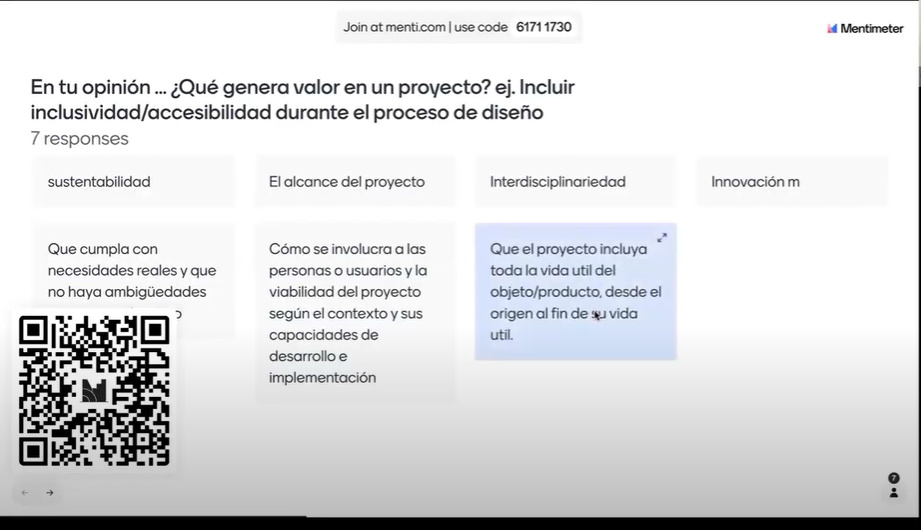
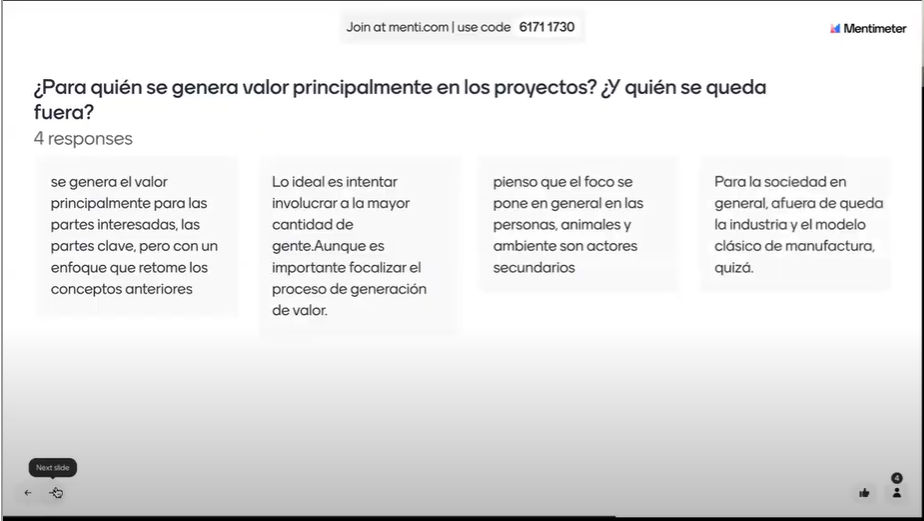
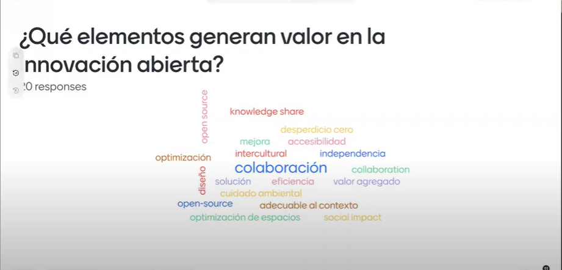
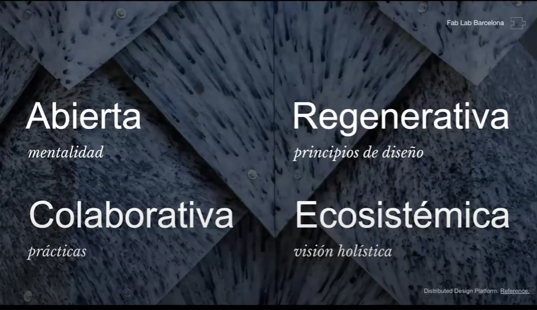
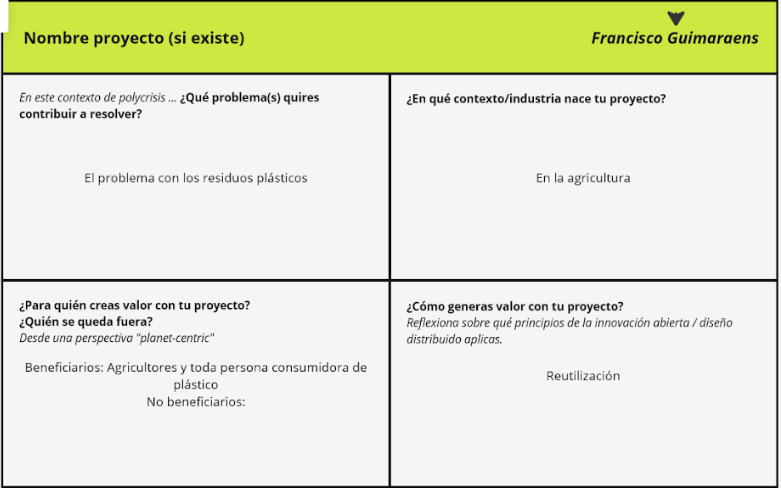
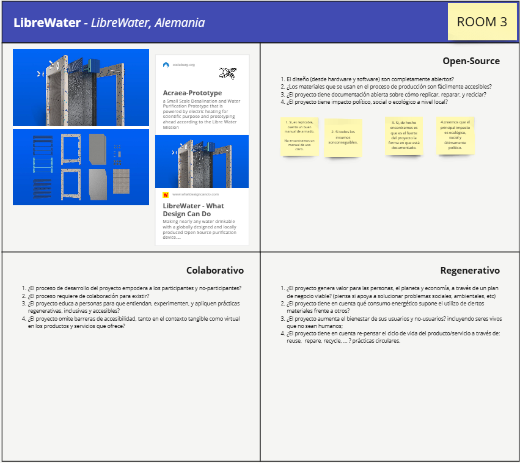

---
hide:
    - toc
---

# MD01

<strong>Innovación y Sostenibilidad</strong>

En este módulo tuvimos el agrado de conocer a Paola Zanchetta, que nos habló sobre el diseño distribuido e innovación abierta. En este caso nos comentó sobre algunos trabajos que realizo en el cual son bastante interesantes porque se trataban de reciclaje como el plástico de botellas.
En nuestra primera clase realizamos diversas actividades en las cuales debíamos responder preguntas según nuestro criterio 

<strong>Actividades:</strong>

 Actividad grupal 

Según nuestras palabras y previos conocimientos explicar que genera valor en nuestros proyectos, para quienes generamos valor principalmete en los proyectos y que elementos generan valor en la innovaón abierta

 

<strong>Definiciones:</strong>

Dentro de varias definiciones nos explió que dentro de la innovación abierta y el diseño distribuido trabajan estos cuatro parámetros

En el primer caso tenemos la innovación abierta que significa trabajar en una forma abierta con el entorno donde haya una documentación amplia y sin restricciones para que se pueda tener acceso y poder replicar y/o mejorar dicho proyecto en otras regiones o lugares del mundo.

Que sea colaborativa con nuestro contexto local y que los ciudadanos puedan participar en el proceso activamente.

También que sea regenerativa pensando en el planeta, el reciclaje y no solo en un usuario final para que genere un impacto positivo en la ecología, la salud y la sociedad. Para ello hay que utilizar datos locales con respecto a las necesidades existentes.  Como en el caso explicado, que un diseñador mexicano contribuyo en la regeneración del suelo de una comunidad porque los habitantes ya no podían cultivar sus alimentos debido a la erosión y falta de fertilidad en el suelo. 

Y como último punto que el proyecto sea ecosistémico.

Actividad individual:

Con esta actividad lo que nos permitió fue tratar de centrarnos mas en nuestro proyecto, donde la consigna se trataba de describir cuales eran nuestros problemas a los que quisiéramos contribuir, en que industria o contexto nacen nuestras ideas, para quienes creamos valor y de qué forma generamos valor a nuestro proyecto.

En mi caso me centre en la problemática de los residuos plásticos producidos por la agricultura y más específicamente en la hortifruticultura.

Para finalizar realizamos una ultima actividad grupal donde analizamos y discutimos sobre un proyecto. En este debíamos analizar sobre los cuatro parámetros hablados que eran si el proyecto era abierto, colaborativo, regenerativo y ecosistémico. En nuestro caso nos toco el proyecto de LibreWater.

El proyecto en lo personal me pareció bastante bueno, trataba de la desalinización del agua a través de la evaporación. Este consistía en calentar una placa a través de la energía solar para luego con transferencia de conducción transferir este calor al agua y así poder evaporarla, este vapor al ponerse en contacto con otra placa a menor temperatura se condensaba y de ese modo bajaba su concentración de sal.

El proyecto brindaba la documentación necesaria para replicarlo, detallaba los materiales utilizados en su creación, pero no explicaba específicamente su funcionamiento, en el cual nos quedamos con la duda de que manera circulaba el agua o si esta agua había que cargarla cada ves que se evaporara.

<strong>Conclusión:</strong> 

Con la innovación abierta en proyectos podemos aprovechar más la colaboración y el intercambio de conocimientos entre comunidades por lo tanto podemos llegar a desarrollar mejores soluciones y más efectivas. Pero para ponerlo en practica debemos dejar de un lado nuestra competición y avaricia para poder más que nada centrarnos en la evolución y el brindar conocimientos para ayudar a la demás persona que quieran replicar nuestros proyectos, además con la innovación abierta le agregamos a nuestro proyecto mayor longevidad para que perdure en el tiempo.