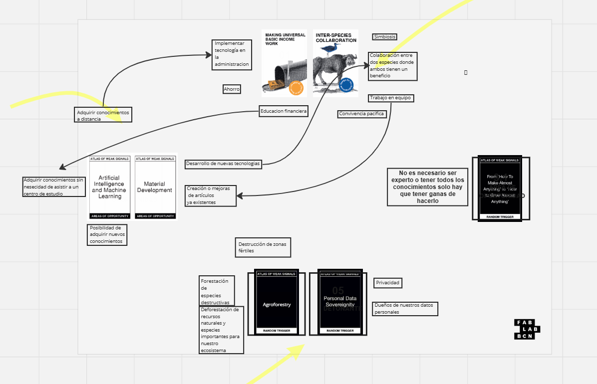
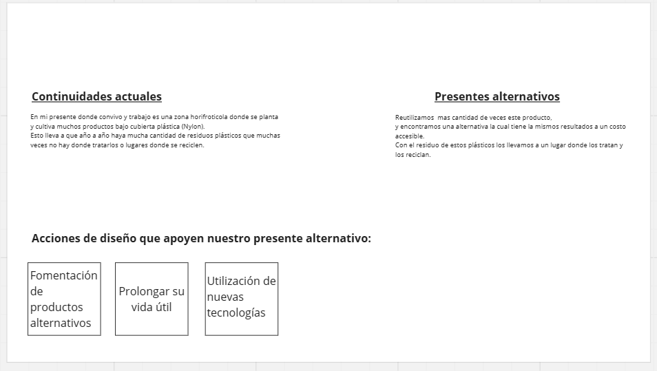
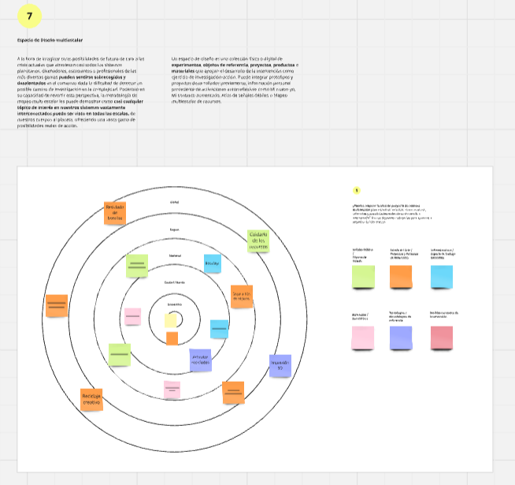

---
hide:
    - toc
---

# MD01

<strong>Proyecto y contexto</strong>

<strong>Definiciones:</strong>

<em>AoWS y espacios de diseno</em> 

<em>¿Qué es un espacio de diseño?</em>
Existen diversas definiciones para esta pregunta, algunas de ellas son:
-Un espacio de diseño, es una herramienta de navegación.  En la práctica del diseño, se utiliza para fundamentar la reflexión.
-También es un espacio que limita donde vamos a trabajar.
-Se utiliza para definir colecciones de ideas y conceptos.
-Es una herramienta que nos ayuda a situarnos y entender más nuestras referencias e intereses. Como también potenciales direcciones, al igual que en proyectos en los que ya hemos trabajado y son útiles en el camino que queremos tomar.

<em>¿Qué es el AoWS?</em>
AoWS (Atlas o Wing Signas) es utilizado como juego o herramienta para confrontarnos e ir construyendo un camino 
para crear nuestro proyecto.

Las AoWS y espacios de diseño son una herramienta que nos permiten especular y diseñar futuros emergentes.
Al hablar de futuros emergentes nos tenemos que sentar consigo mismo para entender nuestros principios, practicas,
valores, direcciones, etc.

Las funciones claves del espacio de diseño son:
-situar: Comprender el entorno y permitir que surjan los vínculos en su interior entre proyectos, actores, temáticas, teorías, etc.
-Organizar: Reducir la complejidad, dar sentido y ver que conexiones surgen.
-Darnos narrativa: Nos ayuda a pensar desde otro punto de vista y dar un paso atrás y verlo desde otro prisma 
-Performativo: Combinar distintos espacios de diseño para generar diferentes potenciales futuros emergentes o nuevos proyectos
-Inspiración: Que sea de interés y genere ganas. 

Weak signals (Señales débiles):
Es un indicador temprano de cambio. Es algo que en el presente no es muy visible, pero tiene potencial a que en un futuro
cercano puede provocar un gran cambio.
Una señal débil es aquel punto de inflexión donde provoca en el tiempo un potencial futuro emergente.
<strong>Actividad:</strong>
<em>-Ejercicio 1:</em>
Este ejercicio o juego nos permite realizar conexiones.
El juego se divide en diferentes secciones de cartas donde las cartas principales o temáticas son 5 de diferentes colores. Las cartas de oportunidad que son las blancas y las detonantes que son las negras.

<em>-Ejercicio 2:</em>
En la primera parte intentamos describir un presente en el cual estamos viviendo y que haya una problemática.
En el segundo párrafo debíamos escribir el presente que nos gustaría estar viviendo con respecto a la problemática descripta anteriormente. 

<em>-Ejercicio 3:<em>
Este ejercicio es con respecto al espacio de diseño multi escalar.
En el cual debíamos pegar en el mapa recuadros con ideas con respecto a señales débiles, proyectos y personas referentes, espacios de trabajos, entre otras. 
El mapa consiste de diferentes círculos donde en el centro se encuentra la palabra “yo” haciendo referencia a la persona y al irnos mas a afuera se va descentralizando. 

<strong>Conclusión/Reflexión:</strong>

Este módulo nos da herramientas para explorar futuros posibles desde nuestras ideas y valores. Nos ayuda a organizar nuestras ideas, ver conexiones que quizás no habíamos notado, y entender el entorno en el que trabajamos.
