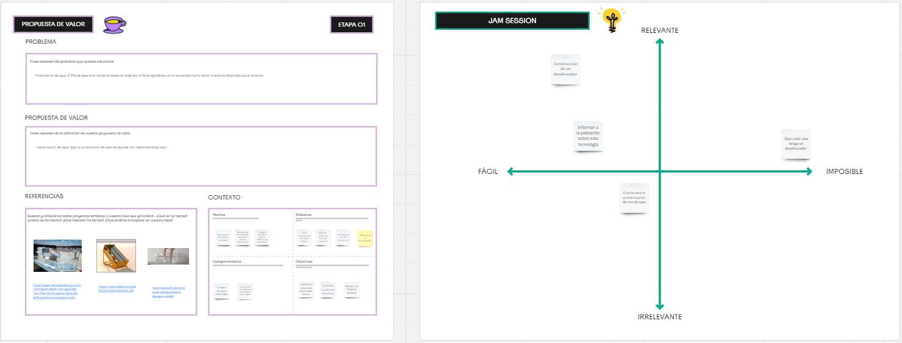

---
hide:
    - toc
---

# MD02

<strong>Proyecto y Diseño</strong>

<strong>Diseño:</strong>

Que es el diseño?
El diseño es crear aquello que aun no existe. Es definir las caracteristicas y/o formas que va a tener lo que nosotros querramos crear ya sea un objeto, una pagina, u otra cosa.
A la hora de realizar un diseño se puede calificar como bueno o malo. Lo podemos calificar como buen diseño si el producto es útil, es deseado por un individuo o comunidad, aporta valor, es innovador, mejora la calidad de vida y/o es amigable con el medio ambiente. Si cumple con estos puntos o algunos de ellos podemos decir que es un buen diseño de lo contrario si el producto es inutil, las personas no lo quieren, no aporta valor, es perjudicial para las personas y/o no es amigable con el medio ambiente podemos calificar ese diseño como malo. El diseño se debe de acomodar y ajustar al usuario final el cual es el que lo va a utilizar y aprobar y no deberia de suceder al contrario ya que esto algunas veces lleva a la no aprovacion. Un ejemplo claro es cuando en algunas ocaciones tenemos que rellenar un formulario web y termina siendo muy engorrozo por motivos de que no esta bien diseñado ni pensado en una persona inexperiente. 
Por ello el diseño se enfoca en el usuario o comunidad a la cual le quiere solucionar un problema, mejorar la calidad de vida o cualquiera que sea su objetivo final, por lo tanto cuando hablamos de diseño no se refiere a que simpelemente nuestros productos queden "lindos/as", sino que la estetica es solo una caracteristica mas dentro de ello.

Entonces podemos concluir que diseñar es entender y saber lo que estamos creando. Para ello tenemos la metodologia de diseño que se divide en estos puntos.

-<em>Empatizar:</em> Esto conlleva a acercarce a las personas y entender la situacion que esta pasando y el problema que necesitan resolver, para ello necesitamos recopilar informacion necesaria para entenderlo y ponernos en contexto, esto lo podemos hacer haciendo observaciones, realizando entrevistas, encuestas, registro fotografico, entre otras.

-<em>Definir:</em> Es tomar toda la informacion recopilada y organizarla para tomar conclusiones sobre el problema.

-<em>Idear:</em> Es simplemente crear ideas que lleven a una solucion.

-<em>Prototipar:</em> Llevar esas ideas a un prototipo inicial que pueden ser ojetos o de lo que nosotros querramos diseñar, esto nos sirve para llevar a la realidad a nuestras ideas.

-<em>Testear:</em> LLevar esos prototipos y ponerlos a prueba en nuestros usuarios o comunidades finales. Esto nos sirve para ver si este producto verdaderamente es util y acepatado por el usuario.

-<em>Produto final:</em> Luego de haber pasado todos estos pasos y hallamos hecho los ajustes necesarios ya sea por informacion recabada por usuarios o por observaciones podemos hacer el producto final para su posterior comercializacion si ese fuese nuestro objetivo.

<strong>Proyecto:</strong>

Despues de todo lo descripto sobre diseño podemos centrarnos y focalizarnos aun mas en nuestro producto final como proyecto. Para ello realizamos una serie de ejercicios la cual nos ayudo a bajar aun mas a tierra nuestras ideas y comenzar a definir.

En este primer ejercicio sobre propuesta de valor debiamos escribir sobre el problema que quisieramos solucionar, despues de tener enfocado nuestro problema pensar en una solucion que pensaramos que seria posible y citar algunos proyectos que se relacionen a ello. 

Que posibles acciones puedo tomar para poder seguir diseñando nuestro proyecto

