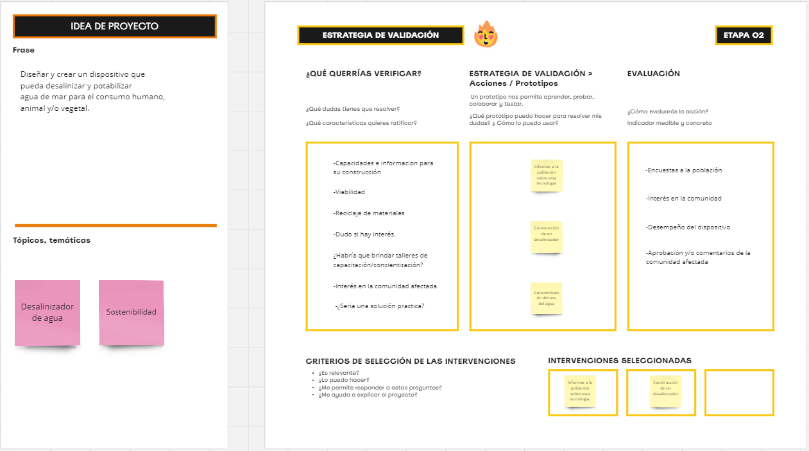
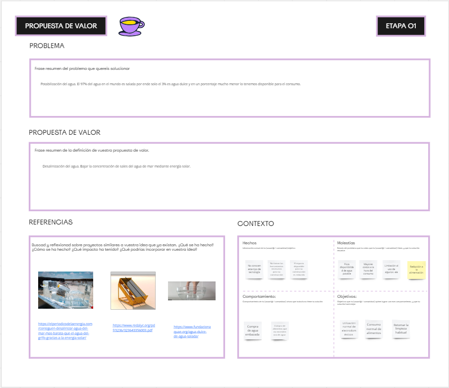
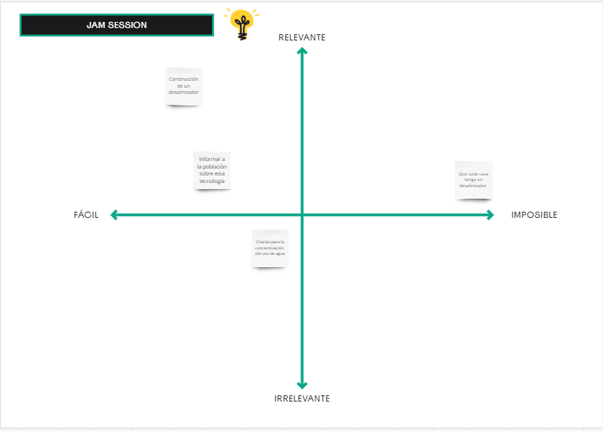
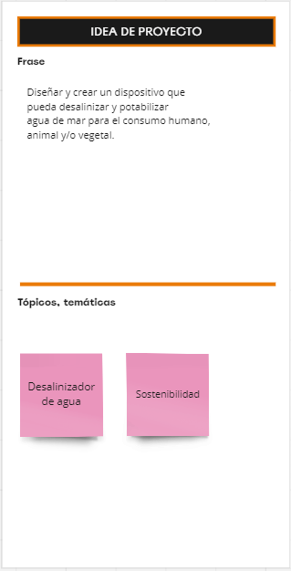
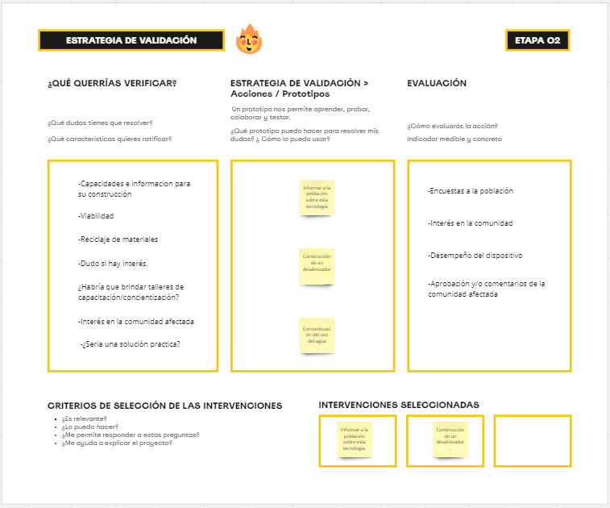

---
hide:
    - toc
---

# MD02

<strong>Proyecto y Diseño</strong>

<strong>Diseño:</strong>

¿Qué es el diseño?
El diseño es crear aquello que aún no existe. Es definir las características y/o formas que va a tener lo que nosotros queramos crear ya sea un objeto, una página, u otra cosa.
A la hora de realizar un diseño se puede calificar como bueno o malo. Lo podemos calificar como buen diseño si el producto es útil, es deseado por un individuo o comunidad, aporta valor, es innovador, mejora la calidad de vida y/o es amigable con el medio ambiente. Si cumple con estos puntos o algunos de ellos podemos decir que es un buen diseño de lo contrario si el producto es inútil, las personas no lo quieren, no aporta valor, es perjudicial para las personas y/o no es amigable con el medio ambiente podemos calificar ese diseño como malo. El diseño se debe de acomodar y ajustar al usuario final el cual es el que lo va a utilizar y aprobar y no debería de suceder al contrario ya que esto algunas veces lleva a la no aprobación. Un ejemplo claro es cuando en algunas ocasiones tenemos que rellenar un formulario web y termina siendo muy engorroso por motivos de que no está bien diseñado ni pensado en una persona inexperiente. 
Por ello el diseño se enfoca en el usuario o comunidad a la cual le quiere solucionar un problema, mejorar la calidad de vida o cualquiera que sea su objetivo final, por lo tanto, cuando hablamos de diseño no se refiere a que simplemente nuestros productos queden "lindos/as", sino que la estética es solo una característica más dentro de ello.

Entonces podemos concluir que diseñar es entender y saber lo que estamos creando. Para ello tenemos la metodología de diseño que se divide en estos puntos.

-<em>Empatizar:</em> Esto conlleva a acercarse a las personas y entender la situación que está pasando y el problema que necesitan resolver, para ello necesitamos recopilar información necesaria para entenderlo y ponernos en contexto, esto lo podemos hacer haciendo observaciones, realizando entrevistas, encuestas, registro fotográfico, entre otras.

-<em>Definir:</em> Es tomar toda la información recopilada y organizarla para tomar conclusiones sobre el problema.

-<em>Idear:</em> Es simplemente crear ideas que lleven a una solución.

-<em>Prototipar:</em> Llevar esas ideas a un prototipo inicial que pueden ser objetos o de lo que nosotros queramos diseñar, esto nos sirve para llevar a la realidad a nuestras ideas.

-<em>Testear:</em> Llevar esos prototipos y ponerlos a prueba en nuestros usuarios o comunidades finales. Esto nos sirve para ver si este producto verdaderamente es útil y aceptado por el usuario.

-<em>Producto final:</em> Luego de haber pasado todos estos pasos y hallamos hecho los ajustes necesarios ya sea por información recabada por usuarios o por observaciones podemos hacer el producto final para su posterior comercialización si ese fuese nuestro objetivo.

<strong>Proyecto:</strong>

Después de todo lo descripto sobre diseño podemos centrarnos y focalizarnos aún más en nuestro producto final como proyecto. Para ello realizamos una serie de ejercicios la cual nos ayudó a bajar aún más a tierra nuestras ideas y comenzar a definir.

En este primer ejercicio sobre propuesta de valor debíamos escribir sobre el problema que quisiéramos solucionar, después de tener enfocado nuestro problema pensar en una solución que pensáramos que sería posible y citar algunos proyectos que se relacionen a ello. 
Para acercarnos más a la situación que quisiéramos resolver debimos de comunicarnos con alguna persona más cercana o que este viviendo ese problema. En mi caso el proyecto de interés va relacionado sobre la desalinización de agua de mar para el consumo humano. En la región donde vivo no existe esta problemática por ello tome como referencia un caso puntual que paso en mi país el cual debido a una seca muy importante se terminaron las reservas de agua dulce lo cual una región del país tuvo que incorporar agua de mar a su red de agua potable. Esta me resulto más fácil y accesible para recabar información y entrevistar a una persona directamente afectada por este problema.

En el ejercicio numero dos debíamos tomar las acciones de validación que habíamos descritas antes y escribir de qué manera las podríamos verificar haciéndonos preguntas como: ¿Que dudas tenemos por resolver? y ¿Qué características queremos ratificar?
En el siguiente paso de evaluación debíamos describir de qué manera podríamos evaluar nuestro proyecto para ver si este es útil y de interés en las personas.

Que posibles acciones puedo tomar para poder seguir diseñando nuestro proyecto

<strong>Conclusión/reflexión:</strong>
En mi caso este módulo fue de mucho aprendizaje y muy importante para poder ir concretando y focalizando mi proyecto final. La clase sobre diseño me pareció sumamente importante ya que nos enseña paso a paso el cómo llevar a cabo nuestras ideas. Mas en particular el prototipado de productos porque al escuchar esta palabra se nos viene a la mente el crear un producto el cual sea funcional y lo más parecido al producto final y no es así, sino que primero debemos de crear algo que simplemente tenga sus partes principales y sus medidas reales para poder ver cómo se comporta y sus dimensiones reales. Luego de que si este cumple o no ir modificando y mejorando nuestro prototipo para llegar a un producto final y funcional.

<strong>Anexo:</strong>

En el caso que no se vean bien las imágenes anteriores dejo acá los ejercicios por separado.

Ejercicio 1

Ejercicio 2

<em>Link de proyectos:</em>

https://elperiodicodelaenergia.com/consiguen-desalinizar-agua-del-mar-mas-barata-que-el-agua-del-grifo-gracias-a-la-energia-solar/

https://www.redalyc.org/pdf/3236/323643356003.pdf

https://www.fundacionaquae.org/agua-dulce-de-agua-salada/

