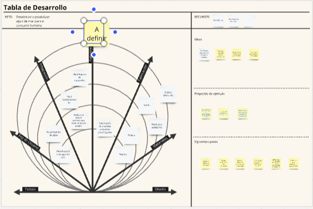
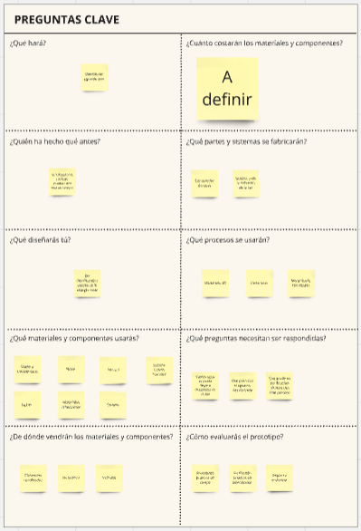
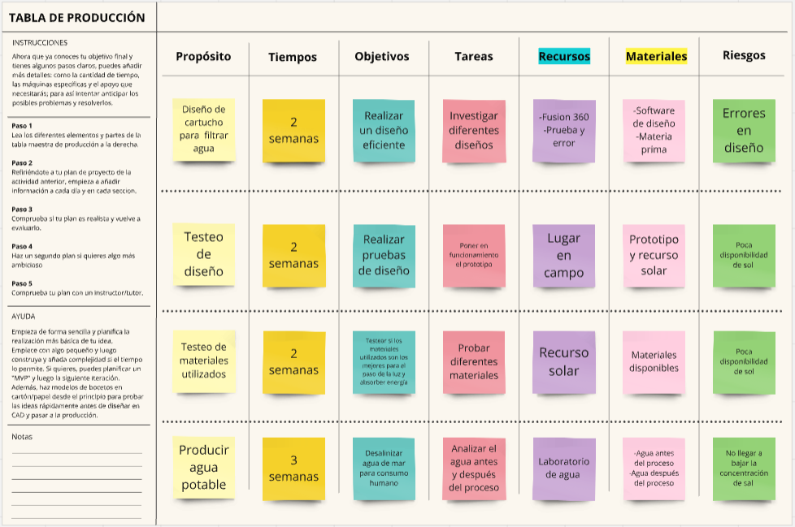
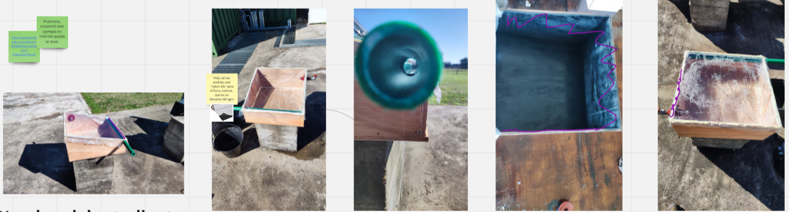

---
hide:
    - toc
---

# MD03

<strong>Proyecto y Diseño</strong>

Este módulo nos sirvió para llevar a tierra y enfocarnos en nuestro proyecto final. En este caso para saber si seguimos con el mismo concepto que antes o lo modificamos, ya sea por otras técnicas otros modelos de fabricación u otro motivo.

A partir de este módulo en delante planificamos un poco más nuestra ruta y nos centramos más en realizar el proyecto. Esto conlleva a si necesitamos investigar un poco más, los costos de este entre otros parámetros.

En este módulo realizamos 3 ejercicios en miro, el primero es un canvas, el segundo son preguntas para realizarnos sobre nuestro proyecto y el tercero más específico sobre nuestro trabajo.

<strong>Actividad:</strong>

El primer ejercicio consistía en definir cuál era nuestro reto y que es lo que nosotros queremos solucionar, con que recursos contamos y cuales vamos a necesitar para ello.
En la tabla dependiendo de cada flecha y la importancia que tenga cada objetivo o parámetro de nuestro proyecto está colocado de adentro hacia afuera. Es decir, lo más importante está más cerca del punto central y lo de menos relevancia en los extremos de afuera.
También en este cuadro nos encontramos con las ideas que se refieren a nuestro proyecto y los pasos que pensamos seguir para mejorarlo o enfocarlo.

En este segundo ejercicio comienzan las preguntas claves y donde comenzamos a pensar más profundamente en nuestro proyecto y cuantificarlo.

En la tercera tabla debíamos a los conceptos que planteamos como objetivos desarrollarlos para cuantificarlos.
¿Por ejemplo, realizarnos preguntas como que tareas debemos de realizar? cuanto tiempo me llevara? existen otros modelos? que materiales necesito?
En este mismo ejercicio tenemos un apartado donde podemos poner que riesgos podrían aparecer.

<strong>Conclusión/Reflexión:</strong>

Este módulo estaba directamente relacionado con el módulo anterior. En mi caso este módulo me sirvió para pensar y bajar a tierra más las modificaciones en mi proyecto ya que en un principio tenía elegido tomar un camino, pero luego por algunas ideas decidí enfocarme en otra cosa.

<strong>Anexo:</strong>

Aquí adjunto algunas fotos que adjunte al Miró de mi prototipo de proyecto final.

Imágenes donde estaba probando el prototipo inicial.

Imágenes térmicas para ver las pérdidas de calor.

