---
hide:
    - toc
---

# MI02

<strong>Desarrollo sostenible y Economía Circular</strong>

<strong>¿Qué es la sostenibilidad?</strong>

<em>Definición:</em> 
La sostenibilidad se basa en el principio de asegurar las necesidades del presente sin comprometer las necesidades de las generaciones futuras, siempre sin renunciar a la protección del medioambiente, el crecimiento económico y el desarrollo social.

Al hablar de sostenibilidad es hablar de ciclos. Los ciclos en un material es la vida útil o tiempo de valor que llevan hasta ser descartados o desechados. 
En nuestro entorno debemos de apostar por objetos o artículos donde podamos reciclarlos, reutilizarlos o en el mejor de los casos que sean fabricados con productos regenerativos. 

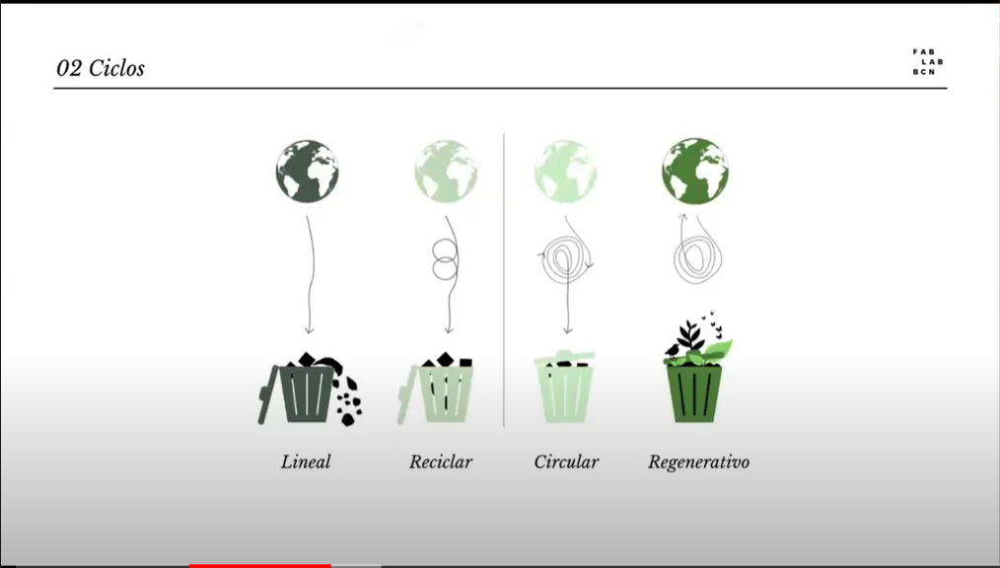

<em>Lineales:</em> Estos son utilizados una vez y luego son desechados. 

<em>Reciclaje:</em> Se cree que estos son una solución para nuestros problemas, el cual, si frena un poco la producción de objetos plásticos, pero no por completo.

<em>Circular:</em> En este caso se puede utilizar otros tipos de materiales como por ejemplo el aluminio en envases para agua en vez de usar plástico, esto para ser reutilizados más de una vez antes de ser desechados.

<em>Regenerativo:</em> En este caso es crear objetos con ciclos de vida circulares o regenerativos. En este caso se trata de crear con materiales cien porcientos degradables, así estos productos vuelven a la tierra en su estado natural y no contaminan.

<em>Ejercicio 1:</em>

Este primer ejercicio consiste en catalogarnos a nosotros mismos para saber que tan sostenible somos como personas, o que estamos haciendo para influir en ello.
Imagen de catálogos de colores
Donde el color celeste sería una persona activista la cual produce su propio alimento y vive en el medio del campo con sus animales, y el gris una persona en el extremo totalmente opuesto donde no le importa el cambio climático ni el cuidado medioambiental. 

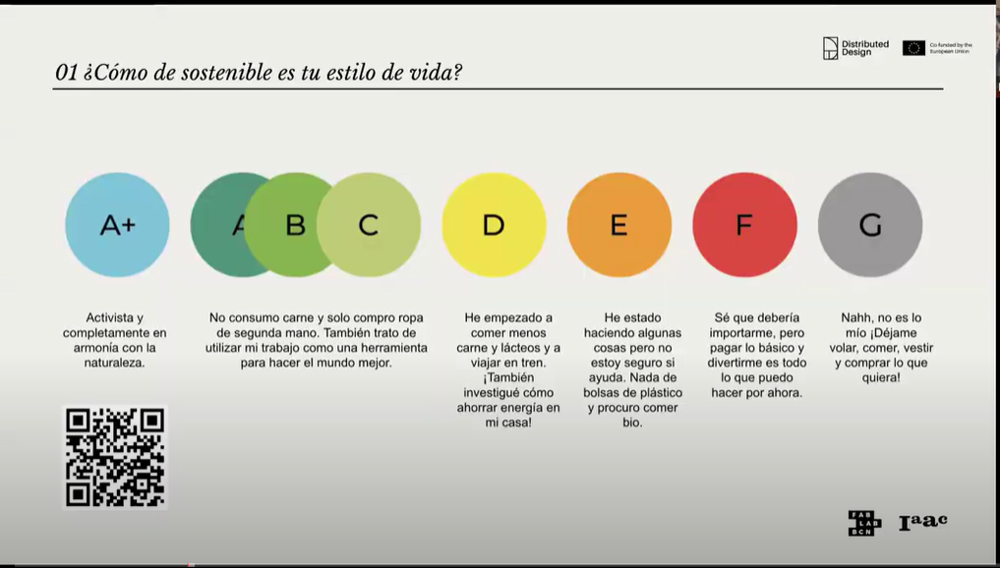

Yo me catalogue como una persona Naranja-Roja esto porque siento que soy una persona la cual esta buscando y piensa que debo de mejorar en cuanto a el consumo plástico, pero siento que es muy poco lo que estoy haciendo por ese motivo. También me es difícil de acostumbrarme y adaptarme en un medio donde el consumo plástico es excesivo. 

<em>Ejercicio 2:</em>

Este ejercicio es necesario y muy bueno de realizarlo cada vez que comenzamos un nuevo proyecto. Este consiste en que: 
En el centro de este círculo escribimos donde estamos físicamente, en mi caso me encuentro en Uruguay, en el departamento de Salto que es el lugar donde yo voy a influenciar.
Luego en la parte superior escribimos lo que a nosotros nos gusta y sabemos hacer, bajando a nuestra derecha escribimos lo que hacemos en nuestro trabajo, en el cuadro inferior quien influye en nuestro trabajo y en el cuadro restante a quien influyo con mi trabajo y en el cuadro gris escribimos que nos preocupa.

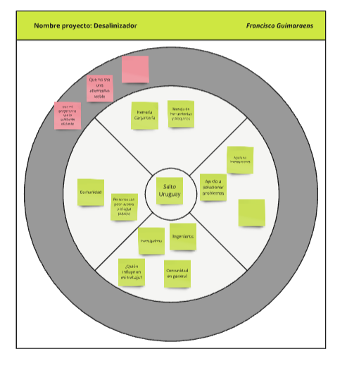

<em>Ejercicio 3:</em> 

Este consiste en que el circulo exterior siguiendo la regla de colores antes vista debemos de pintarlo del color que nosotros creamos que en este momento tiene nuestro proyecto, y el circulo interior al color que nosotros aspiramos llegar.
 

<strong>Creación de Biomateriales</strong>

<strong>Introducción:</strong>

Los biomateriales son compuestos de origen natural o sintético, por lo que pueden ser introducidos en un tejido vivo para reemplazar o restaurar alguna función.
A parte de su biocompatibilidad, este tipo de materiales también cuenta con otras características que los distingue del resto como puede ser que suelen ser simultáneamente robustos y ligeros. La síntesis de los biomateriales se realiza a temperatura ambiente y con elementos abundantes.

<strong>componentes principales:</strong>

<em>-Biopolímeros:</em> Los biopolímeros son un tipo específico de biomateriales que se destacan por ser polímeros naturales o sintéticos que aglutinan a los demás ingredientes. Están diseñados para ser biodegradables y generalmente son derivados de fuentes biológicas como por ejemplo tenemos la gelatina, el agar agar, la resina de pino y el alginato de sodio

<em>-Plastificante:</em> Los plastificantes son aditivos utilizados para mejorar la flexibilidad, la manejabilidad y la durabilidad de los materiales. Estos desempeñan un papel crucial al modificar las propiedades físicas y mecánicas de los polímeros para hacerlos más adecuados para aplicaciones específicas. Generalmente se utiliza glicerina o cera.

<em>Aditivo:</em> Los aditivos son incorporadas para modificar o mejorar las propiedades físicas, químicas y biológicas de los materiales. Estos aditivos pueden influir en características como la flexibilidad, la resistencia, la biocompatibilidad, la degradabilidad y la funcionalidad general del biomaterial. Como por ejemplo son los residuos alimenticios, flora, tintes y fibras. 

<em>Solvente:</em> Los solventes son sustancias que disuelven otros materiales para formar soluciones, y son cruciales en el procesamiento y la fabricación de biomateriales. Su papel es la disolución de polímeros para formar soluciones o suspensiones, facilitando la fabricación de dispositivos. El solvente utilizado es el agua o alcohol, este componente desaparece al momento de la elaboración ya que se evapora.

<strong>Preparación de los componentes:</strong>

El primer paso es recolectar algunos ingredientes de nuestro interés para luego seleccionarlos, procesarlos y posteriormente utilizarlos. Por ejemplo, en el caso que utilicemos cascara de huevo, debemos recolectar la cascara para luego darle un proceso de limpieza donde no haya algunas partículas extrañas que no sean de nuestro interés. Luego de esto, reducir los fragmentos lo más chicos posible, para luego tamizar y quedarnos con el material deseado. Esto lo podemos guardar en algún frasco o recipiente para su posterior uso.

<strong>Moldes de secado:</strong>

Los moldes de secado son componentes cruciales en la fabricación de biomateriales, especialmente en procesos donde los biomateriales deben ser formados, endurecidos o estabilizados a través de la eliminación de solventes o la modificación de sus propiedades físicas. Estos moldes están diseñados para garantizar que los biomateriales obtengan la forma deseada mientras se secan o se curan.

Algunas características que deben de tener los moldes son: Estos deben de estar nivelados para que al momento de verter nuestra solución no ocurra un desborde. 
 Para las soluciones basadas en Gelatina que resulta pegajosa, se utiliza el textil (goretex) por el lado más liso. Esto permite remover nuestro producto con facilidad luego de solidificado. También se puede reemplazar por otros plásticos, como polietileno. 
Si queremos que la superficie del material resultante tenga texturas, se puede lograr fácilmente buscando un textil o plástico texturado, como los envoltorios de burbujas en los empaques, o algunas superficies de silicona.

Para las recetas basadas en Agar Agar y Alginato de Sodio, que reducen mucho su tamaño durante el proceso de secado, se utiliza el textil (goretex) por el lado más rugoso. De esta forma, la mezcla se adhiere a la superficie y pierde el agua disminuyendo su espesor, en vez de disminuir su superficie (que es lo que sucede si vaciamos este tipo de mezclas en superficies muy lisas como un plástico, un vidrio o un espejo). Para esto también es importante que el marco de borde sea de madera, ya que es clave la adherencia en el borde, incluso mejor si lo sobrepasamos levemente con la mezcla. Como materiales alternativos a la tela goretex, podemos utilizar otros tipos de telas con texturas en base a algodón y poliéster, por ejemplo, para evitar que se nos escape el líquido al momento del vaciado, pero al ser semipermeables que la muestra libere humedad tanto por su superficie superior como por la inferior.

Para las recetas basadas en Resina de Pino se utiliza los moldes de madera maciza forrados con papel de horno. El papel de horno evita que la resina se pegue directamente a la madera y nos permite desmoldar la pieza inmediatamente.

<strong>Recetas para la creación de Biomateriales:</strong> 

<em>Receta de Gelatina:</em>
- 200 ml de agua
- 1 cucharada pequeña de vinagre
- 5 a 15 ml de glicerina
- 40 gr de gelatina
- 20 gr a 40 gr de aditivos.

Instrucciones:
Agregar el agua, el vinagre y la glicerina a la olla en frío, revolver para que se incorpore y dejar calentar a fuego medio. Agregar de a poco la gelatina y revolver para disolver hasta que suelte un hervor. Bajar la temperatura y agregar los aditivos o colorantes y revolver. Dejar reposar y que entibie, cuando la mezcla se pegue a los dedos, verter.

<em>Receta de Resina:</em>
- 50 gr de colofonia
- 15 ml de alcohol
- 5 gr de cera carnauba
- 40 gr / 60 gr de aditivos según cual use.

Instrucciones:
Preparar los moldes con papel de horno. Agregar la colofonia y el alcohol en la olla cuando esté fría, encender a fuego medio bajo y tapar la olla. Esperar a que esté todo derretido sin revolver. Una vez que esté derretido, agregar la cera carnauba y revolver. Agregar el o los aditivos, incorporar toda la mezcla hasta que esté uniforme y densa. Volver a tapar para que derrita todo junto. Una vez que la mezcla está homogénea verter en el molde y aplastar con fuerza. Dejar enfriar en el molde antes de desmoldar.

Para limpiar: volver a poner alcohol en la olla y dejar hervir nuevamente en el hornillo. Retirar la resina con papel de cocina, repitiendo la operación cuanta veces sea necesario hasta que la olla y los utensilios estén limpios.

<em>Receta de Alginato de sodio:</em>
- 4 gr de alginato de sodio
- 200 ml de agua
- 8 ml de vinagre
- 15 - 20 gr de aditivo cáscaras de huevo

Instrucciones:
Mezclar el agua con el alginato de sodio, procesar con mixer para mezclar bien. Reservar en heladera 24hs.
Mezclar las cáscaras de huevo con la preparación de alginato de sodio y agua, evitando que se formen burbujas. Una vez mezclado, colocar con cuchara sobre el molde y acomodar, y luego verter suavemente por encima el vinagre. Comenzará a reaccionar y coagularse. Luego de 15 minutos separar la mezcla del molde suavemente para dejar espacio para que el vinagre penetre por los lados. Esperar una hora. Luego sacar la muestra del molde y darle la vuelta para permitir que el vinagre llegue al otro lado del biocompuesto. Dejar reposar por una hora más.

Por último, lavar el mismo debajo de la canilla para eliminar el vinagre.

<em>Receta de Agar Agar:</em>
- 200 ml de agua
- 7,5 gr de agar agar
- 12 ml de glicerina
- 10 gr a 15 gr de aditivos.

Instrucciones:
Agregar el agua, y el agar agar a la olla en frío y disolver. Agregar la glicerina. Revolviendo siempre, calentar a temperatura baja durante 2 minutos. Subir la temperatura paulatinamente cada 2 minutos. Agregar los aditivos o colorantes. La mezcla debiese cambiar su textura entre el minuto 6 y 8. Se vierte en ese momento apenas comienza a parecerse a una crema liquida.

<strong>Algunas fotos de nuestro proceso y experiencia con Biomateriales:</strong>

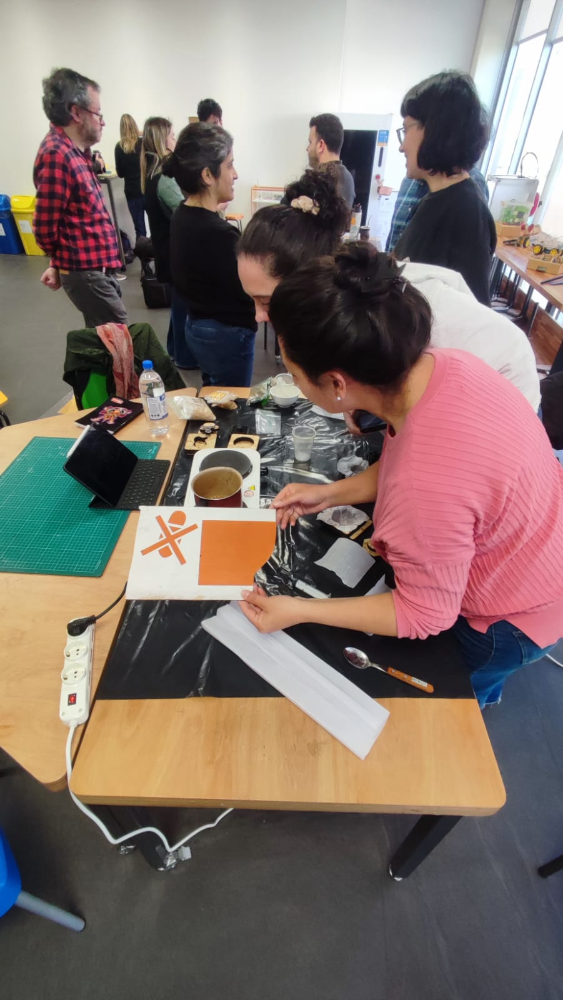

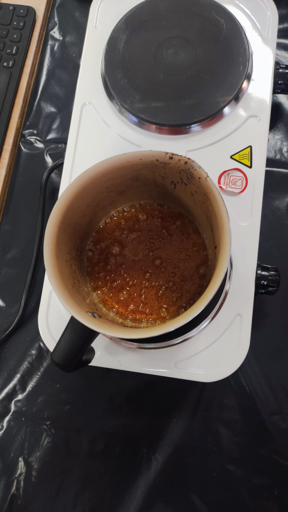

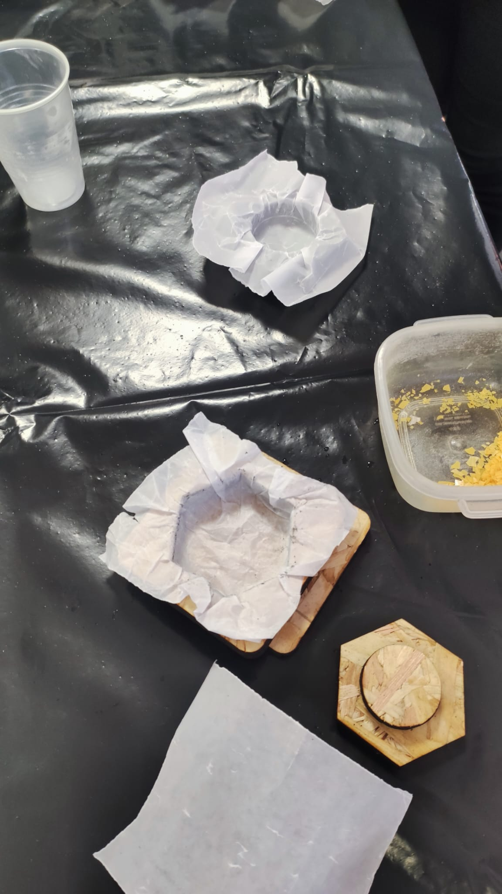

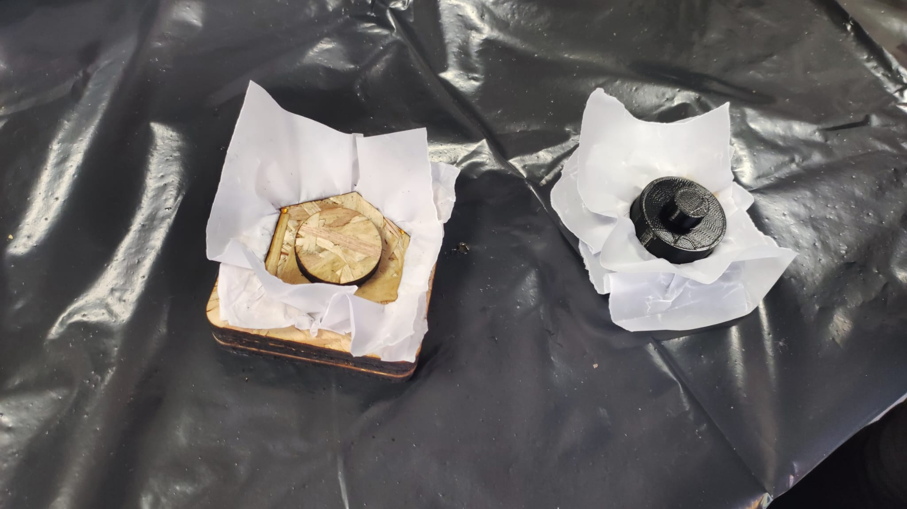

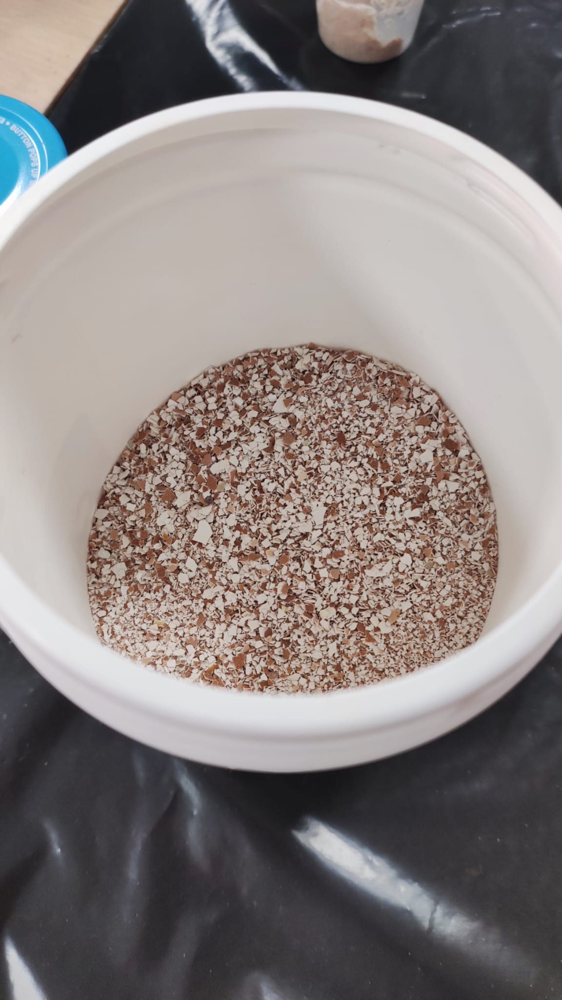

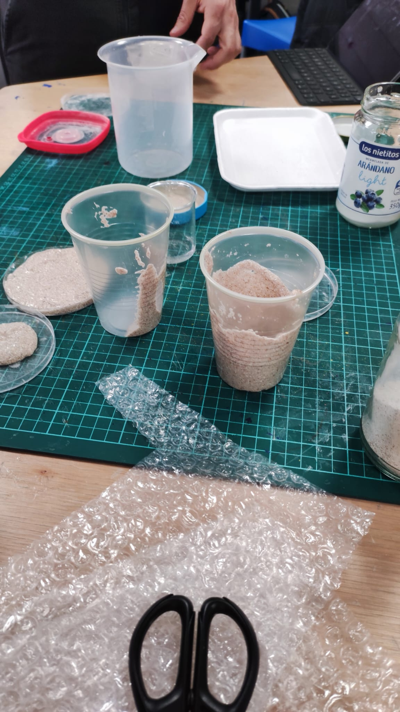

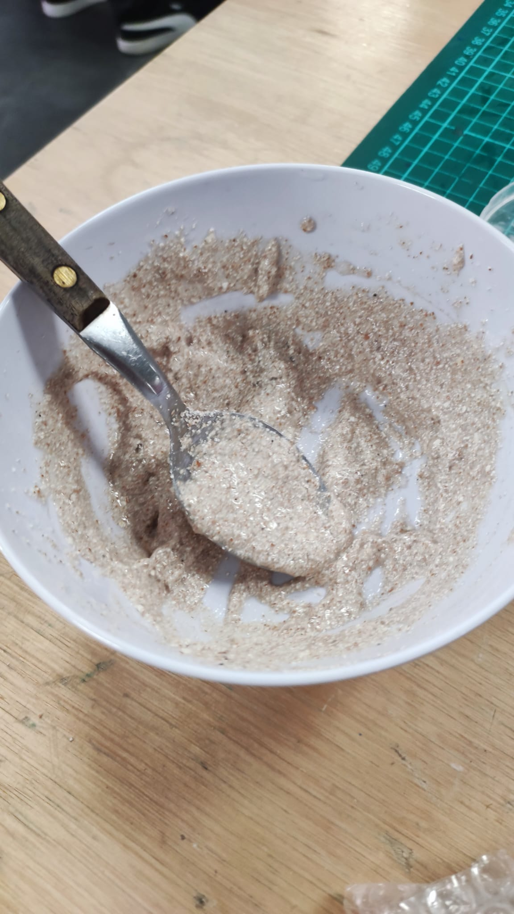

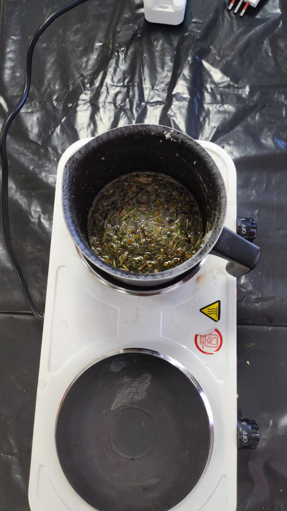

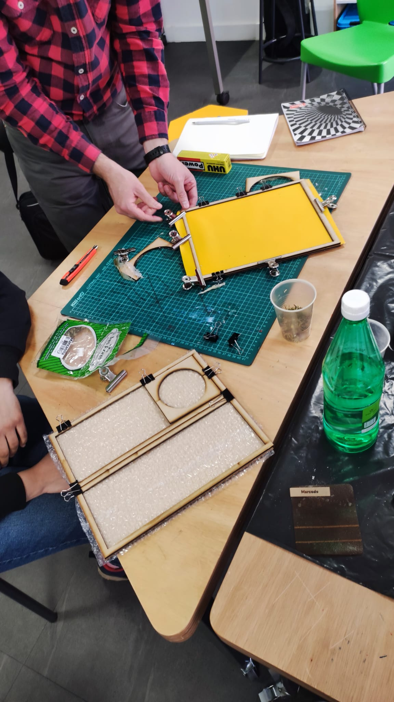

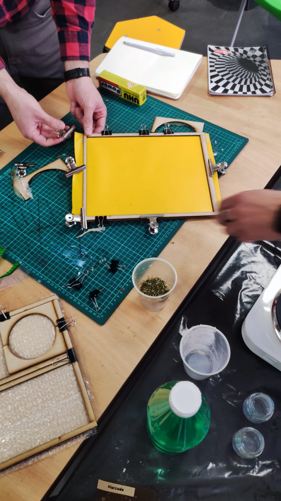

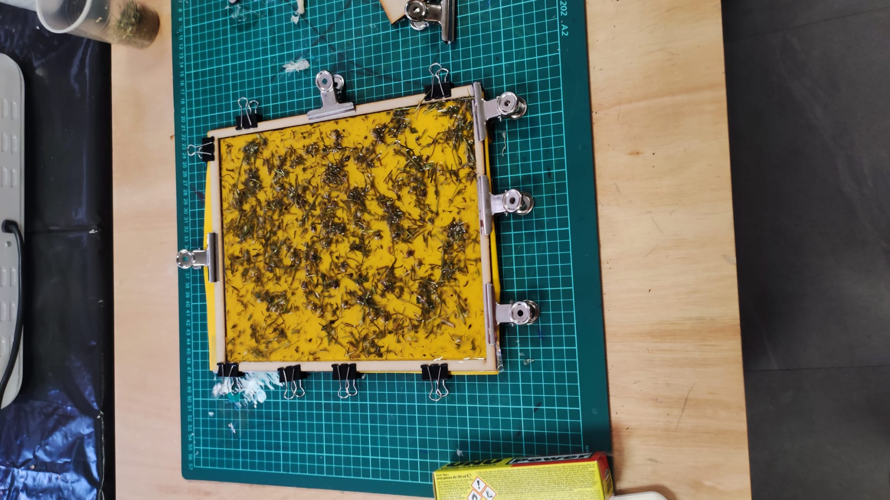

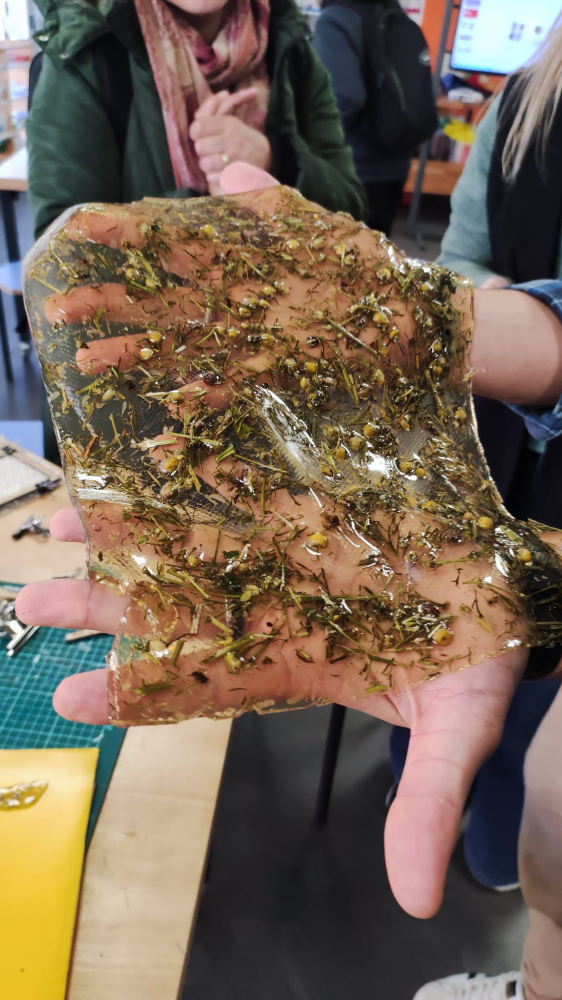

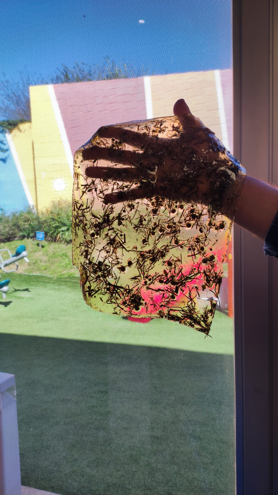

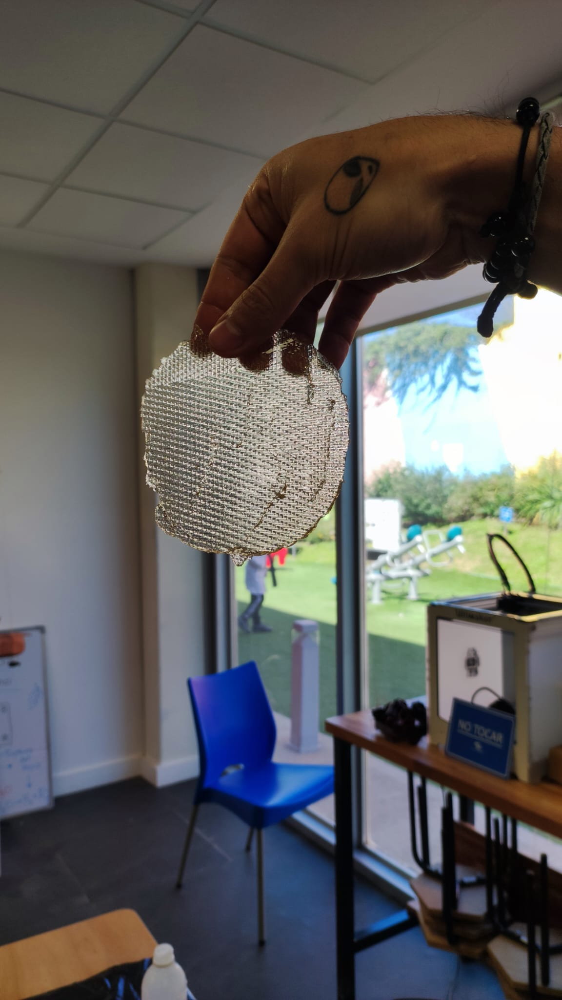

