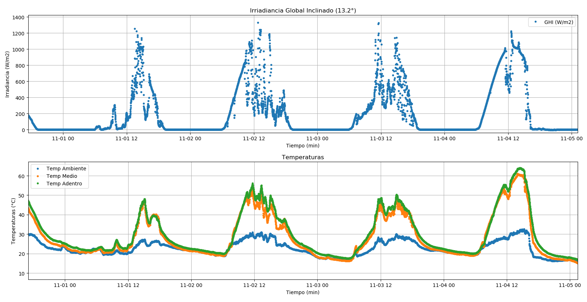
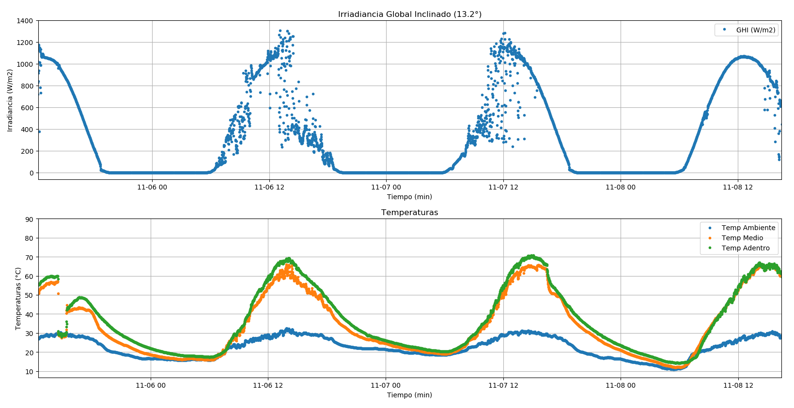
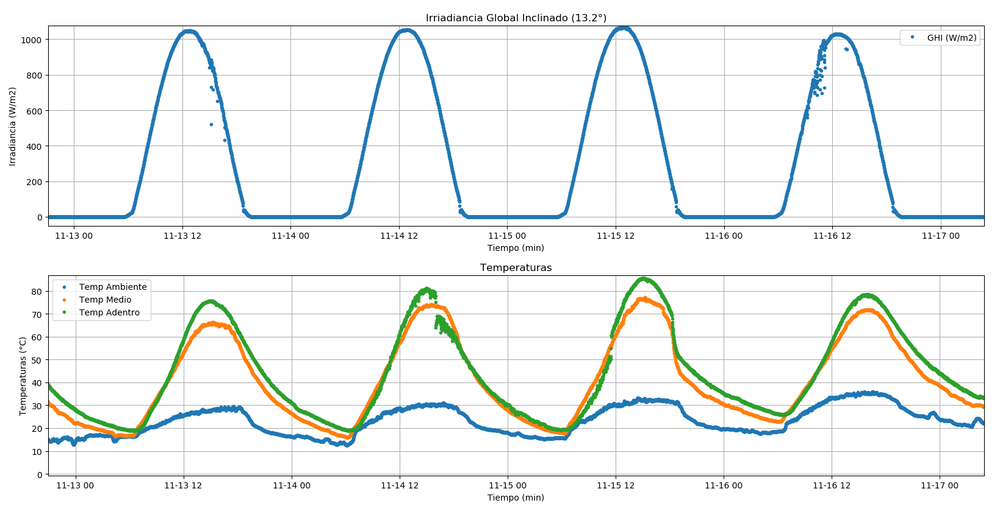

---
hide:
    - toc
---

# Prototipo

<strong><Mark>Construcción y pruebas de perdidas de calor</Mark></strong> 

Para la realización de este proyecto construí un prototipo que me ayudo a entender el funcionamiento de este y poder ir mejorándolo.

El prototipo comenzó con un primer diseño a mano en una hoja. En este primer diseño definí las características
principales que debería de tener como sus dimensiones y su inclinación.
La idea al definir sus dimensiones fue que sea algo de poco tamaño pero eficiente para que puede caber en lugares reducidos.
Su inclinación es de 13,2 grados, esto favorece más que nada la captación de radiación provenientes del sol más que nada
en los periodos de verano en nuestro país donde el sol toma su punto más alto. Esta inclinación también Devia favorecer la caída
de las gotas de agua acumuladas por la condensación en el vidrio superior.

<small>Ángulo Solar</small>

<small>Bosquejo inicial</small>

<strong>Construcción:</strong>

El prototipo lo construí con materiales que fui reciclado de diversas construcciones.
Como primeros pasos recolecte todos los materiales que iba a necesitar para la construcción.
El acumulador cuenta con una caja de madera, un vidrio, un nylon que recubre la parte interior para evitar las fugas de agua y un ducto que permite capturar las gotas que se deslizan por el vidrio y llevarlas al exterior para poder juntarlas.

<em>Pasos para la creación:</em>

Para la creación del prototipo utilice herramientas manuales. 
Comencé con el corte de la madera para hacer la caja donde estaría acumulada el agua que sería evaporada, realice los corte con una cierra circular eléctrica y lo ensamble con clavos y grampas.
Para la realización de los agujeros para la entrada y salida del agua los realice con un un taladro.
El vidrio lo sujete a la su base con silicona lo que me permitió sellarlo para que no se contamine el agua con objetos u agua de lluvia y también para que no haya perdidas de vapor.

<small>Corte y ensamble</small>

-Prueba 1:

Luego del armado proseguí a realizar algunas pruebas referentes a si tenía alguna fuga de agua y luego de esto para ver su funcionamiento.
Al ponerlo en el sol por varias horas vi que este no lograba condensar más que algunas gotas de agua. Esto se debía a que en esas primeras pruebas la radiación que estaba llegando era muy baja por que en ese periodo estaba saliendo del invierno y Otro de los motivos era que mi prototipo tenía muchas perdidas de calor la cual me impedía el aumento de temperatura.

-Prueba 2:

Como segunda mejora pinte la parte interior del condensador con pintura en aerosol de color negro para favorecer la acumulación de energía. También para evitar las pérdidas de calor opte por ponerle doble vidrio en la parte superior, esto para que existiera entre ambos vidrios un pequeño espacio de aire que me permitiría asilarla de la temperatura ambiente exterior y de los vientos existentes.
En esta reformación también opte por poner una placa reflectiva en su base interior la que en el transcurso de los días me di cuenta que esto empeoraba el rendimiento.

<small>Colocación de doble vidrio</small> 

 
<small>Fotos térmicas sin aislación</small>

Al ir realizando todos estos cambios no sabía que mejoras me beneficiaban y cuáles no. Lo cual para ello instale una estación de medida para que me ayude a obtener datos necesarios para las investigaciones y toma de decisiones en futuras mejoras.
La estación de medida consiste de un sensor PAR de medidas de Radiación Solar y tres sensores de medidas de temperaturas PT1000.
Todos estos datos eran recogidos por un adquisidor de datos (Dattalogger) el cual tomaba datos cada 10 segundos y realizaba el promedio minutal. Con esto podía graficar y ver los datos en tiempo real lo cual me favorecía un montón para ver los avances de las mejoras.
Cabe mencionar que la inclinación del sensor PAR estaba en la misma inclinación del vidrio y tanto la estación como el colector estaban orientados exactamente al norte solar.

<small>Adquisidor de datos y sensores de temperatura</small>

Datos:

<small>Gráfica de radiacón y temperaturas (Prueba 2)</smll>

En la gráfica podemos apreciar 4 días de pruebas. En la gráfica superior podemos observar la radiación Global en plano inclinado y en las de abajo las diferentes temperaturas obtenidas para ese día.
La grafica de temperatura en color azul es la temperatura ambiente, la de color naranja es la temperatura entre ambos vidrios y la de color verde es la interior del colector.
Al mirar las gráficas podemos apreciar que para una radiación de aproximadamente 1000W/m2 y una temperatura ambiente de 32°C tenemos una diferencia de temperatura con el acumulador de 33°C.

-Prueba 3:

Al examinar las fotos térmicas vistas anterior mente opte por aislar el acumulador. Utilice espuma plast de 2 cm de espesor y membrana refractante para mitigar las perdidas.

<small>Aislación térmica</smll>

<small>Fotos térmicas con una aislación</small>

<small>Gráfica de radiacón y temperaturas (Prueba 3)</small>

En la gráfica podemos observar una mejora del aumento de las temperaturas en el interior del acumulador.
Podemos analizar que para una radiación de aproximadamente 1050 W/m2 y una temperatura ambiente de 30°C tenemos una diferencia de aproximadamente 40°C.

-Prueba 4:

Luego de obtener los datos y examinarlos junto con las fotos térmicas se podía seguir notando que todavía existían perdidas de calor por la aislación anteriormente colocada. Al ver esto decidí colocarle otra capa de aislación para moderar está perdida de calor.
Junto a este cambio realice la extracción de la placa refractante que tenía en su lugar y en su lugar coloque grava de color negra, esto para que ayude en la acumulación de energía

<small>Fotos térmicas con doble aislación</small>

<small>Gráficas de radiación y temperaturas (Prueba 4)</small>

<small>Grava</small>

Observando las gráficas podemos ver que con una radiación de aproximadamente 1000W/m2 y una temperatura ambiente de 30°C tenemos una diferencia de temperatura de aproximadamente 50°C

<strong><Mark>Pruebas de agua<Mark></strong>

Para realizar las pruebas de agua utilice un instrumento el cual me permitia la medicion de varios parametros de los cuales tome la conductividad, salinidad y temperatura del agua.
Estos tres parametros estan relacionados entre si ya que al aumentar la temperatura tambien aumenta la conductividad del agua, lo que tambien ocurre si aumenta o disminuye la salinidad.

<small>Instrumento para medir salinidad, conductividad y temperatura<small>

Para realizar las pruebas tome agua provenientes de diferentes lugares. La primera prueba que realice fue sacando agua proveniente de la red de agua potable localizada en mi localidad y pasada por un filtro purificador. 
La siguiente prueba fue sacando agua de la misma red pero sin pasar por este purificador.
Al estar lejos de una fuente de agua de Mar y no tener acceso a ella opte por agregar una cantidad conocida de Cloruro de sodio (NaCl) a un volumen de agua haciendo asi que este fuera lo mas parecido al agua encontrada en el mar. 

<small>Agua salada</small>

<small>Datos obtenidos de las distintas pruebas</small>

<em>Producción:</em>
Para concluir las pruebas realice mediciones de cuanta cantidad de agua deslinizada podia llegar a obtener con todas estas mejoras.
En definitiva pude obtener hasta 350ml de agua en un dia de produccion. Esto a una radiacion de 1000W/m2 y a una temperatura ambiente de 30°C en sus extremos maximos.

<strong>Anexo:</strong>

<small>Tambla de medidas</small>

