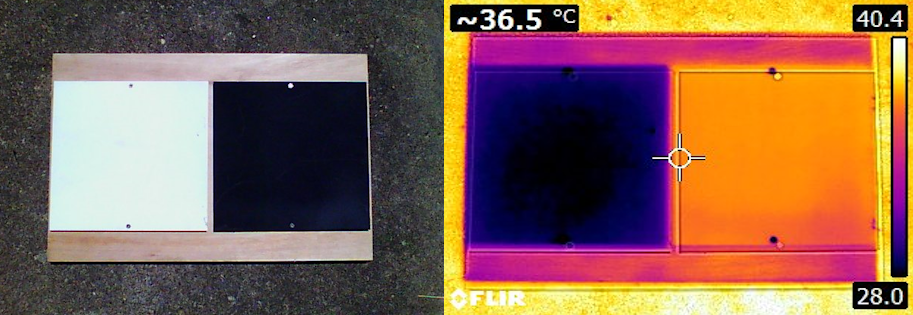

---
hide:
    - toc
---

# Ideas Iniciales

Cuando empecé la especialización, mi primera idea fue trabajar en un proyecto relacionado con los residuos plásticos que se generan en la agricultura. Es algo que veo en mi día a día y me parece un problema importante. Muchos productores no saben qué hacer con esos plásticos, y muchas veces terminan quemándolos para que el viento no los disperse por las chacras. Pero con el tiempo y a medida que fui avanzando en los módulos, mi idea inicial fue cambiando.

Fue durante el Módulo MI01 (Innovación y Sostenibilidad) cuando empezó a tomar forma mi interés por crear un desalinizador solar. En ese módulo, con un grupo de compañeros analizamos un proyecto que consistía en desalinizar agua usando energía solar. Esa idea me quedó dando vueltas en la cabeza, sobre todo porque me hizo recordar la situación que vivimos en el país el verano pasado. Hubo una sequía muy fuerte que afectó a gran parte del territorio, y la fuente principal de agua dulce de la capital estuvo a punto de agotarse. Como solución de emergencia, mezclaron agua dulce con agua de mar y la enviaron por la red de agua potable.

Ese problema me impactó mucho. Me resultaba increíble que algo así estuviera pasando, más aún cuando vivimos en un territorio que cuenta con uno de los acuíferos más grandes del mundo y tantos ríos caudalosos. Esto me llevó a reflexionar sobre las personas que no tienen acceso al agua potable, a pesar de que nuestro planeta está cubierto en su mayor parte por agua.

Otra razón por la que decidí hacer un desalinizador solar es que gran parte del agua del planeta es salada y no potable, pero al mismo tiempo, contamos con una fuente de energía que es abundante, gratuita y no contamina: el sol. Esta combinación me pareció una excelente oportunidad para crear un proyecto sencillo, sostenible y accesible, que pueda ayudar a resolver este problema tan importante y mundial.

# Marco teórico

<strong>Ciclo del Agua:</strong>

El ciclo del agua, también llamado ciclo hidrológico, es el proceso mediante el cual el agua circula por todo el planeta. Durante este proceso, el agua se desplaza y cambia de estado físico debido a factores como el calor y el frío, pasando por sus tres formas: líquido, sólido y gaseoso.

El ciclo del agua está compuesto por varias etapas: evaporación, condensación, precipitación, infiltración y escorrentía. Es un proceso fundamental para mantener el equilibrio del planeta y es indispensable para la vida.

No hay un punto exacto donde comience el ciclo del agua, ya que se trata de un proceso continuo en el que intervienen el clima, el viento y la energía del sol.

Una de las funciones más importantes del ciclo del agua es que ayuda a purificar el agua de forma natural. Gracias a las distintas etapas del ciclo, se eliminan impurezas, se reduce la salinidad y se asegura que el agua esté disponible para los ecosistemas y, en muchos casos, para el consumo humano.

<small>Foto ilustrativa del ciclo del agua</small>

El agua cubre el 71% de la superficie de la Tierra. Sin embargo, el 96,5% de esa agua se encuentra en los mares y océanos como agua salada, mientras que solo el 2,5% es agua dulce. De esta agua dulce, el 68,7% está congelada en casquetes polares y glaciares, el 30,1% se encuentra en manantiales subteráneos y menos del 1% está en ríos y arroyos.

Esto significa que, aunque el agua cubre gran parte de nuestro planeta, solo una pequeña porción es potable y apta para el consumo humano. Además, la contaminación del agua ha ido aumentando con el paso de los años, lo que agrava aún más el problema.

En el proyecto de purificación y desalinización del agua, se buscó imitar el ciclo del agua. El proceso funciona de la siguiente manera: el agua de mar se vierte en un recipiente construido especialmente para este fin. Dentro del recipiente, el agua absorbe la energía solar y, al aumentar la temperatura, se evapora. El vapor sube y, debido al efecto de la convección, choca contra la pared superior de la caja a menor temperatura.

Al entrar en contacto con una superficie de menor temperatura, el vapor se condensa y se forman gotas de agua. Estas gotas se deslizan por la pared superior hasta llegar a un tubo recolector.

Aunque este proceso se asemeja al ciclo del agua natural, no se completa de la misma manera, ya que el agua resultante no vuelve a entrar al sistema.

<small>Foto ilustrativa del ciclo dentro del desalinizador</small>

<strong>Transferencia de calor por los materiales:</strong>

Las distintas paredes nos separan del exterior, generando en su interior un microclima diferente. Esto se refleja, entre otras cosas, en una diferencia de temperaturas entre el interior y el exterior. Tanto en los cerramientos opacos como en los transparentes, se produce un intercambio de calor de un medio a otro. Debido a esta diferencia de temperaturas, el calor se pierde con más facilidad a través de los cerramientos transparentes. Este fenómeno se intensifica cuando el sol se oculta y la temperatura exterior baja.

<em>Vidrio:</em>

Cuando tenemos un cerramiento transparente con una sola lámina de vidrio y la temperatura interior es mayor que la exterior (como ocurre en invierno), el movimiento del aire transporta calor hacia la superficie fría del vidrio, haciendo que este pierda calor por conducción y convección. Para reducir este efecto, se utilizan dos vidrios separados entre sí, creando un espacio de aire o gas que actúa como aislante. Este tipo de diseño es muy común en hornos de cocina.

<em>Absorción de temperatura de los colores:</em>

Los materiales de color negro absorben casi toda la radiación que reciben y no la reflejan. Esto hace que aumente la temperatura de su superficie, ya que la energía absorbida se convierte en calor.

En el caso de la radiación solar, las superficies oscuras absorben una mayor cantidad de energía y, por lo tanto, se calientan más que las superficies de colores claros, las cuales reflejan gran parte de la radiación solar y se mantienen más frías.

<small>Experimento realizado con dos placas de diferentes colores</small>

Aquí podemos ver cómo los materiales de color negro alcanzan temperaturas más altas que las superficies blancas o metálicas cuando se exponen a la radiación solar.

<em>Inercia térmica de algunos materiales:</em>

La inercia térmica es la capacidad de un material para resistir y absorber los cambios de temperatura cuando se somete a variaciones de calor o frío. En otras palabras, un material con alta inercia térmica se calienta y enfría lentamente, mientras que uno con baja inercia térmica cambia de temperatura rápidamente.

Esto ocurre en materiales como piedras, ladrillos y concreto, que, debido a su alta densidad y capacidad para retener calor, absorben y liberan energía de forma gradual. Esto ayuda a regular la temperatura interna de algunos sistemas.

<strong>Referencias:</strong>

https://www.iingen.unam.mx/es-mx/Investigacion/Proyecto/Paginas/Destiladorsolarparaagua.aspx

https://www.fundacionaquae.org/agua-dulce-de-agua-salada/

<strong>Bibliografía:</Strong>

https://concepto.de/ciclo-del-agua/

https://concepto.de/ciclo-del-agua/#ixzz8syGRpLNJ

Facultad de Arquitectura UdelaR - Cátedra de Acondicionamiento Térmico

Duffie, J.A., & Beckman, W.A. (2013). Solar engineering of thermal processes (4th ed.). Wiley.

Apuesta por la piedra natural: inercia térmica
