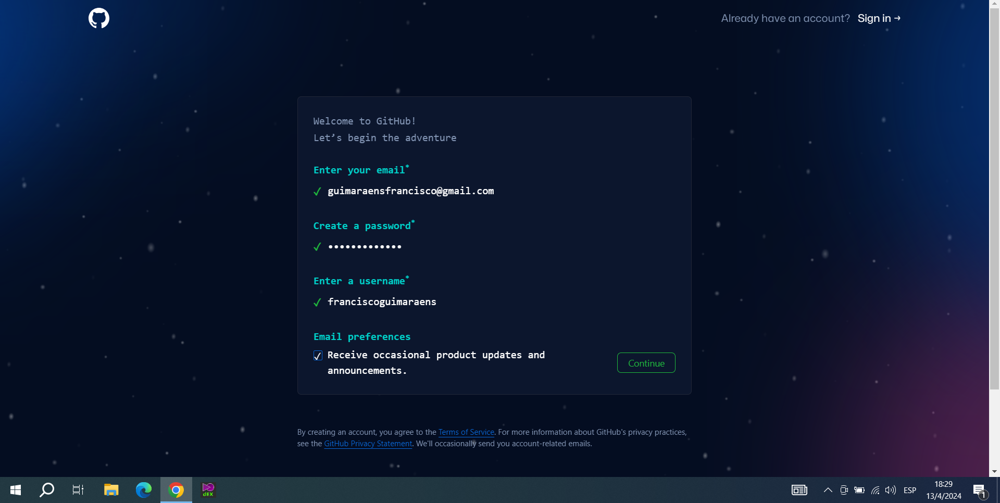
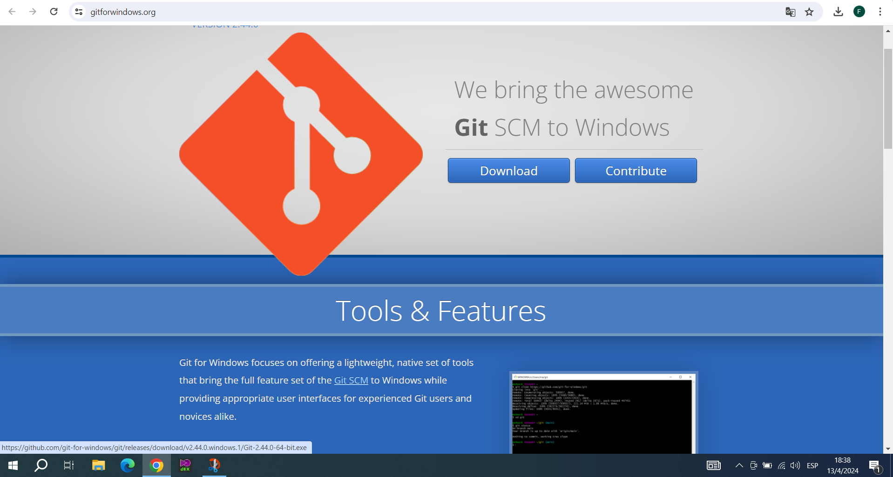
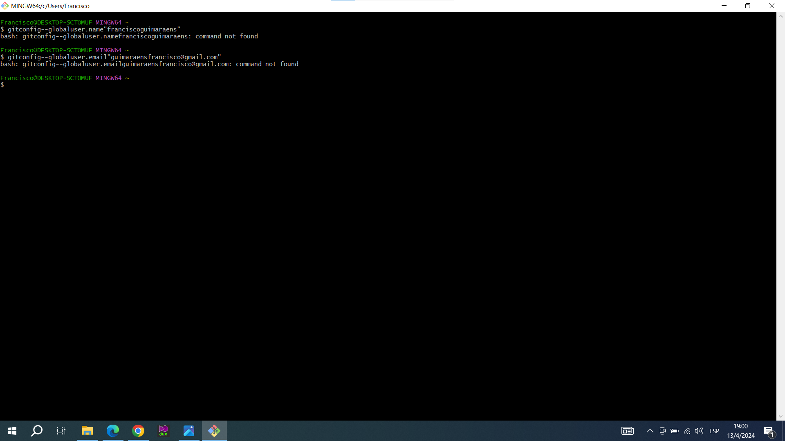
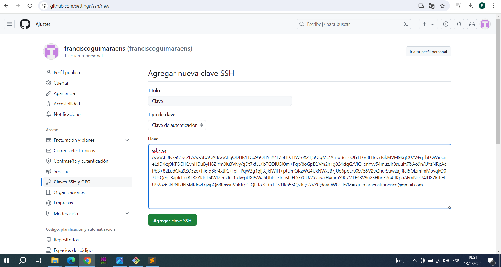
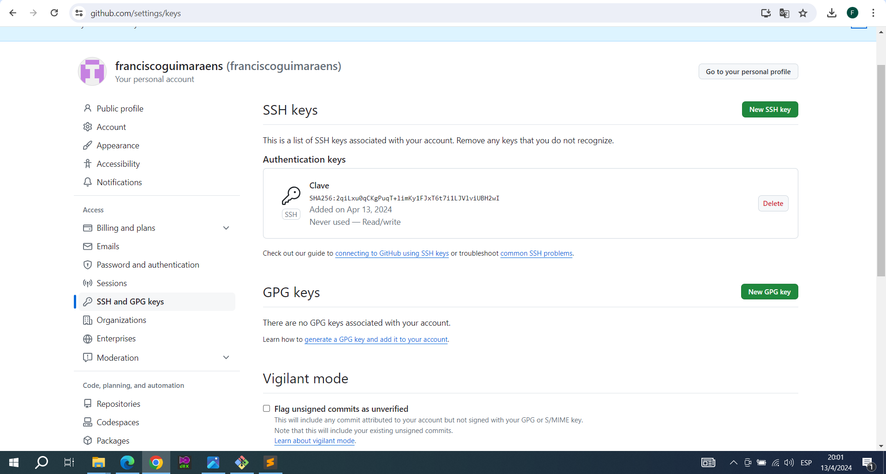
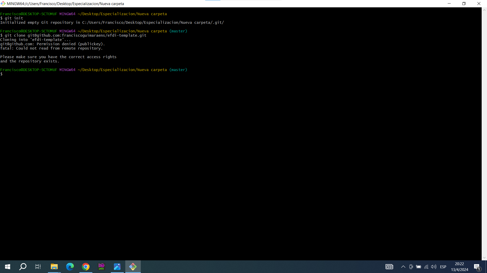
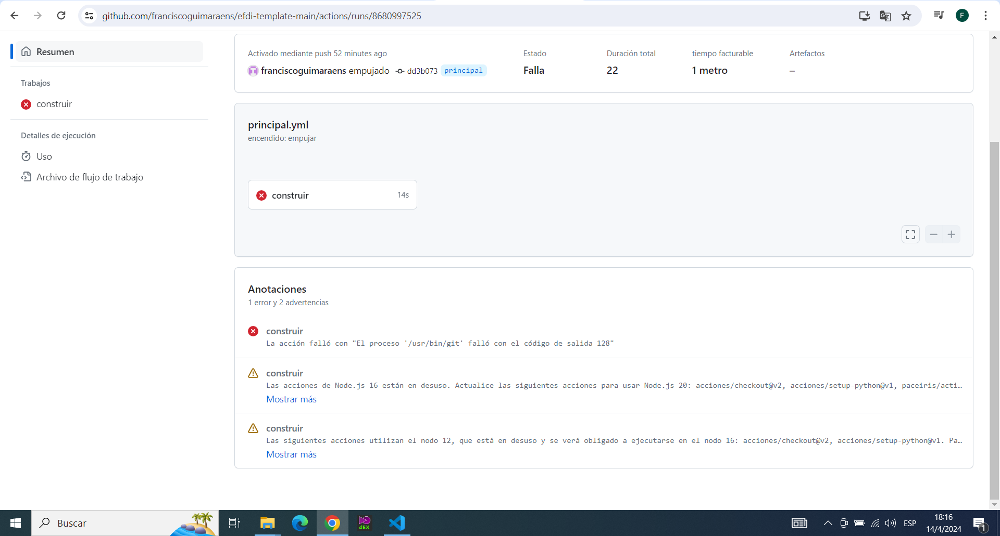
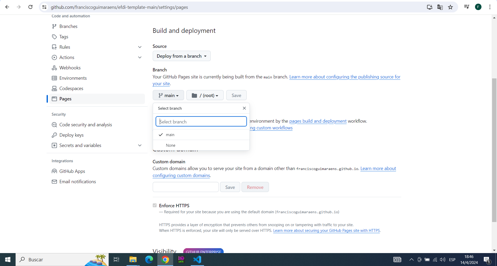

---
hide:
    - toc
---

# MT01

Comenzé haciendo mi cuenta en Git Hub

Descargue el terminal Git

Comenze a ecribir en la terminal, pero comenze a cometer errores como poner mi nombre y gmail entre comillas. Esto me llevo un tiempo en encontrar el error.

Despues de varios intentos pude crear la clave

Y a continuación la llave

Despues de esto, al intentar clonar el codigo y descargarlo a mi PC no me funcionaba, asi que procedi a descargarlo como ZIP. 
Descargue el Visual Studio y abri el archivo pero este al estar comprimido no me dejaba ver, asi que lo descomprimi y lo volvi a abrir.

Al intentar crear mi pagina me aparecian errores y no me aparecian las opciones que necesitaba 

