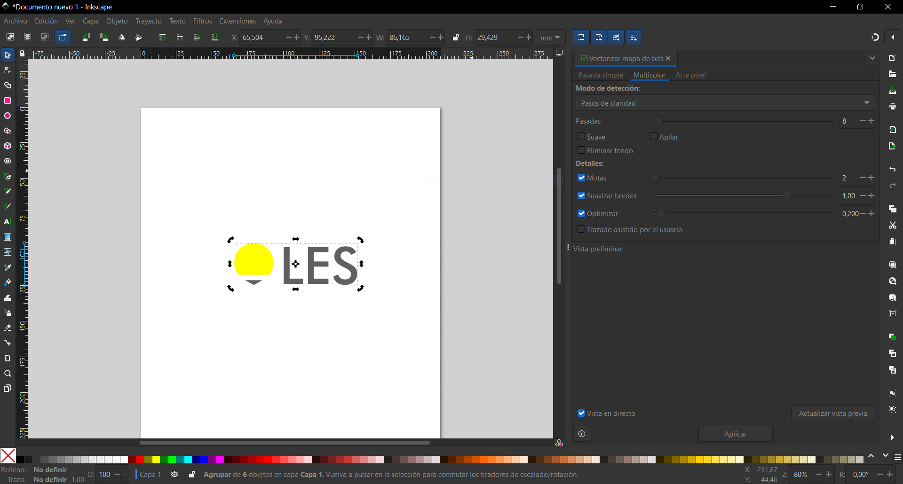

---
hide:
    - toc
---

# MT02

Diseño en tinkercard de un soporte para calibración de sensores de temperatura.
Este soporte lo copie de uno ya existente en mi lugar de trabajo, este soporte lo utilizamos para sujetar los sensores a calibrar y tambien el sensor de referencia. Le realice una mejora la cual consiste en un soporte especificamente para sujetar la baina del sensor de referencia.  

