---
hide:
    - toc
---

# MT02
<strong>Introducción:</strong>

En este módulo nos asignaron como consigna crear un objeto utilitario que contenga al menos dos piezas y que cuente con un logo en relieve. Para eso se necesitaba un modelo en 2D para posteriormente modelarlo en 3D.

<strong>Actividad:</strong>

En mi caso para la creación del logo utilicé la aplicación Inkscape. Esta aplicación me sirvió para editar una imagen pixelar que descargue de internet. Con la imagen lo que hice fue vectorizarla, osea pasar de una imagen pixelar a una imagen vectorizada.

Para el modelado en 3D mi intención era realizarlo en fusion 360, pero tuve algunos problemas a la hora de descargarlo, entonces utilice la aplicación tinkercard ya que es gratuita y para este tipo de proyecto cumplía con los requisitos.

<strong>Pasos:</strong>

<strong>1)</strong> El primer paso a realizar es elegir o descargar la imagen que vamos a utilizar para vectorizar, en este caso utilice un logo ya existente. Abrimos la imagen en Inkscape y en el caso que queramos añadirle alguna palabra al logo lo hacemos para luego realizar la vectorización, luego de culminada esta parte guardamos la imagen (.SVG) en una carpeta conocida.

<strong>2)</strong> Para el modelado en 3D procedemos a abrir tinkercard y comenzamos a realizar nuestro objeto. En este caso comencé por la base del soporte para luego crear la columna que sostendrá las demás piezas.
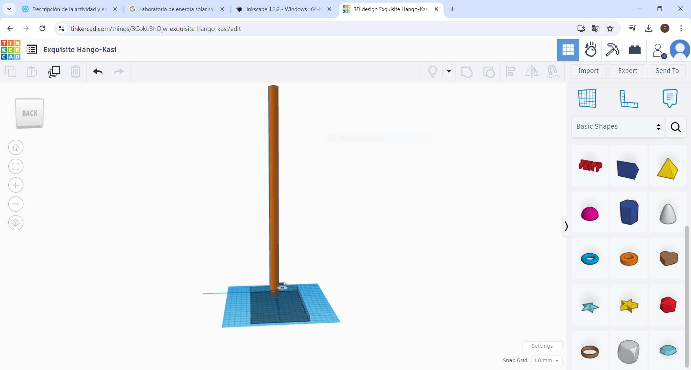
<strong>3)</strong> Cree uno de los brazos con sus piezas correspondientes y luego duplique este para crear el segundo brazo.
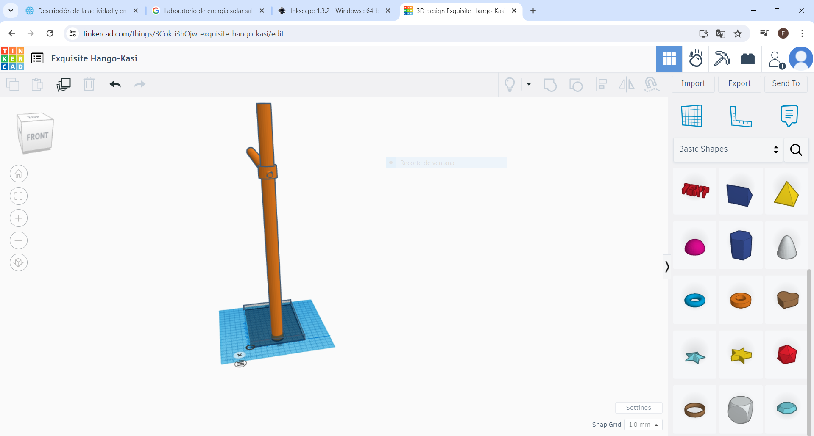
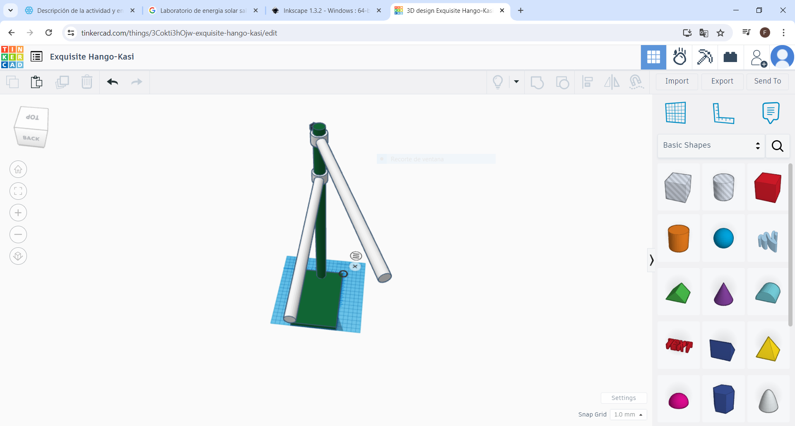
<strong>4)</strong> Apliqué en la base del soporte el logo visto anteriormente. a dicho logo le cree relieve y lo agrupe a la base para fijarlo.
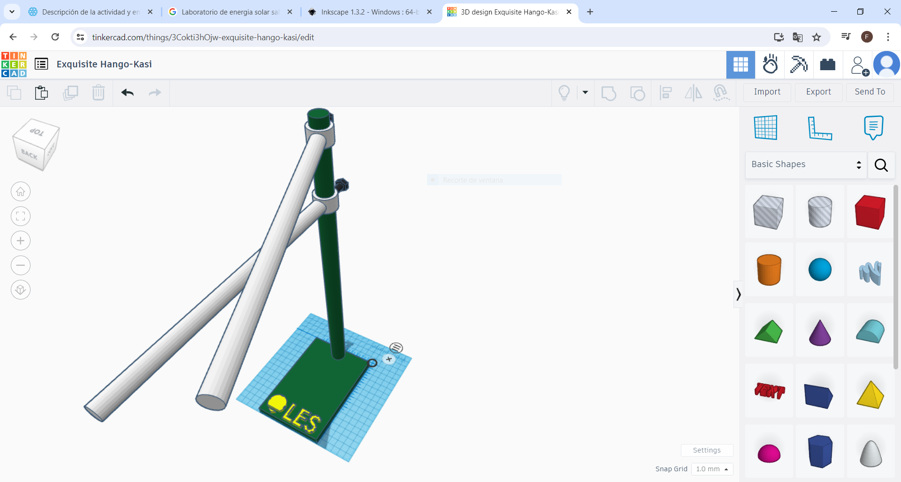
<strong>5)</strong> Proyecto terminado visto en dos ángulos distintos.
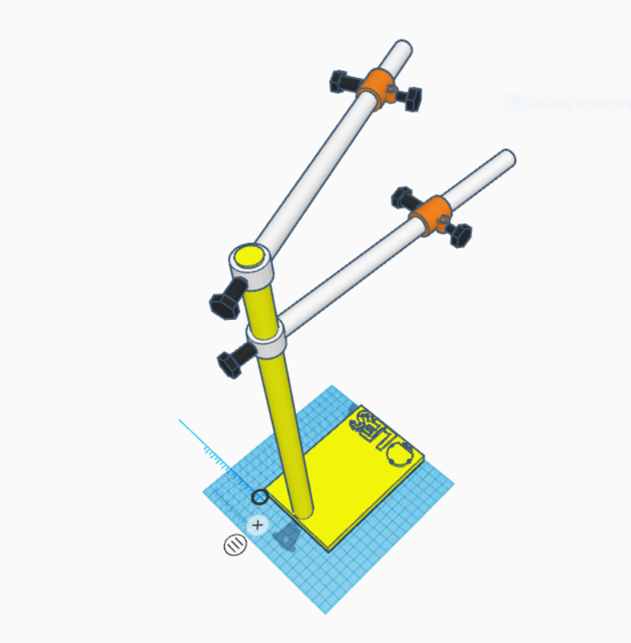
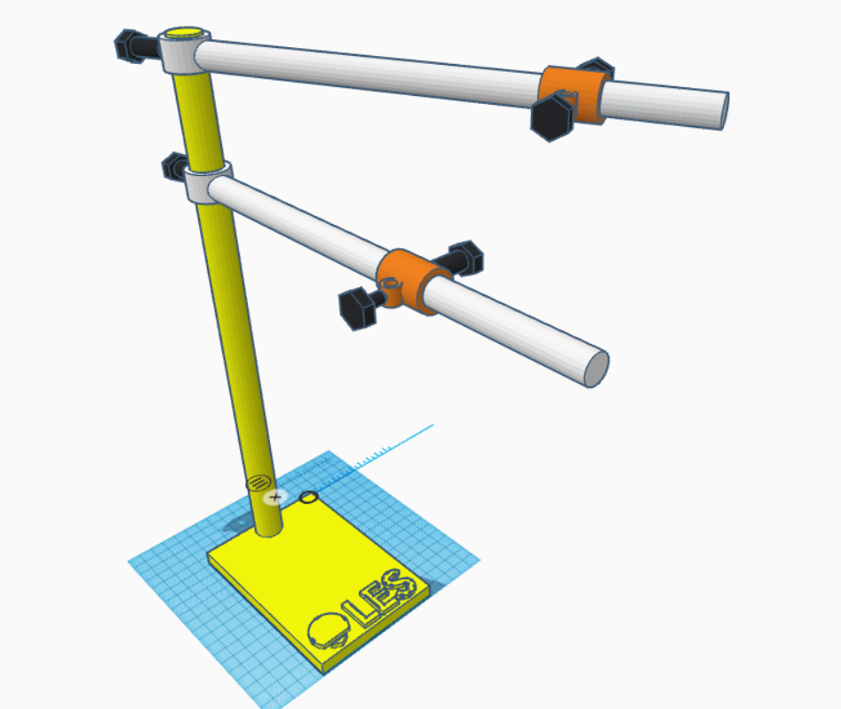

<strong>Anexo:</strong>

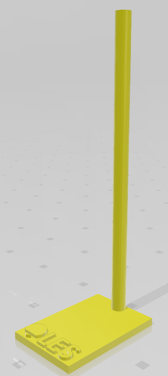

Base con columna.

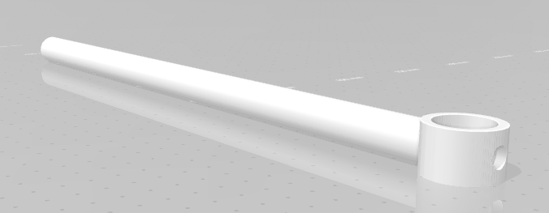

Brazo.

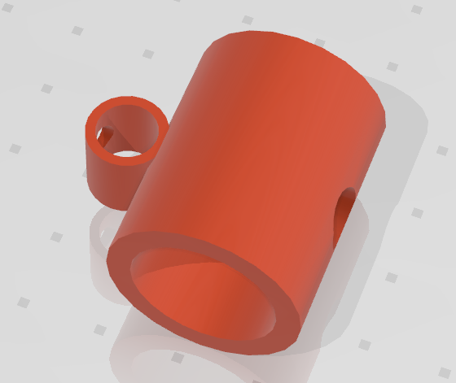

Sujetador de sensor.

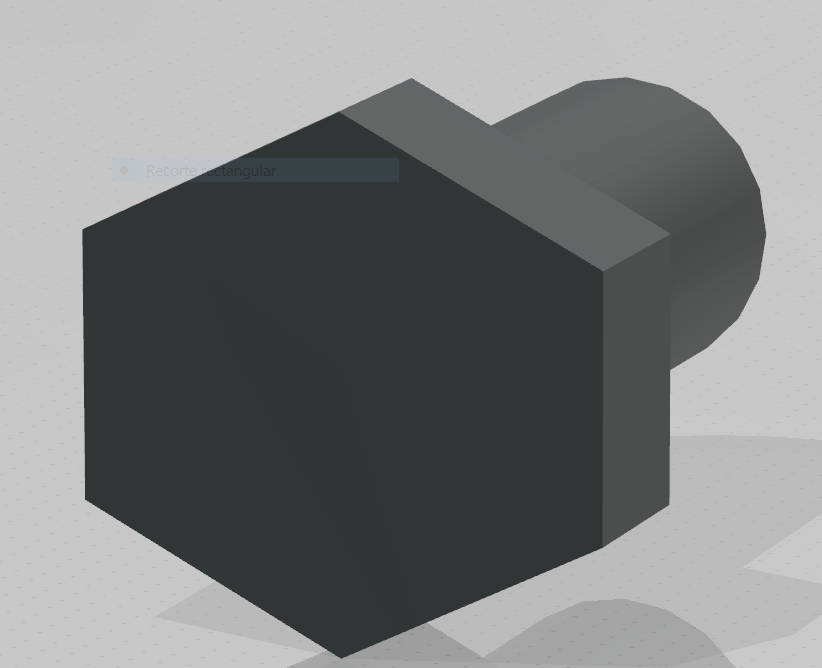

Tornillo.

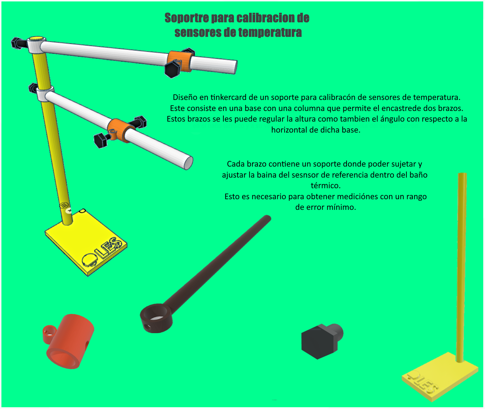

Presentación del trabajo final.
 
Para realizar esta hoja utilice la aplicación de Paint.net.

<strong>Descripción:</strong>

Diseño en tinkercard de un soporte para calibración de sensores de temperatura.
Este soporte lo copie de uno ya existente en mi lugar de trabajo, a este lo utilizamos para sujetar los sensores a calibrar y también el sensor de referencia. Le realice una mejora la cual consiste en un soporte específicamente para sujetar la baina del sensor de referencia.  

<strong>Nota:</strong> 

Cabe destacar que no tenía grandes conocimientos en este tipo de programas de modelado en 3D, tengo algo de conocimientos en AutoCAD únicamente en 2D ya que lo utilizaba para la creación unifilar de sistemas eléctricos.
Tinkercard supero mis expectativas ya que en un principio me pareció muy básico. Para un principiante como yo fue de gran utilidad para familiarizarme con este tipo de modelado.

Click aquí para descargar lámina:  <a href="../Nuevacarpeta/a.png" download="proyectoFG"> <strong>Descargar</strong> </a>

Click aqui para descargar proyecto en stl:  <a href="../Nuevacarpeta/Proyecto.stl" download="proyectoFG.stl"> <strong>Descargar</strong> </a>

<i>Proyecto en tinkercard:</i> https://www.tinkercad.com/things/3Cokti3hOjw-exquisite-hango-kasi/edit

