---
hide:
    - toc
---

# MT03

<strong>Introducción:</strong>

Como cierre de este modulo teniamos que diseñar un objeto para ser cortado con una maquina laser.

Objetivo:

El objeto deberia de tener al menos 3 piezas y estas deberian de ser encastrables entre si para mantenerse undias, sin necesidad de usar pegamentos o fijacion externas. Tambien poder utilizar las tres funciones basicas de la maquina las cuales son: Grabado raster, grabado sobre vector y corte sobre vector.

Actividad:

1) Para dicha actividad quise hacer una mesa a pequeña escala, y para efectuarla utilice el programa de diseño Fusion 360. 
En un principio comenze realizando mi dibujo en un plano de dos dimenciones con algunos de los encastres para su futura fijación. 

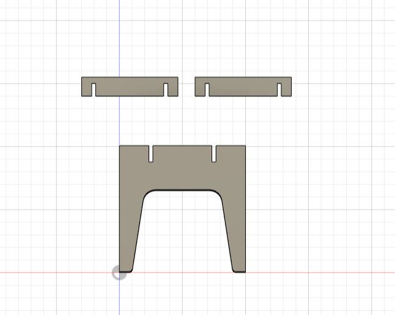

Luego de haber realizado el dibujo completo con sus detalles prosegui a realizar la extrucion de la pieza, que en este caso deberia de ser de 3mm porque es el espesor del material a utilizar.
Cada ranura donde van encastradas las piezas debe de ser del mismo espesor de la pieza a encastrar más 0.2mm de holgura. Esta holgura sirve para que al momento de encastrar las piezas se pueda hacer de manera facil y asi evitar que se dañen. 

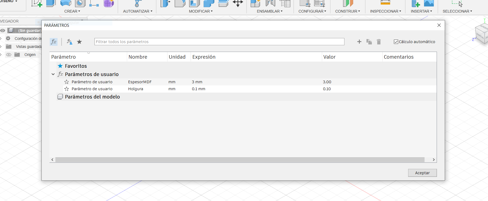

Para realizar estas extuxiones, ranuras y holgura se puede utilizar la opcion de parametros que dispone Fusion 360 como muestra la imagen. En este caso es muy util ya que si en algun momento se quiere utilizar otro material con un espesor distinto solamente debemos de modificar el parametro y listo, en cambio si lo hacemos con una medida fija y quisieramos utilizar otro material con otro espesor deberiamos de hacer de nuevo todo el diseño.  

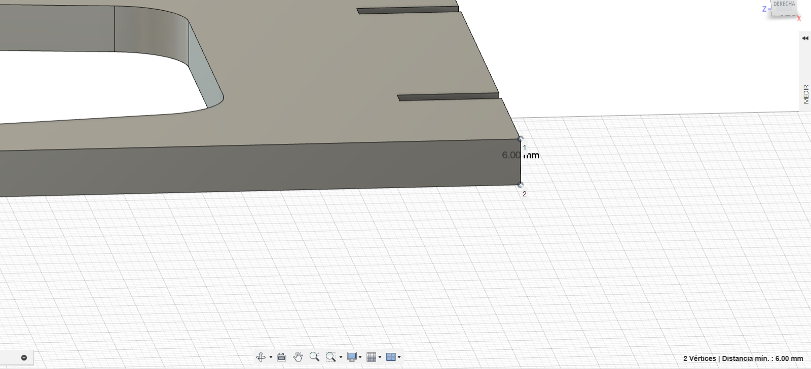
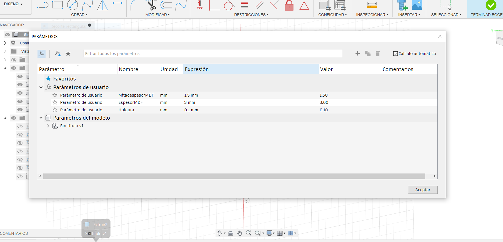

En mi caso tuve un problema ya que al estruir las pieza de forma simetrica con el parametro fijado en 3mm me extruia el doble, haciendo que las piezas me quedara el doble de lo requerido. Para ello la solucion que encontre fue crear otro parametro con la mitad del espesor del del material.

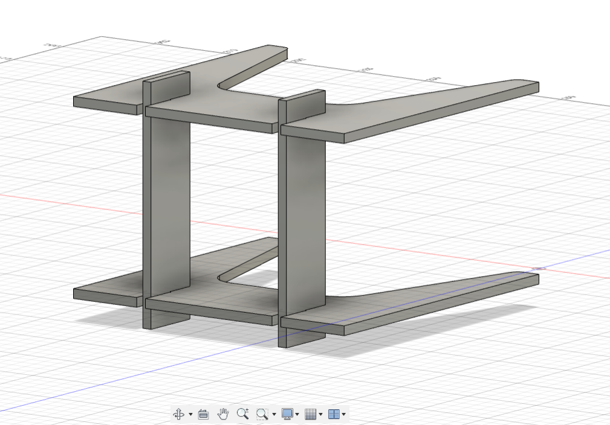
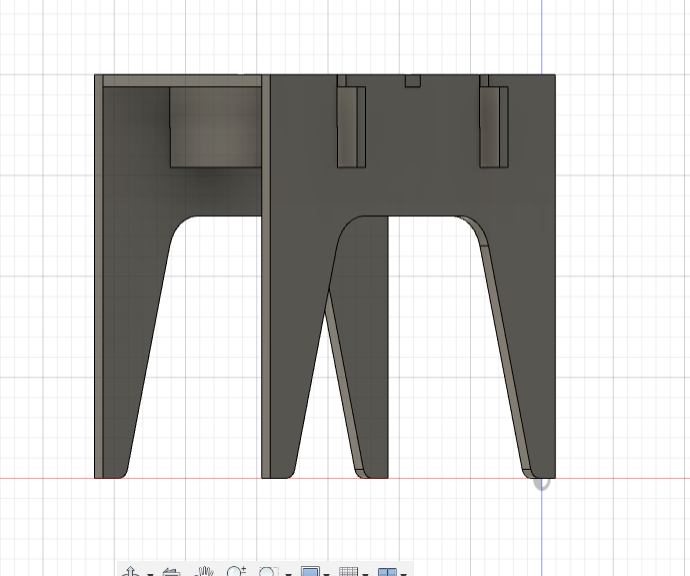
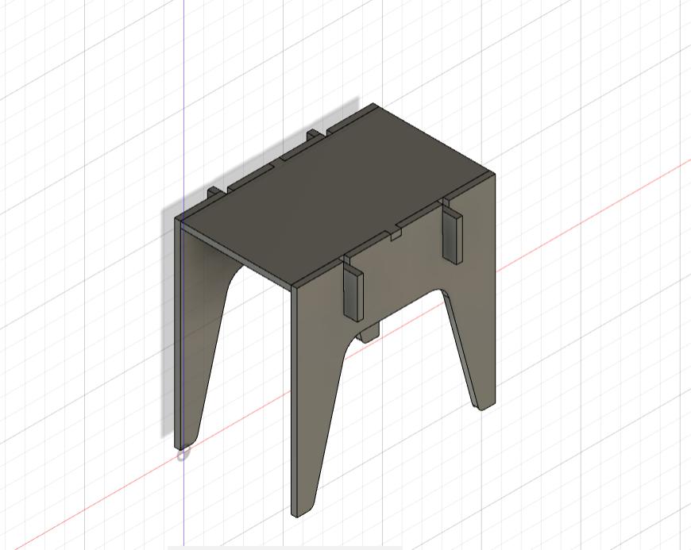

Luego de realizar todas las piezas las ensamble y asi se ve el producto terminado.
Al terminar de diseñar y modificar el producto descargamos las piezas en un formato .DXF.

2) Cargamos nuestros archivos de las piezas en un progrma vectorial, en mi caso utilice el programa inkscape. 
Este programa nos permite vectorizar y unir todas las lineas de nuetra pieza para que la cortadora laser realice su trabajo correctamente. Tambien si hay lineas sobrantes donde no querramos que pase nuetra cortadora aca es el momento de eliminarlas.

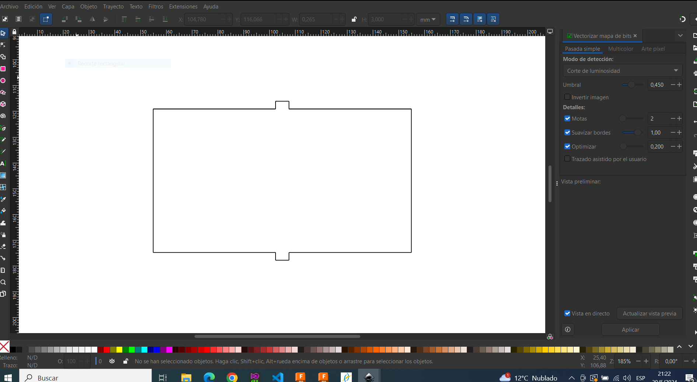
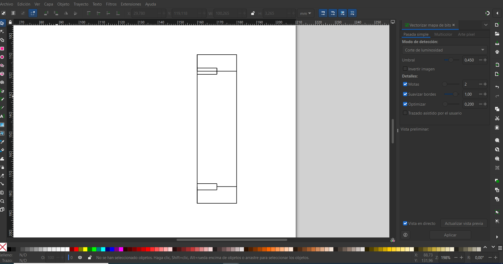
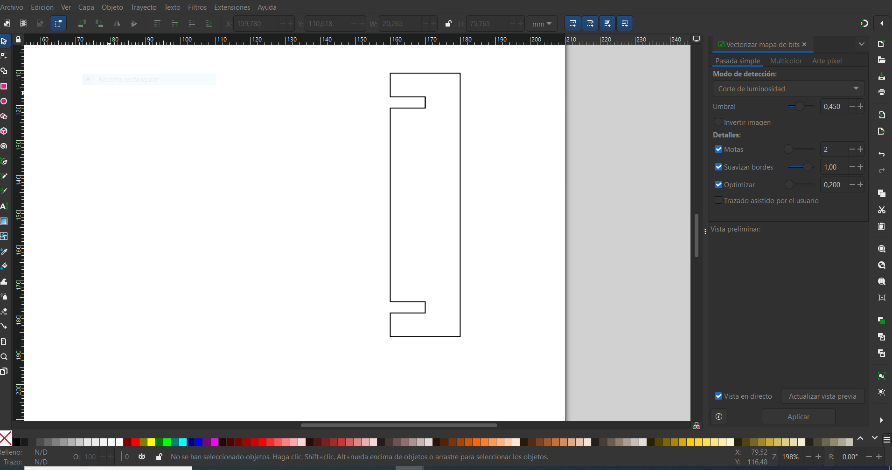

Esto se realiza con cada una de las piezas y se lo guarda en formato .DXF, tambien se debe de vectorizar el logo si es que se lo quieren aplicar a alguna pieza.

3) Para terminar y poder cortar nuestras piezas debemos de cargarlas a un progrma que nos genere un archivo compatible con nuestra cortadora laser. En este caso utilizamos el programa RDworksv8 que nos genera un archivo Gcode.

Preparacion del programa donde le especificamos las dimensiones de corte de la maquina.

Preparacion del logo en la parte superior de la mesa.

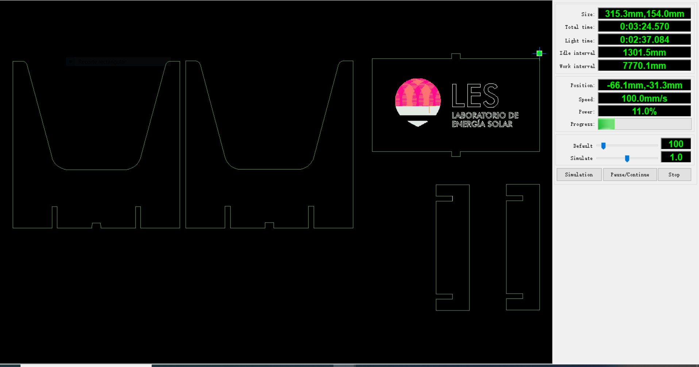
Simulacion de corte y grabado.

En el programa debemos de especificarle a la maquina que partes de las piezas son para para realizar corte y cuales son para realizar un grabado, esto se hace seleccionando y definiendole colores a las partes de nuestros objetos.

Anexo:

Realice un diseño aparte de Kerf bending para experimentar con esta pieza las posibilidades y caracteristicas que puede llegar a tomar el material.

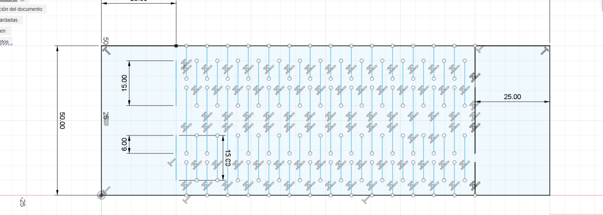
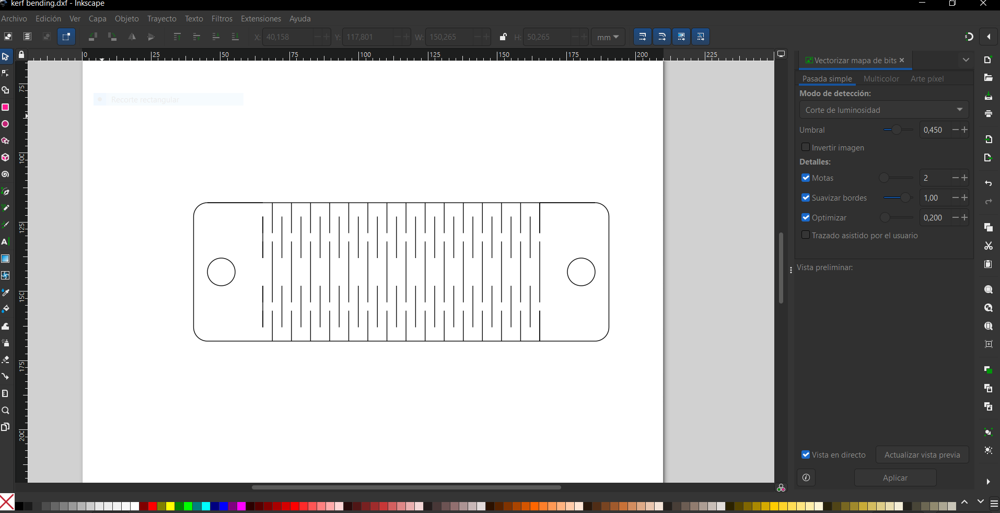

Click aqui para descargar G-code mesa:<a href="../Nuevacarpeta/CorteFranciscoGuimaraens.rd" download="G-codemesa.rd"> <strong>Descargar</strong> </a>
Click aqui para descargar G-code kerfbending:<a href="../Nuevacarpeta/Kerfbendin.rd" download="G-codemesa.rd"> <strong>Descargar</strong> </a>