---
hide:
    - toc
---

# MT03

<strong>Introducción:</strong>

Como cierre de este módulo teníamos que diseñar un objeto para ser cortado con una maquina laser. Aquí voy a describir las herramientas y demostrar la forma en la que realice dicha actividad.

<strong>Objetivo:</strong>

El objeto debería de tener al menos 3 piezas y estas deberían de ser encastrables entre sí para mantenerse unidas, sin necesidad de usar pegamentos o fijación externas. También poder utilizar las tres funciones básicas de la maquina que son: Grabado raster, grabado sobre vector y corte sobre vector.

<strong>Actividad:</strong>

1) Para dicha actividad quise hacer una mesa a pequeña escala, y para efectuarla utilicé el programa de diseño Fusion 360. 
En un principio comencé realizando mi dibujo en un plano de dos dimensiones con algunos de los encastres para su futura fijación. 

Luego de haber realizado el dibujo completo con sus detalles proseguí a realizar la extrusión de la pieza, que en este caso debería de ser de 3mm porque es el espesor del material a utilizar.
Cada ranura donde van encastradas las piezas debe de ser del mismo espesor de la pieza a encastrar más 0.2mm de holgura. Esta holgura sirve para que al momento de encastrar las piezas se pueda hacer de manera fácil y así evitar que se dañen. 

Para realizar estas extusiones, ranuras y holgura se puede utilizar la opción de parámetros que dispone Fusion 360 como muestra la imagen. En este caso es muy útil ya que si en algún momento se quiere utilizar otro material con un espesor distinto solamente debemos de modificar el parámetro y listo, en cambio sí lo hacemos con una medida fija y quisiéramos utilizar otro material con otro espesor deberíamos de hacer de nuevo todo el diseño.  

En mi caso tuve un problema ya que al extruir la pieza de forma simétrica con el parámetro fijado en 3mm me extruia el doble, haciendo que las piezas me quedasen el doble de lo requerido. Para ello la solución que encontré fue crear otro parámetro con la mitad del espesor del del material.

Luego de realizar todas las piezas las ensamble y así se ve el producto terminado.
Al terminar de diseñar y modificar el producto descargamos las piezas en un formato .DXF.

2) Cargamos nuestros archivos de las piezas en un programa vectorial, en mi caso utilice el programa inkscape. 
Este programa nos permite vectorizar y unir todas las líneas de nuestra pieza para que la cortadora laser realice su trabajo correctamente. También si hay líneas sobrantes donde no queramos que pase nuestra cortadora acá es el momento de eliminarlas.

Esto se realiza con cada una de las piezas y se lo guarda en formato .DXF, también se debe de vectorizar el logo si es que se lo quieren aplicar a alguna pieza.

3) Para terminar y poder cortar nuestras piezas debemos de cargarlas a un programa que nos genere un archivo compatible con nuestra cortadora laser. En este caso utilizamos el programa RDworksv8 que nos genera un archivo Gcode.

Preparación del programa donde le especificamos las dimensiones de corte de la máquina.

Preparación del logo en la parte superior de la mesa.

Simulación de corte y grabado.

En el programa debemos de especificarle a la máquina que partes de las piezas son para para realizar corte y cuales son para realizar un grabado, esto se hace seleccionando y definiéndole colores a las partes de nuestros objetos. 
Al finalizar guardamos el archivo para posteriormente enviárselo a la cortadora laser y asi poder realizar nuestros cortes.

<strong>Anexo:</strong>

Realice un diseño aparte de Kerf bending para experimentar con esta pieza las posibilidades y características que puede llegar a tomar el material con este tipo de cortes.

<strong>Conclusión/Reflexión:</strong> Completar este Módulo ha sido un camino muy lindo, con desafíos y lleno de aprendizaje, en el cual aprendí sobre nuevas tecnologías y nuevos programas. Para mi es la primera vez utilizando el programa de diseño Fusion 360, el cual me pareció muy interesante y bastante fácil de usar. Además, todo este camino me esta ayudando a familiarizarme aún más con la programación.
Me intereso el diseño Kerf bending porque podemos a partir de un material solido diseñar objetos que tengan plegados sin necesidad de un corte total de la pieza.    
Ahora en mas queda llevarlo a la practica y ver el proceso.

<strong>Links:</strong>

Click aqui para descargar G-code mesa:<a href="../Nuevacarpeta/CorteFranciscoGuimaraens.rd" download="G-codemesa.rd"> <strong>Descargar</strong> </a>

Click aqui para descargar diseño de mesa:<a href="../Nuevacarpeta/Mesa.f3d" download="mesa.f3d"> <strong>Descargar</strong> </a>

Click aqui para descargar G-code kerfbending:<a href="../Nuevacarpeta/Kerfbendin.rd" download="G-codekerfbending.rd"> <strong>Descargar</strong> </a>

Click aqui para descargar diseño de kerfbending:<a href="../Nuevacarpeta/kerfbendingv1.f3d" download="kerfbending.f3d"> <strong>Descargar</strong> </a>

Click aqui para descargar DXF: <a href="../Nuevacarpeta/PartesDXF.zip" download="Partes"> <strong>Descargar</strong> </a>

<strong>Taller</strong>

En el taller se llevo a cabo la puesta en practica con la cortadora laser.

<Strong><em>Procedimiento:</em></strong>

Los primeros pasos fueron elegir el material que disponía el laboratorio para el corte, que consiste en elegir una placa de MDF de espesor de 3mm lo más plana posible. Luego de esto ponerlo en la mesa de la cortadora laser y verificar que el puntero este con una separación adecuada para este tipo de corte que en nuestro caso fue 6mm.
Luego de esto colocar el puntero en el lugar de origen donde se va a comenzar el corte, verificar que estén encendidos el compresor y extractor de aire para un correcto funcionamiento de la máquina.
El siguiente paso es cargar los archivos a la cortadora laser y verificar por ultima vez si todos los parámetros están como nosotros lo deseamos. Luego de esto dar inicio al corte.

<strong><em>Corte de mesa:</em></strong>

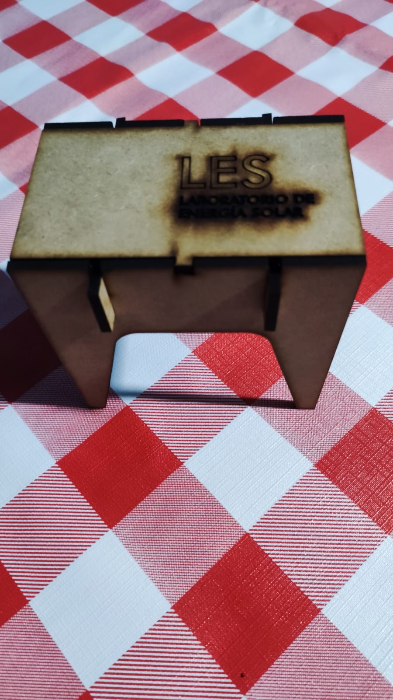

En mi caso al realizar los primeros cortes y encastrar las piezas nos dimos cuenta que la holgura en los encastres era muy grande, por lo que procedimos a modificar ese parámetro en el programa de diseño e importarlo nuevamente a la cortadora.
También modificamos la potencia y velocidad para el grabado del logo en el cual le dimos un poco mas de velocidad y menor potencia para el grabado. 

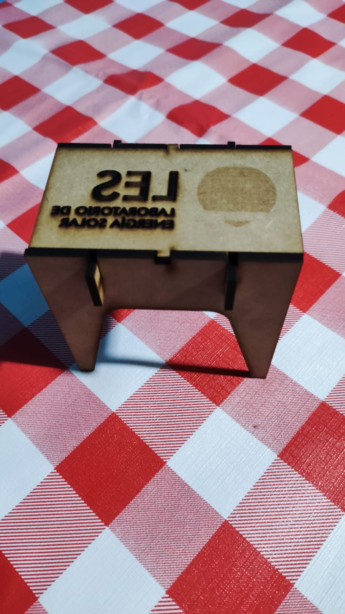

En la segunda prueba experimentamos el grabado del logo y letras con un grabado línea por línea. En este caso cometí un error de colocar el logo a la inversa.
Cabe mencionar que el encastre en este caso quedo muy bien con una holgura de 0.5mm.

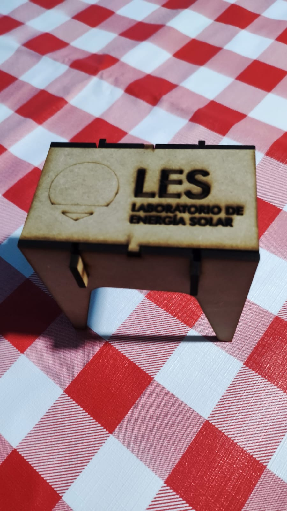

Para el ultimo caso lo que hicimos fue usar los mismos parámetros que el anterior, con misma potencia y velocidad, pero modificamos el logo haciendo que este se viera únicamente el contorno.

<strong><em>Corte kerf bending:</em></strong> 

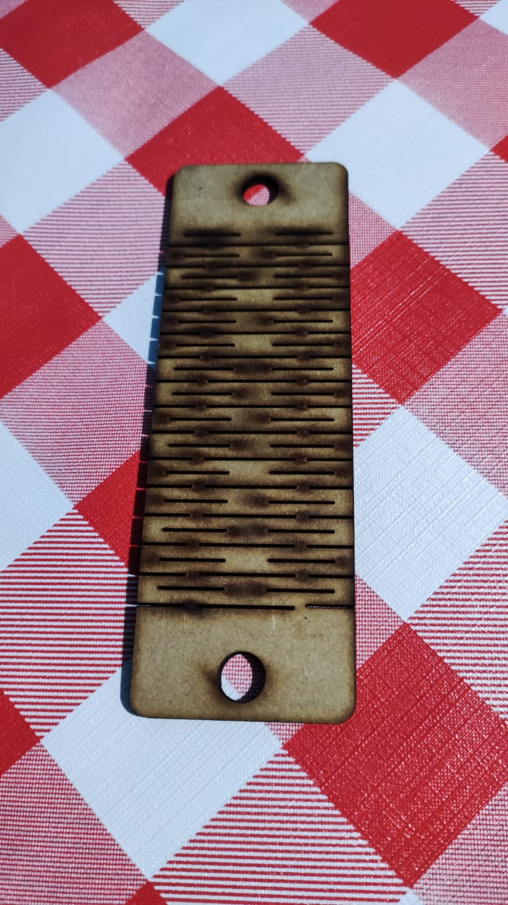

Realizamos dos cortes de este diseño, el cual pudimos ver que este primero tenía muy pocas líneas de cortes y con una separación muy grande, esto conlleva a que la pieza no tenga tanta flexibilidad (separación entre corte 3mm).

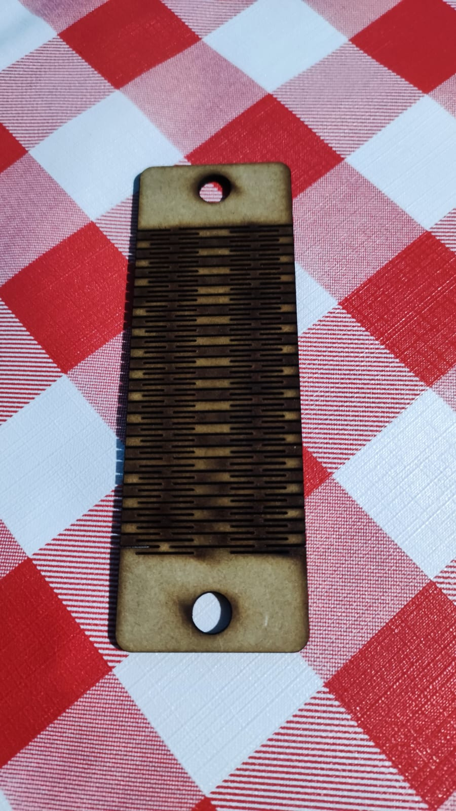

Para este segundo lo que hicimos fue rediseñar duplicando la cantidad de líneas de cortes, haciendo que este obtenga mejores resultados a la hora de intentar flexionarlo (separación entre corte 1.5mm)

<strong><em>Variables:</em></strong>

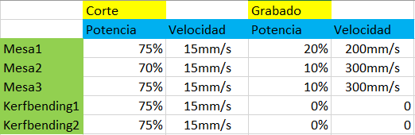

Potencias y velocidades utilizadas para los diferentes cortes y grabados

<strong><em>Anexo:</em></strong>

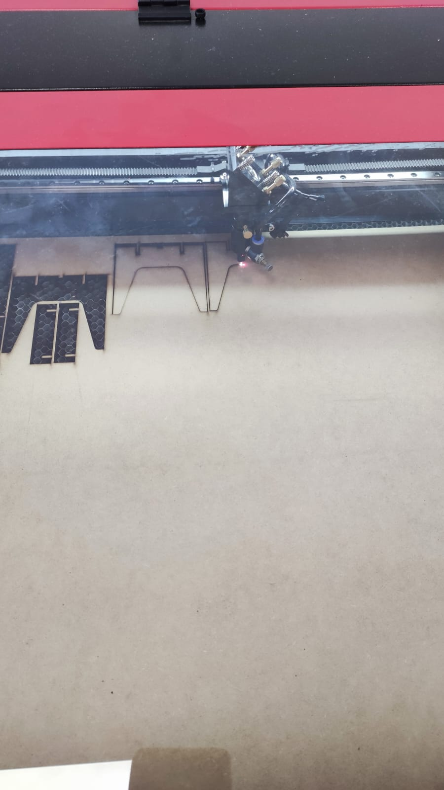

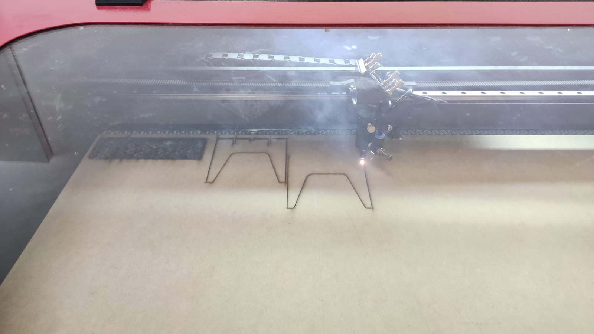
Corte de piezas 

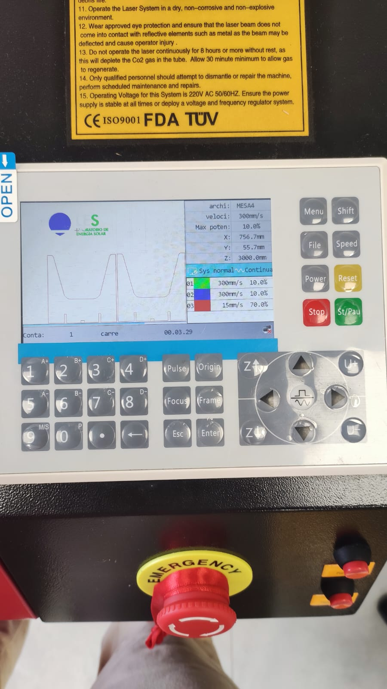
Proceso y parámetros vistos desde la cortadora laser 

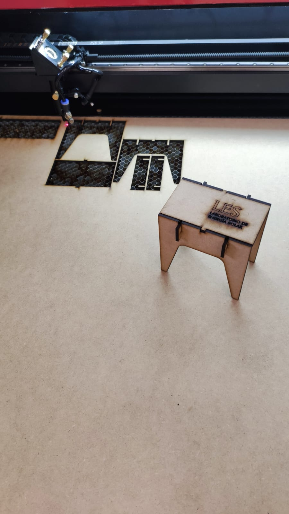
Mesa terminada y ensamblada 

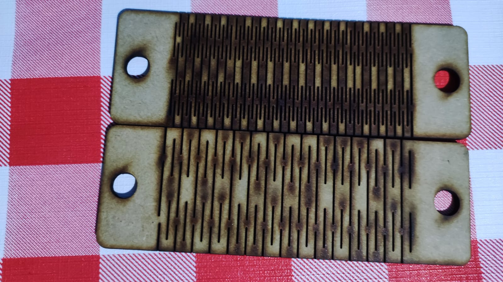
Difernecia entre piezas con diseño kerfbending

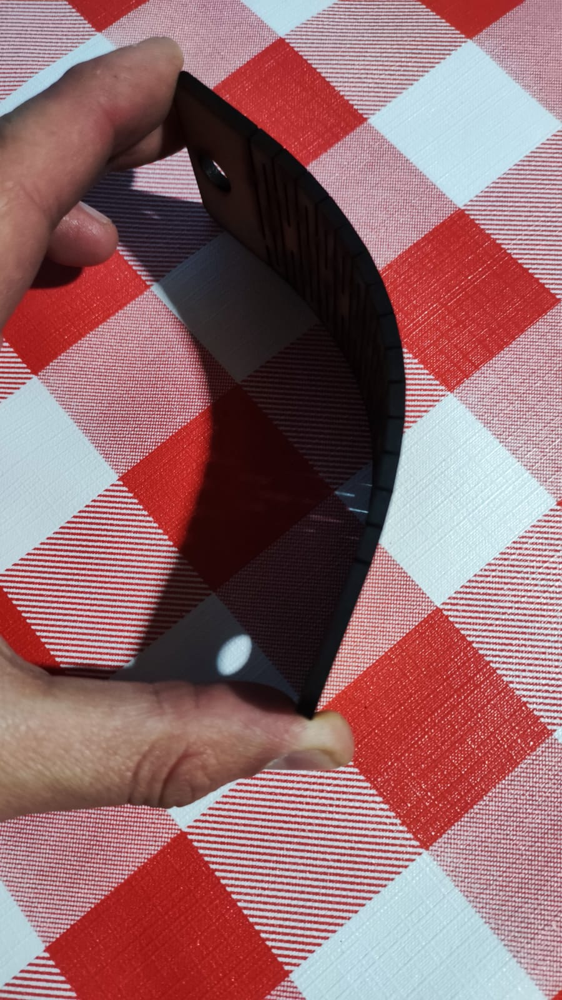
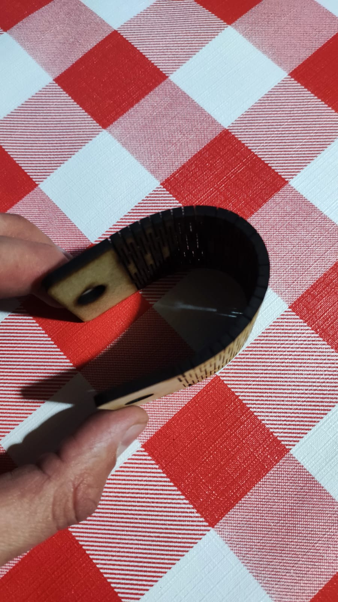
Diferencias entre piezas con diseño kerfbending en cuanto a su flexibilidad 

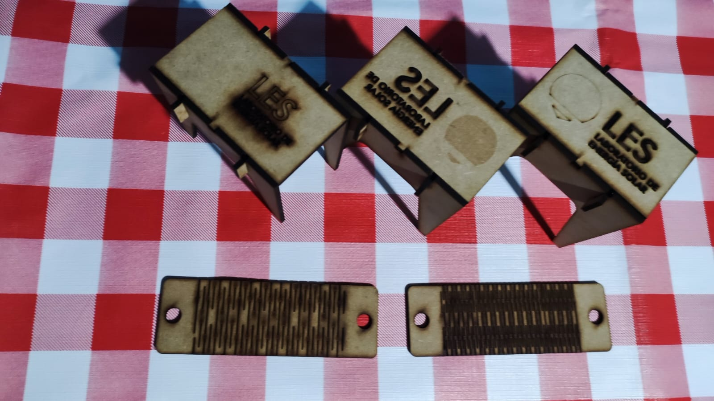
Conjunto de piezas realizadas 

