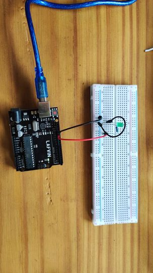
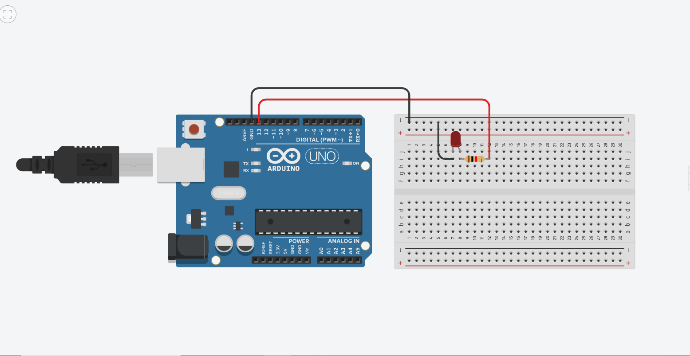
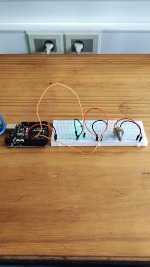
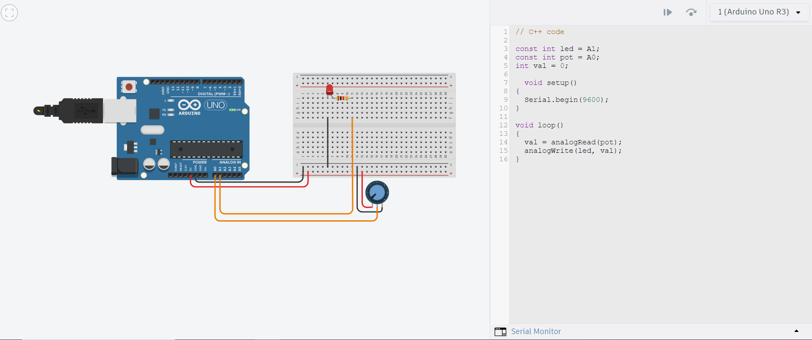
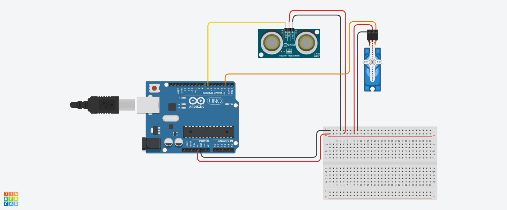
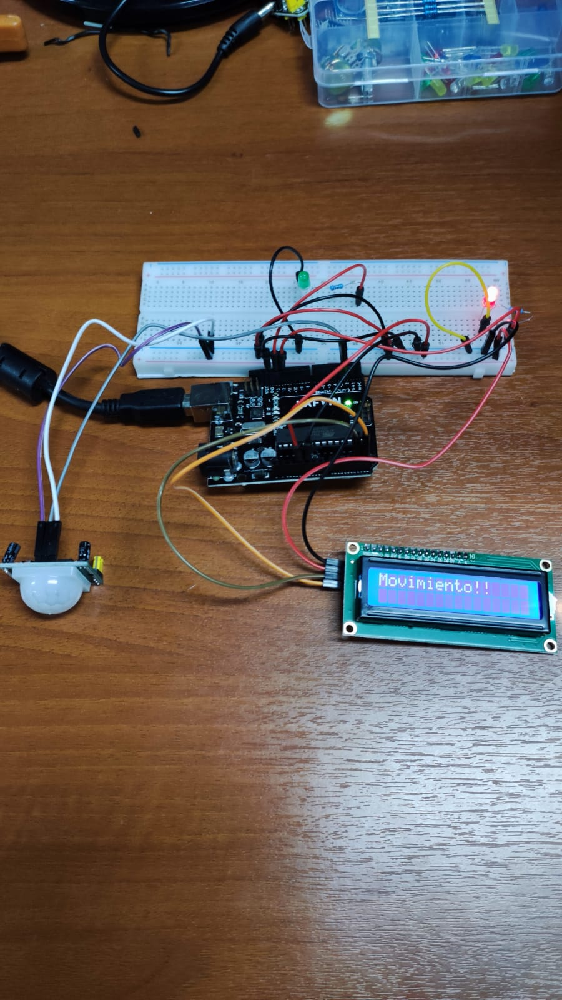
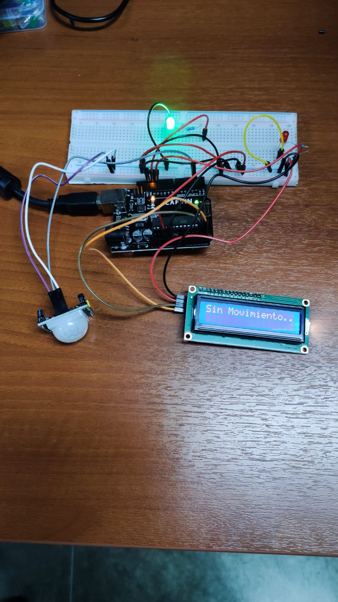
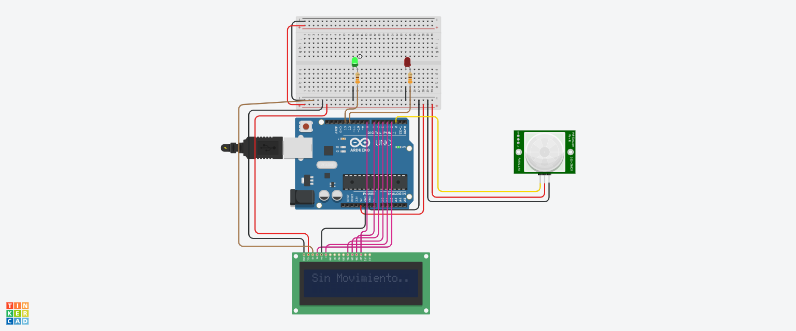

---
hide:
    - toc
---

# MT04

<strong>Introducción a la electrónica y programación</strong>

<strong>Objetivo:</strong>

El objetivo de este modulo es introducirnos en los principios de la programación y electrónica aplicada en microcontroladores. 

<strong>Definiciones:</strong>

Para dicho modulo debemos de saber y tener presentes algunos conceptos básicos de electricidad.

<em>¿Qué es la electricidad?</em> La electricidad es un flujo de electrones. Estos van pasando de átomo en átomos produciendo una corriente.
En la electricidad hay tres conceptos básicos que son:

<em>Voltaje (V):</em> Es la fuerza de atracción que hace que los electrones se muevan de un punto a otro cuando hay diferencia entre el número de electrones en esos dos puntos. Se mide en Voltios y se denomina con una V.

<em>Corriente (I):</em>  La corriente eléctrica es producto del flujo de electrones que es excitado por el voltaje, y que se transfiere a través de un conductor que otorga baja oposición al flujo de electrones.  Se mide en Ampere y se denomina con una A.

<em>Resistencia (R):</em>> La resistencia eléctrica es toda oposición que encuentra la corriente a su paso por un circuito eléctrico cerrado, atenuando o frenando el libre flujo de circulación de las cargas eléctricas o electrones. Se mide en Ohm y se denomina con la letra griega Ω.

<strong><em>Ley de Ohm:</em></strong> 

Esta ley relaciona la tensión eléctrica, la corriente eléctrica y la resistencia eléctrica de la siguiente manera:
La intensidad que circula por un punto del circuito eléctrico es directamente proporcional a la tensión entre sus extremos e inversamente proporcional a la resistencia.

(I=V*R)

(V=I/R)

(R=V/I)

<strong><em>Corriente continua y corriente alterna:</em></strong>

En la electricidad tenemos dos tipos de corrientes la corriente continua (CC-DC) y la corriente alterna (AC-CA).

Se denomina corriente continua a el flujo continuo de electrones entre dos puntos con diferencia de potencial, sin cambiar de dirección. Cualquier corriente que siempre tenga la misma polaridad se denomina corriente continua. Este tipo de corriente es la utilizada en baterías, pilas y cualquier otro objeto de acumulación de carga eléctrica.

La corriente alterna se denomina por el cambio de dirección en el flujo de electrones. Este tipo de corriente es la utilizada hoy en día y es la que tenemos presentes en nuestras casas.

<strong><em>Electrónica y Microcontroladores:</em></strong>

<em>¿Qué es la electrónica?</em> La electrónica es una parte de la ciencia que estudia cómo controlar los electrones para crear aparatos como celulares, computadoras y televisores. La electrónica se divide en varias ramas, la electrónica digital, análoga y de potencia.

La electrónica digital es una rama de la electrónica que se centra en el manejo de señales discretas, principalmente binarias, es decir, que solo tienen dos estados: 0 y 1. Estos estados representan apagado y encendido, respectivamente. Este tipo de electrónica es la base de la informática moderna y de muchos dispositivos electrónicos. 

En la electrónica digital se utilizan componentes como: Puertas lógicas, flip-flops, microprocesadores-microcontroladores y memorias.

<em>Microcontroladores:</em> Los microcontroladores son pequeños chips que funcionan como mini computadoras. Incluyen un procesador, memoria y puertos de entrada/salida en un solo dispositivo. Se utilizan para controlar aparatos y sistemas específicos, como electrodomésticos, automóviles y dispositivos médicos. Algunos ejemplos de estos son:

Arduino: Ideal para proyectos.

PIC: Usados en aplicaciones industriales.

AVR: Común en proyectos de electrónica.

En nuestro caso utilizaremos Arduino.

<strong>Práctica:</strong>

Para realizar dichas prácticas utilice 2 programas diferentes, Tinkercad y Arduino IDE.

Tinkercad me permitió desarrollar y probar los proyectos antes de llevarlos a cabo en el Microprocesador físico, al igual que ir probando y desarrollando el código para su funcionamiento.
Arduino IDE lo utilice para terminar y mejorar mi código para luego enviarlo a mi Microcontrolador.  

En mi caso realice diferentes practicas con sensores y actuadores donde utilice un sesnsor PIR, un potenciómetro y luces LEDs. 

1) -La primer practica que realice fue el encendido de una LEDs.
Primero realice mi circuito en Tinkercad con sus componentes para luego hacer el programa correspondiente.
Este circuito está compuesto de una LEDs de color verde y una resistencia de 330Ω.
La idea de este era que encendiera por 1000ms y se mantenga apagada por otros 1000ms, y así lo repitiera una y otra vez.

<iframe width="560" height="315" src="https://www.youtube.com/embed/t79p_swlg38?si=M8-1t9eC3M17tpQM" title="YouTube video player" frameborder="0" allow="accelerometer; autoplay; clipboard-write; encrypted-media; gyroscope; picture-in-picture; web-share" referrerpolicy="strict-origin-when-cross-origin" allowfullscreen></iframe>

2) -En este segundo proyecto realice el encendido de una LEDs con un potenciómetro, la idea de este era encender y apagar dicha luz con el potenciómetro. Para este circuito utilice una LEDs de color verde, una resistencia y un potenciómetro. 

<iframe width="560" height="315" src="https://www.youtube.com/embed/s0xNlKrvTl8?si=vlyP141YKiAQRe7a" title="YouTube video player" frameborder="0" allow="accelerometer; autoplay; clipboard-write; encrypted-media; gyroscope; picture-in-picture; web-share" referrerpolicy="strict-origin-when-cross-origin" allowfullscreen></iframe>

3) -Como tercer proyecto realice una prueba donde por medio de un sensor de ultrasonido podía controlar el movimiento de un servomotor.
Este consistía en que dependiendo de la distancia que este el objeto frente al sensor ultrasónico dependería directamente el movimiento del servomotor. Este ejercicio no lo pude llevar a cabo físicamente porque tuve algunos problemas con el sensor de ultrasonido. 

4) -Como cuarto y último proyecto utilice un sensor PIR.
En este proyecto utilice un sensor PIR, dos luces LEDs, dos resistencias de 330Ω, y una pantalla LCD. El proyecto consistió en que al pasar un objeto frente al sensor encendiera una luz roja y la pantalla me imprimiera un aviso de "Movimiento!!" y al contrario cuando no hubiese movimiento me encendiera una luz verde e imprimiera en la pantalla "Sin movimiento..".
Al realizar esta prueba tuve varios errores en el cual uno de ellos fue no darme cuenta que los pines de la placa + y - a la mitad cortaba su continuidad. Esto me llevo un rato darme cuenta el porque me funcionaba una luz y la otra no.
Al realizar mi proyecto en Tinkercad y llevarlo a mi Microcontrolador físico note que la cantidad de pines en la pantalla LCD no era la misma la cual esto me tomo un tiempo estudiarla y entender como era el circuito.
Otro de mis problemas fue que al energizar mi pantalla LCD no funcionaba, hasta que mirando unos tutoriales pude comprender cual era el problema. Este consistía en que había que enviarle primeramente a la LCD un código que era necesario para crear la comunicación. 
También me sucedió que, aunque no hubiera movimiento y mi tiempo de regreso en el código al modo “sin movimiento” sea muy corto, este demoraba bastante en volver. Hasta que me di cuenta que el sensor PIR tenia dos tornillos de regulación el cual uno regula la sensibilidad y distancia con la cual detecta y el otro el tiempo en el cual se mantiene activo, le baje al mínimo este último y quedo funcionando perfectamente como yo lo quería.

<iframe width="560" height="315" src="https://www.youtube.com/embed/sgiSL2SN-Hk?si=4qXW4LrBM_1LGsYH" title="YouTube video player" frameborder="0" allow="accelerometer; autoplay; clipboard-write; encrypted-media; gyroscope; picture-in-picture; web-share" referrerpolicy="strict-origin-when-cross-origin" allowfullscreen></iframe>

<strong>Conclusión/Reflexión:</strong>

Me pareció muy útil y practico utilizar este kit de Arduino para dichas prácticas, además de ver y tomar conocimiento de los sensores y actuadores existentes. Me sorprendió la cantidad de utilidad que se le puede dar a este tipo de microcontrolador por la cantidad de sensores que hay disponibles, además está muy bueno poder practicar con ellos. En la programación se me dificulto un poco por no tener cocimientos sobre este, pero note que en internet hay mucha información para desarrollarlo.
Otra de las cosas que me pareció muy buena es que podés mezclar Tinkercad para ir probando el código y verificar que funciona con sensores y actuadores parecidos a los existentes en la realidad. 

<strong>Códigos:</strong>

Código proyecto 1:  <a href="../Nuevacarpeta/prueba1.ino" download="Proyecto1"> <strong>Descargar</strong> </a>

Código proyecto 2:  <a href="../Nuevacarpeta/prueba2.ino" download="Proyecto2"> <strong>Descargar</strong> </a>

Código proyecto 3:  <a href="../Nuevacarpeta/prueba3.ino" download="Proyecto3"> <strong>Descargar</strong> </a>

Código proyecto 4:  <a href="../Nuevacarpeta/Progrmasensor.ino" download="Proyecto4"> <strong>Descargar</strong> </a>

<em>Tutoriales que me fueron útiles:</em>

https://www.youtube.com/watch?v=6QzIVh6upyQ&t=314s

https://www.youtube.com/watch?v=kmBVA51hrFQ

https://www.youtube.com/watch?v=LTNpX0k9PmA

<strong>Anexo:</strong>

Otras definiciones de los sensores, actuadores y elementos utilizados: 

<em>Arduino:</em> La tarjeta de desarrollo del microcontrolador la cual será el corazón de tus proyectos. Es un simple ordenador, pero uno con el cual todavía no puedes realizar nada. Construirás circuitos e interfaces para hacer cosas y decirle al microcontrolador como trabajar con otros componentes.

<em>Placa de pruebas:</em> Una placa sobre la cual puede montar componentes electrónicos. Es como un panel con agujeros, con filas de agujeros que le permite conectar juntos cables y componentes electrónicos. También están disponibles tarjetas sobre las que hay que soldar y también sin necesidad de usar un soldador como la mostrada aquí.

<em>Pantalla de Cristal Líquido (LCD):</em> Un tipo de pantalla numérica o gráfica basado en cristal líquido. Los LCDs están disponibles en varios tamaños, formas y estilos. El que se incluye con este kit dispone de 2 filas con 16 caracteres en cada una de ellas.

<em>Cables puente:</em> Utilizarlos para conectar unos componentes con otros sobre la placa de prueba, y la tarjeta de Arduino.

<em>Cable USB:</em> Permite conectar la placa Arduino Uno a un ordenador para que se pueda programar. También proporciona la alimentación necesaria tanto a la placa Arduino como a todos los componentes electrónicos.

<em>Resistencias:</em> Se opone al paso de la corriente eléctrica en un circuito, dando como resultado a un cambio en la tensión y en dicha corriente. El valor de las resistencias se mide en ohmios. Las bandas de colores en un lado de la resistencia indica su valor.

<em>Diodos Emisores de Luz (LEDs):</em> Un tipo de diodo que emite luz cuando la corriente lo atraviesa. Como en todos los diodos, la corriente solo fluye en un sentido a través de estos componentes. Estará probablemente familiarizado con ellos al verlos como indicadores dentro de una gran variedad de dispositivos electrónicos. El ánodo, que normalmente se conecta al positivo de la alimentación, es generalmente el terminal más largo, y el cátodo el terminal más corto.

<em>Potenciómetro:</em> Una resistencia variable con tres terminales. Dos de estos terminales están conectados a los extremos de una resistencia fija. El terminal central se puede mover a través de la superficie de la resistencia fija (dispone de un mando), consiguiendo de esta forma dos valores diferentes de resistencia según el terminal extremo que se tome como referencia. Cuando los terminales extremos del potenciómetro se conectan entre una tensión y masa, en el terminal central aparece una tensión que es proporcional al giro del mando central, entre cero (un extremo) y la máxima tensión (el otro extremo).

<em>Sensores PIR o sensor de movimiento:</em> Son dispositivos que detectan variaciones de la radiación infrarroja en el área de cobertura, por lo que son especialmente útiles para detectar la presencia de personas o animales a través del calor que emiten sus cuerpos. El concepto pasivo del nombre de PIR hace referencia a que no generan de forma activa ninguna señal y solo reciben radiaciones para su funcionamiento.

