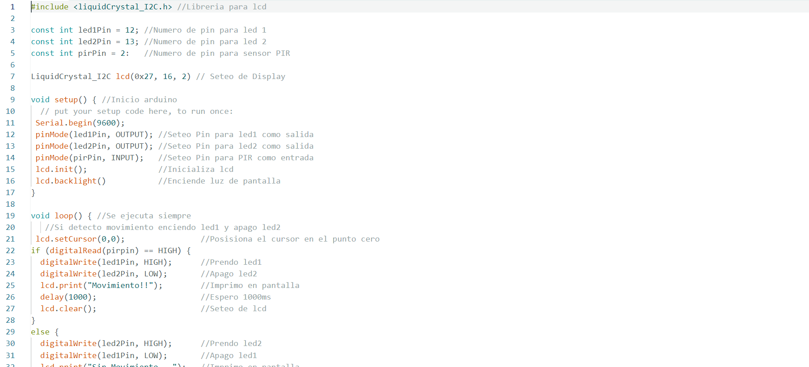

---
hide:
    - toc
---

# MT04

<strong>Definiciones:</strong>

Arduino:
 La tarjeta de desarrollo del microcontrolador la cual será el corazón de tus proyectos. Es un simple ordenador, pero uno con el cual todavía no puedes realizar nada. Construirás circuitos e interfaces para hacer cosas y decirle al microcontrolador como trabajar con otros componentes.

Placa de pruebas: Una placa sobre la cual puede montar componentes electrónicos. Es como un panel con agujeros, con filas de agujeros que le permite conectar juntos cables y componentes electrónicos. También están disponibles tarjetas sobre las que hay que soldar y también sin necesidad de usar un soldador como la mostrada aquí.

Pantalla de Cristal Líquido (LCD): Un tipo de pantalla numérica o gráfica basado en cristal líquido. Los LCDs están disponibles en varios tamaños, formas y estilos. El que se incluye con este kit dispone de 2 filas con 16 caracteres en cada una de ellas.

Cables puente: Utilizarlos para conectar unos componentes con otros sobre la placa de prueba, y la tarjeta de Arduino.

Cable USB: Permite conectar la placa Arduino Uno a un ordenador para que se pueda programar. También proporciona la alimentación necesaria tanto a la placa Arduino como a todos los componentes electrónicos.

Resistencias: Se opone al paso de la corriente eléctrica en un circuito, dando como resultado a un cambio en la tensión y en dicha corriente. El valor de las resistencias se mide en ohmios (se representa por la letra griega omega:
). Las bandas de colores en un lado de la resistencia indica su valor (ver la tabla de código de colores de la resistencia en la página 41).

Diodos Emisores de Luz (LEDs): Un tipo de diodo que emite luz cuando la corriente lo atraviesa. Como en todos los diodos, la corriente solo fluye en un sentido a través de estos componentes. Estará probablemente familiarizado con ellos al verlos como indicadores dentro de una gran variedad de dispositivos electrónicos. El ánodo, que normalmente se conecta al positivo de la alimentación, es generalmente el terminal más largo, y el cátodo el terminal más corto.

Potenciómetro: Una resistencia variable con tres terminales. Dos de estos terminales están conectados a los extremos de una resistencia fija. El terminal central se puede mover a través de la superficie de la resistencia fija (dispone de un mando), consiguiendo de esta forma dos valores diferentes de resistencia según el terminal extremo que se tome como referencia. Cuando los terminales extremos del potenciómetro se conectan entre una tensión y masa, en el terminal central aparece una tensión que es proporcional al giro del mando central, entre cero (un extremo) y la máxima tensión (el otro extremo).

Sensores PIR o sensor de movimiento: Son dispositivos que detectan variaciones de la radiación infrarroja en el área de cobertura, por lo que son especialmente útiles para detectar la presencia de personas o animales a través del calor que emiten sus cuerpos. El concepto pasivo del nombre de PIR hace referencia a que no generan de forma activa ninguna señal y solo reciben radiaciones para su funcionamiento.

<strong>Imagenes:</strong>

Link de programa:  <a href="../Nuevacarpeta/Progrmasensor.ino" download="Programa"> <strong>Descargar</strong> </a>

<iframe width="560" height="315" src="https://www.youtube.com/embed/sgiSL2SN-Hk?si=4qXW4LrBM_1LGsYH" title="YouTube video player" frameborder="0" allow="accelerometer; autoplay; clipboard-write; encrypted-media; gyroscope; picture-in-picture; web-share" referrerpolicy="strict-origin-when-cross-origin" allowfullscreen></iframe>