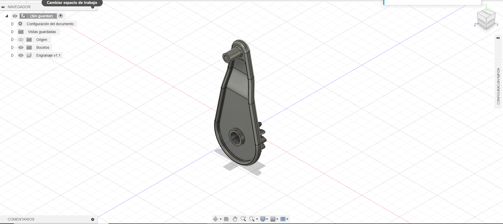
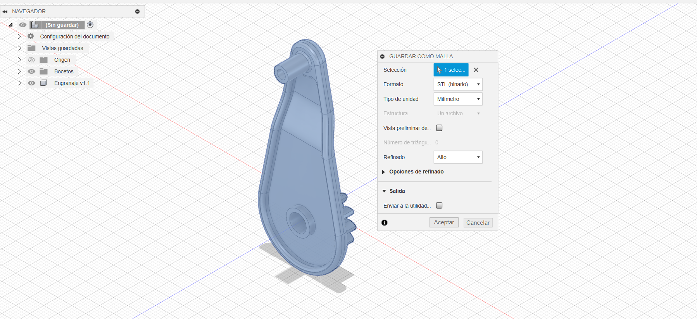
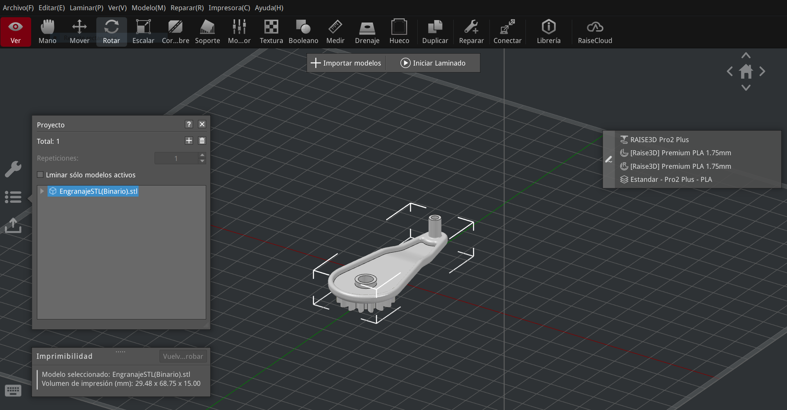
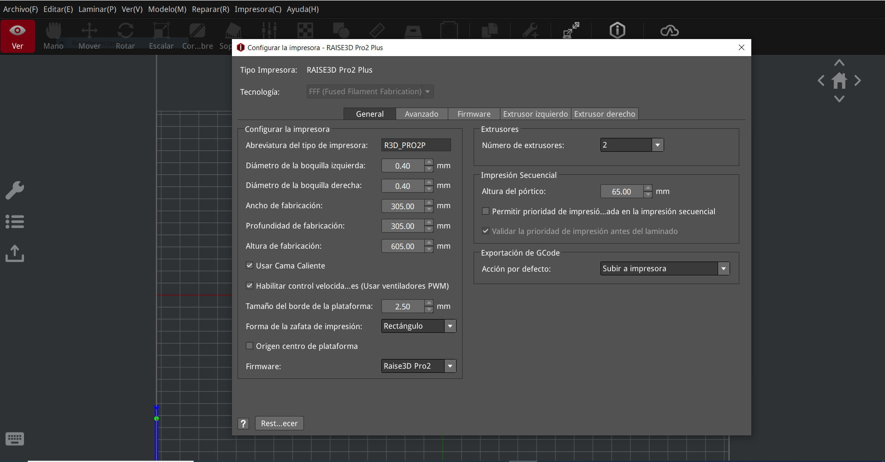
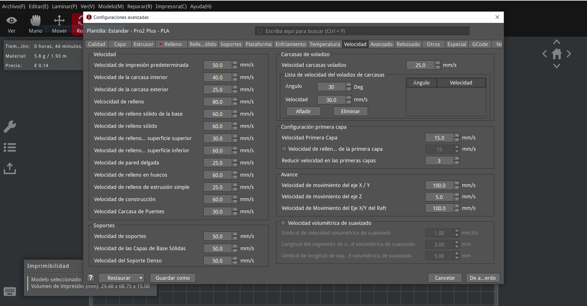
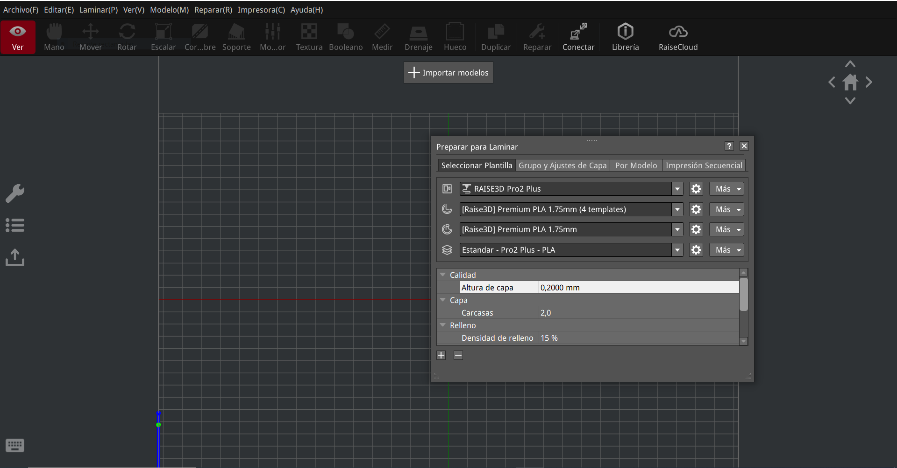
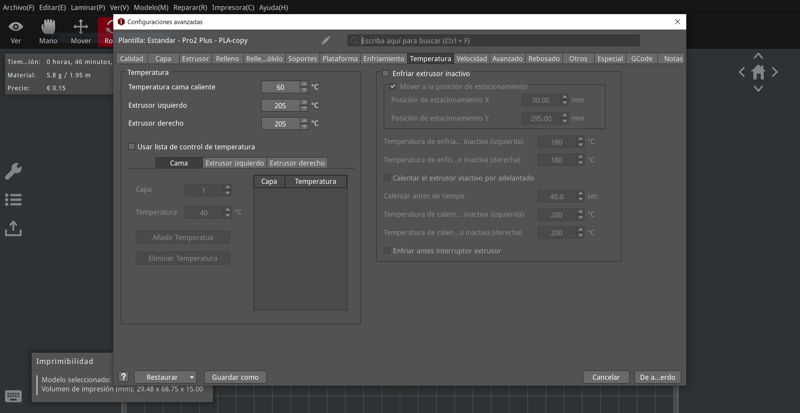
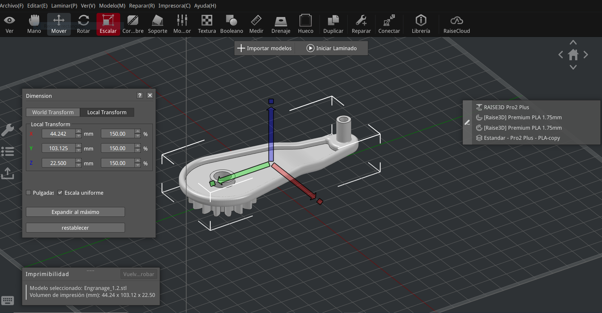
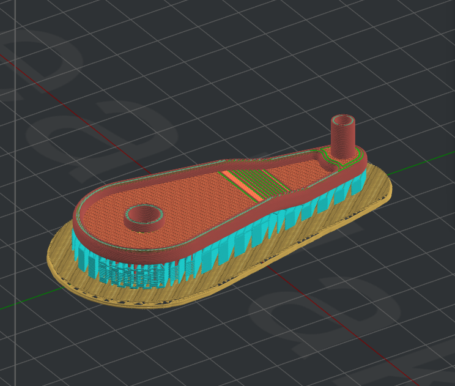
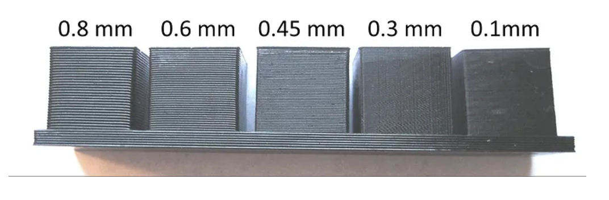

---
hide:
    - toc
---

# MT05

<strong>Impresión y escaneo 3D</strong>

<strong>Objetivo:</strong>

El objetivo de este módulo es introducirnos en la creación de piezas en 3D 

<strong>Introducción:</strong>

El diseño asistido por computadora y la fabricación asistida por computadora se han convertido en herramientas muy importantes para mejorar la calidad de los productos y aumentar la productividad. Ambos procesos son interdependientes, dado que el diseño se ve determinado por la forma en la que se va a fabricar y a su vez, el proceso de manufactura se ve determinado por la forma en la que se pensó el diseño. Un error en cualquiera de las dos etapas puede llevar a la generación de un producto defectuoso.

La impresión 3D es el proceso de creación de objetos mediante el depósito de capas de material unas sobre otras. Estas generan objetos capa a capa, al igual que un edificio se construye piso a piso las impresoras usan finas capas de menos de un mm de espesor para la impresión. 
En impresión 3D, la altura de capas es sinónimo de resolución o definición. Esto es similar a lo que ocurre con las cámaras digitales y los pixels. Mientras más pixels mejor definición de la imagen.

La impresión 3D se denomina fabricación aditiva, se llama así por la acumulación de material para la creación de objetos, en lugar de otros métodos utilizados más comúnmente que son sustractivos, como el fresado y torneado CNC, donde para crear objetos se toma una pieza en bruto y se va quitando material excedente hasta llegar a un resultado deseado.

La impresión 3D se ha vendido desarrollando muy rápidamente y a paso firme los últimos tiempos, y esto se debe a que promete y tiene muchos beneficios a su favor en los cuales podemos destacar:

-Prototipado rápido: Permite crear prototipos rápidamente, facilitando la prueba y el ajuste de diseños.
-Personalización: Permite la fabricación de productos personalizados según las necesidades específicas de los clientes, como prótesis médicas, audífonos y joyería.
-Reducción de Costos: Reduce los costos de producción al eliminar la necesidad de moldes y herramientas especiales.
-Complejidad de Diseño: Facilita la creación de geometrías complejas que son imposibles o muy difíciles de fabricar con métodos tradicionales.

<strong>Actividad:</strong>

Para la impresión de piezas en 3D necesitamos como primer paso crear un objeto en algún programa de diseño, en el cual en nuestro caso utilizamos Fusion 360.
Luego de haber creado nuestra pieza y haberle dado todas las características deseadas debemos descargar o exportar nuestro archivo como malla. stl Binario. Debemos descargar nuestro archivo de esa manera para poder cargarlo a otro programa donde ajustaremos los parámetros para nuestra impresora deseada.

Luego de haber descargado nuestro archivo utilizaremos el programa IdeaMaker para sus ajustes.
IdeaMaker es un software utilizado para preparar modelos 3D para impresión. Este software convierte modelos 3D en archivos de código G que las impresoras pueden interpretar para construir la pieza capa por capa.
Este programa nos permite ajustar parámetros como la altura de capa, velocidad de impresión, relleno, soportes, y más.

Ajustes generales, altura de capa y velocidad.

Luego de haber configurado todos los parámetros deseados proseguimos con escalar nuestro objeto. Escalamos de 100% a 150% esto significa que aumentamos en un 50% su tamaño original.

Después de tener todos nuestros ajustes y parámetros deseados podemos realizar una visualización de nuestra figura y que pasos realizara la impresora al crearlo.

<iframe width="560" height="315" src="https://www.youtube.com/embed/Z7ZK4HRWMQ4?si=EUXDBChbsURmc06q" title="YouTube video player" frameborder="0" allow="accelerometer; autoplay; clipboard-write; encrypted-media; gyroscope; picture-in-picture; web-share" referrerpolicy="strict-origin-when-cross-origin" allowfullscreen></iframe>

<strong>Conclusion/Reflexion:</strong>

Desde mi punto de vista decidí dejar el objeto en esa posición ya que de esa manera se ahorra más material en la formación del soporte que si lo pusiéramos en la posición inversa. También desde el punto de vista de las fuerzas que realizaran los dientes del engranaje y de la forma en que la impresora depositará el material me parece la mejor manera de crearlo. Ya que la impresora depositara el material en el perímetro exterior e ira depositando capa a capa en todo el perímetro, y si lo pusiera de otra manera el engranaje donde se efectuará la mayor fuerza quedaría laminado. 

<strong>Archivos:</strong>

G-code:  <a href="../Nuevacarpeta/Francisco_Guimaraens.gcode" download="G-code_Guimaraens"> <strong>Descargar</strong> </a>

<strong>Anexo:</strong>

Resolución de un objeto según la altura de capas.

<strong>Taller:</strong>

En el taller llevamos a cabo la parte práctica de impresión en 3D.

<strong>Procedimiento:</strong>

Llevamos a cabo la practica con dos impresoras (RAISED Pro2 Plus y RAISED Pro3 Plus).
Antes de comenzar la impresión verificamos en IdeaMaker que todos los parámetros estén correctos.
Al momento de verificar los parámetros volvimos a cargar el archivo de engranaje .stl para cambiarlo de posición donde este quedase con la parte del engranaje hacia arriba para un mejor acabado.  

Comenzamos realizando una práctica en la impresora RAISED Pro2 Plus donde utilizamos ambos extrusores Izquierdo y Derecho. 
Configuramos que el extrusor derecho sea para realizar la pieza con un filamento de color rojo y el extrusor izquierdo que realice los soportes necesarios para la pieza con un filamento de color blanco. Al utilizar este método tuvimos un problema el cual fue que al realizar los cambios de extrusor el filamento seguía cayendo por gravedad y la pieza no quedaba limpia. También pasaba esto porque los extrusores mantenían su temperatura estando o no aportando material.

<iframe width="560" height="315" src="https://www.youtube.com/embed/onott-Ts8FU?si=JhjEt-YVemAASkPm" title="YouTube video player" frameborder="0" allow="accelerometer; autoplay; clipboard-write; encrypted-media; gyroscope; picture-in-picture; web-share" referrerpolicy="strict-origin-when-cross-origin" allowfullscreen></iframe>

<iframe width="560" height="315" src="https://www.youtube.com/embed/XO5ud-ggy-o?si=RgHkiRXgMDZYGWbT" title="YouTube video player" frameborder="0" allow="accelerometer; autoplay; clipboard-write; encrypted-media; gyroscope; picture-in-picture; web-share" referrerpolicy="strict-origin-when-cross-origin" allowfullscreen></iframe>

La segunda pieza realizada con la impresora RAISED Pro2 Plus la realizamos de tal forma que el engranaje quedara para la parte inferior, en esta impresión utilizamos solo el extrusor derecho para realizar tanto la pieza como los soportes. En este caso notamos que al no realizar un cambio continuo de extrusor no dejaba tan imperfecta la pieza.

<iframe width="560" height="315" src="https://www.youtube.com/embed/pCbuGUPKm_w?si=EDAPA08ZGiuohIaf" title="YouTube video player" frameborder="0" allow="accelerometer; autoplay; clipboard-write; encrypted-media; gyroscope; picture-in-picture; web-share" referrerpolicy="strict-origin-when-cross-origin" allowfullscreen></iframe>

Al utilizar la impresora RAISED Pro3 Plus se veía una diferencia notable al realizar la pieza, casi sin ningún detalle de imperfección. Notamos que esta impresora realizaba una pieza simultanea para eliminar el material no utilizado y al mismo tiempo variaba la temperatura del extrusor.

<iframe width="560" height="315" src="https://www.youtube.com/embed/UBDAWiT2bhU?si=rwq78uLNFBjzOSNc" title="YouTube video player" frameborder="0" allow="accelerometer; autoplay; clipboard-write; encrypted-media; gyroscope; picture-in-picture; web-share" referrerpolicy="strict-origin-when-cross-origin" allowfullscreen></iframe>

Para utilizar la impresora RAISED Pro3 Plus realizamos el cambio de ambos filamentos donde nuevamente utilizamos ambos extrusores derechos e izquierdo. El extrusor derecho lo utilizamos para realizar los soportes de color blanco y la pieza de color negro con el extrusor izquierdo.

<strong>Conclusión/reflexión:</strong> 

Al final creamos la pieza de ambas maneras para realizar una comparación final donde vimos que el acabado final de la pieza es mucho mejor que la base donde se junta la pieza con el soporte.

