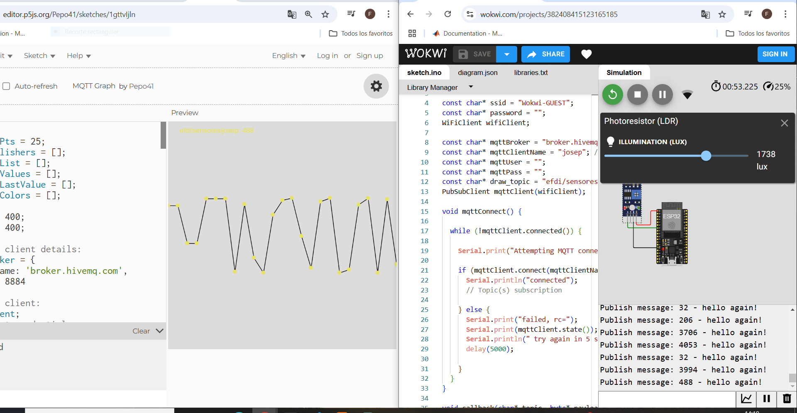

---
hide:
    - toc
---

# MT06

<strong>Networking</strong>

<strong>Objetivo:</strong>

El objetivo de este módulo es introducirnos en Networking y comunicación entre microprocesadores.

<strong>Introducción:</strong>

<em>Comunicación:</em> La comunicación se refiere al intercambio de información entre dispositivos, programas o sistemas. Es lo que permite que computadoras, teléfonos y otros dispositivos "hablen" entre sí, compartan datos y trabajen juntos.

Para que exista este intercambio de información entre diferentes dispositivos existen la redes. Estas proporcionan la infraestructura para que la comunicación entre dispositivos, sistemas y aplicaciones sea posible. Sin comunicación, las redes no tendrían utilidad, y sin redes, la comunicación informática estaría limitada.

Existen varios tipos de redes informáticas estas son algunas de ellas:

-Centralizadas: Este tipo de red, todo gira alrededor de un solo punto que es el servidor principal. Ese servidor es el encargado de gestionar toda la información y los dispositivos dependen de él para funcionar.

-Descentralizadas: En este caso no hay un servidor que lo controle todo. En lugar de eso, hay varios servidores que comparten el trabajo y los datos entre ellos.

-Distribuidas: Acá no hay un centro ni servidor principal. Todos los dispositivos son iguales y comparten el trabajo y datos.

Cada red mencionada tiene diversas características y por ende tienen sus ventajas y desventajas en las cuales se destacan algunas, por ejemplo, en el caso de las redes centralizadas tenemos como ventaja que es fácil de manejar porque todo pasa por un solo punto, pero si esta falla se cae toda la red.
En el caso de las descentralizadas esto ya no pasa porque al no contar con un solo servidor si algunos de estos falla, esta puede seguir funcionando. En el caso de la distribuidas si falla algunos de este punto toda la red puede seguir funcionando correctamente ya que no depende de uno solo.

<em>¿Porque utilizar redes?</em>

Uno de los grandes motivos por los que se utilizan redes es la ubicación. Ya que muchas veces no es posible realizar todas las tareas en un solo lugar o con el mismo hardware.
También otro motivo es por el Paralelismo. Esto refiere a que dos o más personas y/o dispositivos pueden realizar diferentes tareas y luego fusionarlas o trabajar al mismo tiempo en paralelo.

<em>Redes y Protocolos:</em>

En definitiva, las redes son un conjunto de servidores, computadoras o dispositivos conectados entre sí que comparten información. Y estas redes permiten la interconexión entre ellos a través de cables, wifi o señales inalámbricas.

Los protocolos son un conjunto de reglas y normas que definen como se van a realizar la comunicación entre los dispositivos de la red.

Existen muchos protocolos de comunicación que se utilizan en redes y sistemas de comunicación. Algunos de ellos son TCP/IP, HTTP, HTTPS, FTP, SMTP, IMAP, SSH, MQTT, entre otros.
En nuestro caso utilizamos el método MQTT.
Este es un protocolo de mensajería que puede funcionar tanto en redes inalámbricas como por cable, dependiendo de la infraestructura de la red utilizada.
El protocolo MQTT define cómo se envían y reciben mensajes entre los dispositivos.

<em>Tipo de conexiones entre dispositivos:</em>

-Por cable: Las conexiones por cable son fundamentales para la transmisión de datos de manera física entre dispositivos en una red.

-Por Wi-Fi o señales inalámbricas: Estas permiten la comunicación de datos utilizando ondas de radio o señales. Estos son fundamentales en redes inalámbricas como las que usamos en las casas, oficinas o teléfonos.

<strong>Actividad:</strong>

En este módulo tuvimos una serie de actividades donde algunas de ellas fueron explicadas y hechas en clase, las cuales se muestran a continuación. Estos ejercicios contaban con una parte donde visualizábamos un esquema de las conexiones y otro donde veíamos y modificábamos el código que era necesario para su funcionamiento. 

1- 

Este primer ejercicio lo realizamos de modo digital.
En este ejercicio debíamos de ponerlo en funcionamiento. La comunicación de los distintos componentes era de manera serial.
Al apretar el botón verde se imprimía un numero en nuestra pantalla y cada vez que lo apretáramos este iba cambiando de n+1.
También el código nos permitía a través de la pantalla serial comunicarnos con un 'on' o 'off' esto hacía que se encienda o se apague la luz que contenía el circuito.

2- 
   

En este segundo ejercicio utilizamos el protocolo MQTT en el cual utilizamos el servidor Broker. 
Utilizamos el código brindado por el ejercicio en el cual debíamos incluir las librerías correspondientes y cambiar el nombre de usuario para que no existieran confusiones. 
Al simular el ejercicio podíamos prender y apagar el LED con el botón.
Este ejercicio también podíamos realizarlo en parejas.

3- 

Este ejercicio es muy similar al anterior con algunas diferencias y utilizando un NeoPixel.

4- 

El cuarto ejercicio utilizando un sensor de luz, simulamos digitalmente que este está captando luz y realizaba el envío de los datos al servidor. La diferencia de este es que a través de un software online podíamos graficar los resultados.

5- 

En este quinto ejercicio que era para realizarlo de manera individual opte por realizar un proyecto donde a través de un sensor ultrasónico midiese la distancia y me graficara los resultados.

Para este ejercicio utilice una placa ESP32, una protoboard, cuatro luces LED, cables de conexión, un sensor ultrasónico y una fuente de alimentación de 5,5V.
Comencé armando mi circuito en la protoboard, al mismo tiempo que me iban surgiendo ideas de como quería que fuera el funcionamiento.
Para realizar la programación utilice el software Arduino IDE. Para realizar el código correspondiente a dicho proyecto me fui ayudando con internet.
El proyecto consistía que a medida que un objeto se vaya alejando del sensor esta media la distancia y a su vez prendía una luz. Si la distancia era menor o igual a 100mm este prendía una luz blanca, cuando era menor o igual a 200mm encendía una luz roja, luego verde y por último azul. Cuando excedía todas estas distancias todas las luces se apagaban.
Todo esto era enviado por el protocolo MQTT y graficado como muestra la figura.
Para realizar este envío tuve que conectarme a la red WIFI que contaba en ese lugar. 

<iframe width="560" height="315" src="https://www.youtube.com/embed/uhIuLXCBxtk?si=_ty37sGuJASEr8N1" title="YouTube video player" frameborder="0" allow="accelerometer; autoplay; clipboard-write; encrypted-media; gyroscope; picture-in-picture; web-share" referrerpolicy="strict-origin-when-cross-origin" allowfullscreen></iframe>

<iframe width="560" height="315" src="https://www.youtube.com/embed/lBn-FwYHmmA?si=6yI_YVrDCdD971IO" title="YouTube video player" frameborder="0" allow="accelerometer; autoplay; clipboard-write; encrypted-media; gyroscope; picture-in-picture; web-share" referrerpolicy="strict-origin-when-cross-origin" allowfullscreen></iframe>

En este video podemos notar como al ir alejándonos del sensor Ultrasónico las luces LED se van encendiendo y vemos un aumento en la gráfica, al contrario, ocurre cuando nos vamos acercando, las luces se apagan y la gráfica va en descenso.
En el transcurso de este Modulo tuve algunos problemas que supe solucionar como por ejemplo uno de ellos era al momento de graficar mis datos la variación era muy chica y no se alcanzaba a apreciar correctamente por ello modifiqué el código del programa. 
Otro de los problemas que me encontré fue que al conectar el sensor ultrasónico en la placa ESP32 no funcionaba, esto era porque el sensor se alimentaba con 5.5V y la placa no tenía la capacidad de entregarme esto. Por ende, conecte otra fuente exterior la cual si me funciono. 

<em>Código Arduino:</em> <a href="../Nuevacarpeta/MT06.ino" download="Francisco_Guimaraens.ino"> <strong>Descargar</strong> </a>

<em>Página Web:</em> https://editor.p5js.org/Pepo41/sketches/1gttvIjln

<strong>Conclusión/Reflexión:</strong>

Este módulo me pareció muy bueno y enriquecedor, me llevo a entrarme más en la programación de Arduino.
Me pareció muy interesante aprender a poder conectarme vía wifi y así poder visualizar los datos obtenidos en tiempo real.
En algunos pasos me estanqué un poco más porque algunas cosas me resultaron difíciles, pero las pude superar.
