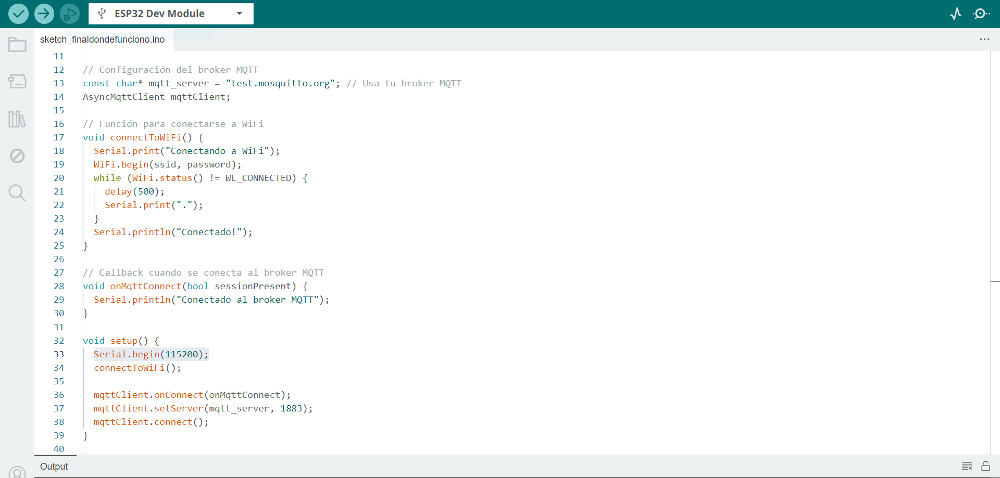
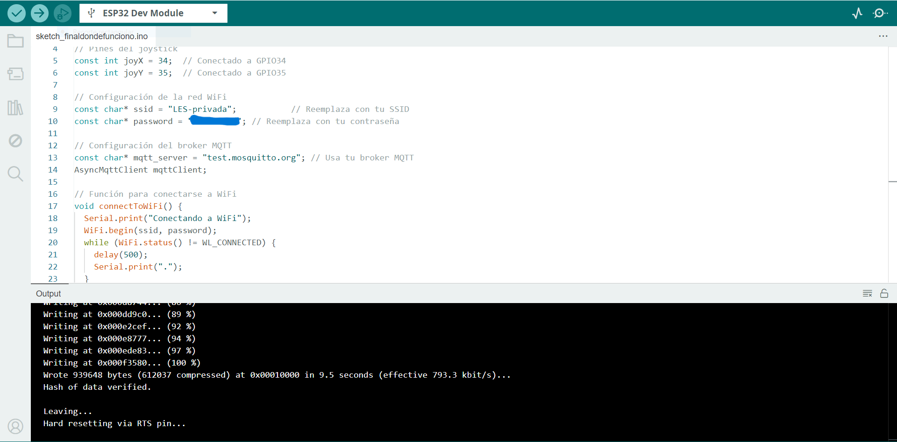
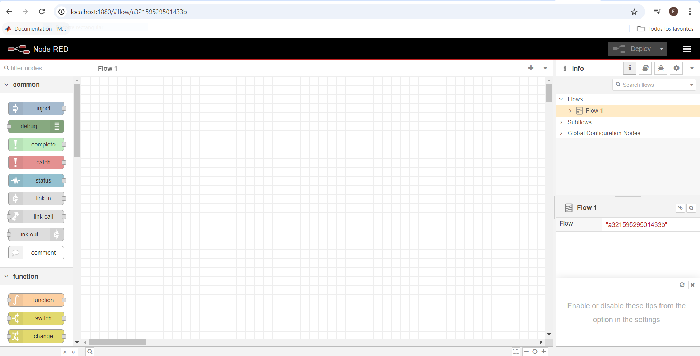
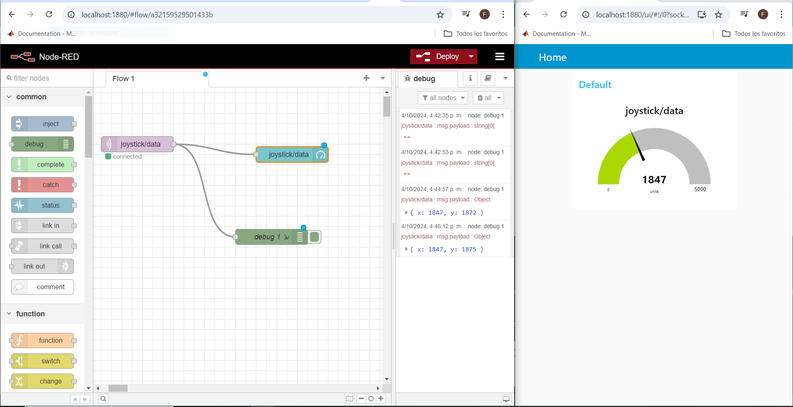
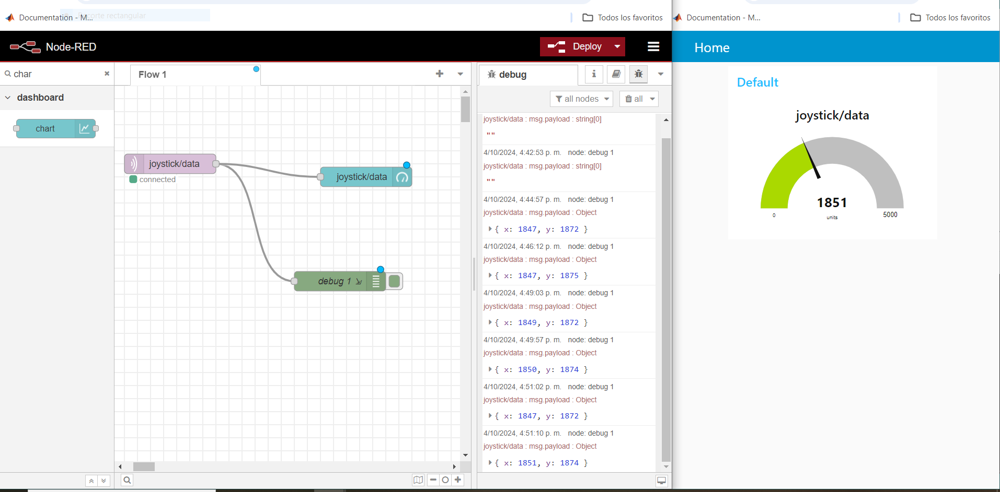
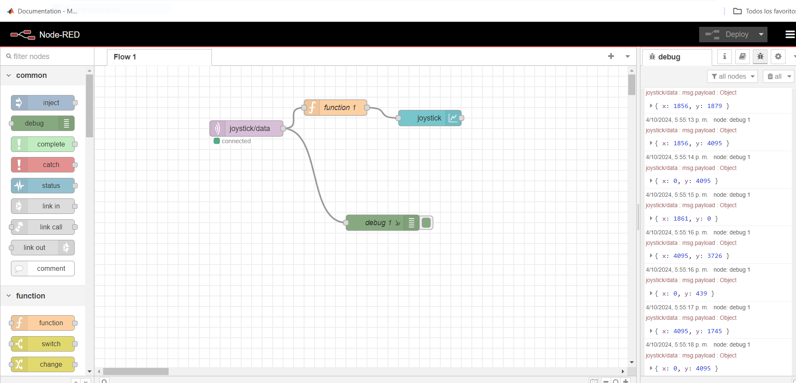
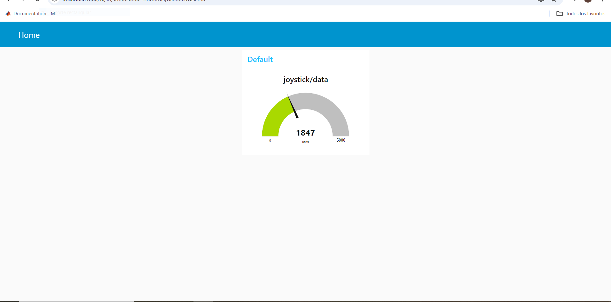

---
hide:
    - toc
---

# MT07

<strong>Interficies y Aplicaciones</strong>

<strong>Objetivo:</strong>

El objetivo de este módulo es introducirnos en la aplicación de interficies digitales en el cual debemos desarrollar y diseñar.

<strong>Introducción:</strong>

Una interfaz digital es un medio o punto de conexión entre dos dispositivos electrónicos que permite el intercambio de información en forma de señales digitales. Las interfaces digitales permiten que dispositivos como computadoras, microcontroladores, sensores, actuadores y otros equipos electrónicos se comuniquen entre sí de manera precisa y eficiente.

<strong>Definiciones:</strong>

Paginas y Procesadores utilizados:

<em>Placa ESP 32:</em> Es una pequeña placa electrónica que permite conectar dispositivos a internet de manera fácil y económica. Tiene Wi-Fi integrado, lo que lo hace ideal para crear proyectos como controladores de luces, sensores inteligentes o robots que puedes controlar desde tu teléfono o computadora. 

<em>Joystick:</em> Es un dispositivo que permite detectar el movimiento en dos direcciones (ejes X e Y) y, en algunos casos, tiene un botón integrado que detecta cuando se presiona.

<em>Protoboard:</em>  Es una herramienta que permite montar circuitos electrónicos de manera temporal sin necesidad de tener que soldar.

<em>Cables de conexión:</em> Los cables de conexión son componentes muy importantes que permiten la interconexión de la placa Arduino con otros dispositivos, sensores, actuadores, etc. 

<em>Arduino IDE:</em> Es el entorno de desarrollo integrado utilizado para programar placas Arduino y otros microcontroladores.

<em>Node RED:</em> Es una herramienta de programación visual que permite crear aplicaciones de Internet mediante la conexión de dispositivos y servicios de forma intuitiva. Utiliza un entorno basado en navegador donde puedes arrastrar y soltar nodos para construir flujos de trabajo, facilitando la integración de sensores y actuadores.

<strong>Actividad:</strong>

La actividad en dicho modulo es desarrollar y diseñar una interficie digital que interaccione con el usuario.

El primer paso fue decidir qué elementos utilizaría para realizar mi actividad. En mi caso decidí utilizar un Joystick conectado a mi placa ESP 32 para realizar la tarea.

Luego de esto tomé los diferentes artículos para su ensamblaje y a medida que lo iba armando fui creando el código necesario para su ejecución.

Luego de haber hecho los pasos anteriores y de haber configurado el programa Arduino IDE para ser utilizado con una placa ESP 32 envié el programa al procesador. Cabe destacar que tuve algunos errores en el programa el cual de a poco los fui acomodando (por ej: Algunas librerías y la línea de código Serial.begin(115200), y el tiempo en el que enviaba los datos).

Al pasar esto comencé a realizar y programar en Node RED, esto me llevo un tiempo ya que este es nuevo para mí y algunas cosas se me hacían difíciles. 

<strong>Imágenes finales:</strong>

<strong>Conclusión/Refección:</strong>
 
Estuvo muy bueno aprender sobre este tema que en mi caso era todo nuevo y en partes se me complicaba bastante. Me familiaricé un poco más con la programación en Arduino IDE aunque en muchos casos tuve que pedir ayuda para solucionar los problemas.  

En el transcurso de esta actividad tuve unos cuantos inconvenientes el cual me serian imposibles de enumerarlos a todos, pero algunos de ellos fueron, Problemas en la conexión a internet con la placa ESP 32, como ya comente anteriormente tuve algunos errores en la programación de la placa y en el caso de Node RED me llevo un rato adaptarme para realizar la programación correspondiente.

<strong>Anexo:</strong>

<iframe width="560" height="315" src="https://www.youtube.com/embed/7I988T23YnQ?si=4aTk33OuEtpV9KYH" title="YouTube video player" frameborder="0" allow="accelerometer; autoplay; clipboard-write; encrypted-media; gyroscope; picture-in-picture; web-share" referrerpolicy="strict-origin-when-cross-origin" allowfullscreen></iframe>

Faltan algunos videos