---
hide:
    - toc
---

# MT08

<strong>Control Numérico Computarizado (CNC)</strong>

<strong>Objetivo:</strong>

En este modulo nos vamos a centrar en la tecnologia de fabricacion con Router CNC.

<strong>Definiciones:</strong>

¿Qué es el CNC y cómo está compuesta una máquina CNC?
 
El control numérico computarizado es el uso de una computadora para controlar y monitorear los movimientos de una máquina herramienta. Entre esas máquinas herramienta, tanto estáticas como portátiles, se puede mencionar: fresadora, torno, rectificadora, máquina de corte por láser, por chorro de agua o por electroerosión, estampadora, prensa, brazo robotizado, etc. Las máquinas de gran porte cuentan con una computadora dedicada que forma parte del equipo, y la mayoría dispone de un sofisticado sistema de realimentación que monitorea y ajusta constantemente la velocidad y posición de la herramienta de corte. Las máquinas menos exigentes usadas en talleres admiten el uso de una computadora personal externa. El controlador CNC trabaja en conjunto con una serie de motores (servomotores y/o motores paso a paso), así como componentes de accionamiento para desplazar los ejes de la máquina de manera controlada y ejecutar los movimientos programados.

Una máquina CNC, consiste de seis elementos principales que son, dispositivo de entrada, Unidad de control o controlador, Máquina herramienta, Sistema de accionamiento, Dispositivos de realimentación y Monitor.

¿Cómo funciona una máquina CNC?
 
Básicamente, el controlador de las máquinas CNC recibe instrucciones de la computadora (en forma de códigos G y códigos M) y mediante su propio software convierte esas instrucciones en señales eléctricas destinadas a activar los motores que, a su vez, pondrán en marcha el sistema de accionamiento.

Ventajas de una maquina CNC:

Además de mejorar la productividad y disminuir los tiempos de producción, las máquinas y herramientas de Control Numérico brindan una serie de ventajas como:

-Mayor precisión y mejor calidad de productos.
-Aumento de los niveles de seguridad del personal operativo.
-Un solo operario puede operar varias máquinas a la vez.
-Variedad de lenguajes de programación.
-Control y normalización de sus productos.
-Mayor exactitud en las operaciones.

¿Qué es una Router CNC?

Una Router es una máquina herramienta diseñada para realizar trabajos de mecanizado por arranque de viruta, mediante el movimiento de una herramienta rotativa de varios filos de corte, denominada fresa.

Se componen de:
-Una estructura o chasis
-Un controlador
-Guias y rodamientos
-Motores paso a paso
-Mesa de trabajo
-Husillo o Spindler

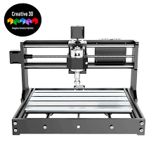

¿Qué es una Fresa?

Mechas  no son fresas, y fresas no son mechas:

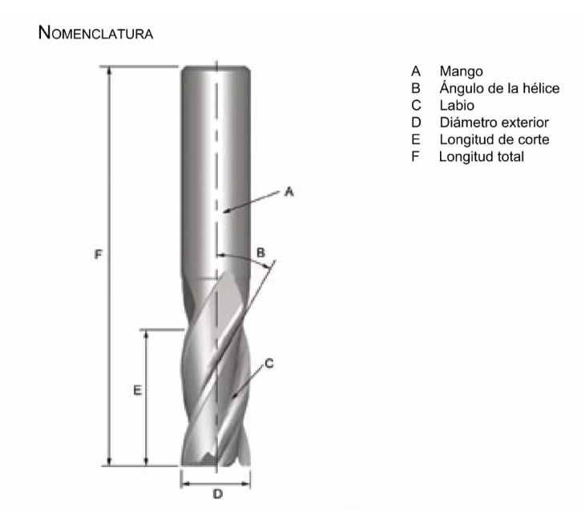

Las mechas están diseñadas para sumergirse directamente en el material, cortando axialmente y creando agujeros cilíndricos.

Las fresas se utilizan normalmente para tallar horizontalmente y cortar lateralmente.

Si bien podemos utilizar una fresa para realizar un agujero, no podemos utilizar una mecha para fresa lateralmente.

¿Qué es la fabricación sustractiva?
 

Este término hace referencia a una técnica utilizada en la fabricación de piezas, donde dichas piezas se consiguen a partir de un bloque sólido al que se le va eliminando el material sobrante, hasta conseguir el resultado deseado.

Hoy por hoy, la fabricación sustractiva es el método más recurrente, sobre todo, al trabajar con materiales como el metal o la madera. Y puede realizarse deforma manual o por medio del mecanizado por control numérico computarizado, es decir, el mecanizado CNC, siendo esta última opción la más eficiente.

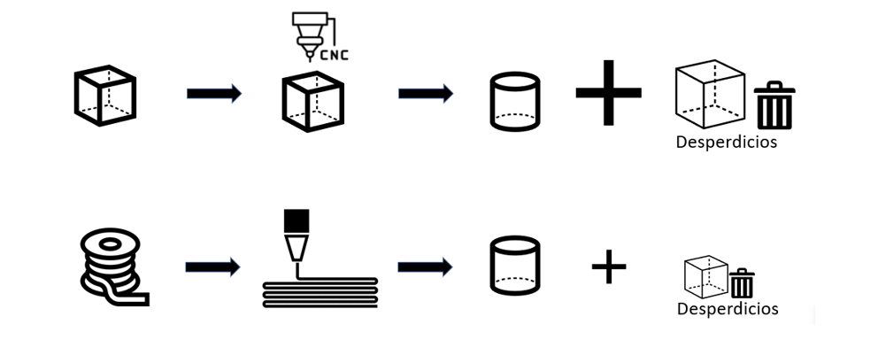

<strong>Actividad:</strong>

Para este modulo dicha actividad consistia en crear un codigo .nc (codigo G) a partir de un archivo con una pieza ya creada para su posterior fresado.

Comenze la actividad descargando un archivo con una pieza ya creada especificamente para este modulo.
Este archivo lo descargue como .f3d para utilizarlo en el programa de diseño Fusion 360.

Lo primero que realice al abrir el archivo de esta pieza en el programa de diseño fue cambiarle la textura que tenia y colocarle una textura simulando que fuera madera ya que es el material en el que lo vamos a realizar.

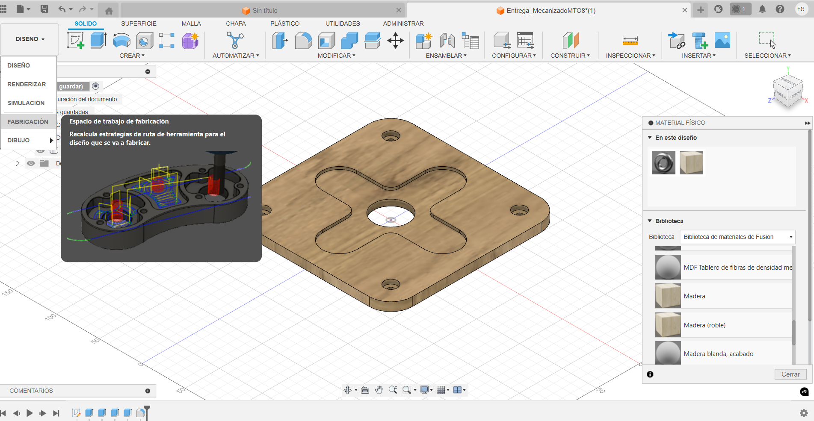

Luego de esto me pase al modo Fabricacion y  realice  la seleccion del router a utilizar (Autodesk Generic 3-axis Roter). Este es un Router que tiene movimiento en 3 ejes, tanto en X e Y como tambien en el eje Z que es el eje utilizado para la altura.
Seleccionar la maquina conlleva a buscarla en la biblioteca del programa Fusion ya dada e importarla a "Mis maquinas" - "Local" 

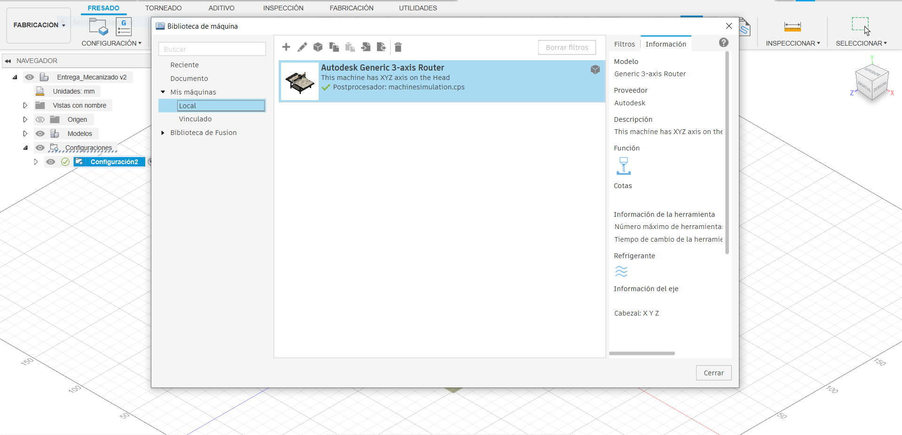

Luego el siguiente paso que tome fue descargar un postprosesador necesario para generar el codigo requerido para la entrega del archivo.
Realice la descarga, lo guarde en mi disco local y luego lo importe en el programa Fusion 360.
Al tener todo esto ya listo continue con la pieza. 

El siguiente paso fue entrar a la opcion "cajeras" para realizar el mecanizado interno de la pieza.
El primer mecanizado que decidi realizar fue el de la cruz en el centro, para ello segui estos pasos.
En la opcion "Herramientas" seleccione la Herramienta optima para el mecanizado con fresa (Fresado-Fresa punta plana). La herramienta seleccionada fue una fresa de 1/8" de diametro.
Tambien se selecciono la opcion de refrigerante como "Desactivada".

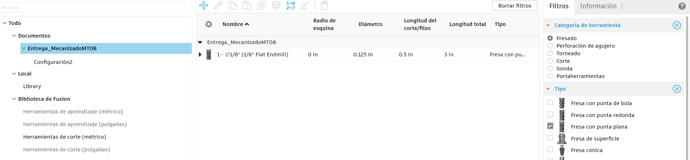

En la segunda opcion se modifico el punto de origen y la orintacion de la herramienta.
El punto de origen lo coloque en la esquina superoior de la pieza y la herramienta en forma perpendicular a la cara superior de la pieza.
Tambien en esta parte seleccione donde queria que me realizara el mecanizado en dicha pieza (Cadena).

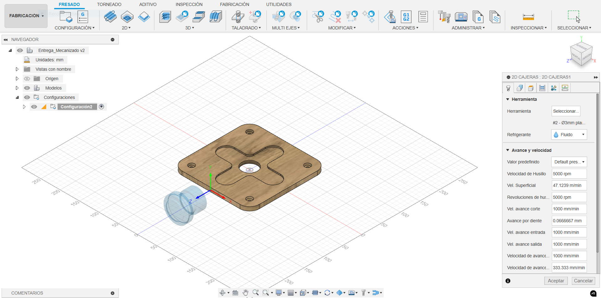

Al pasar esto modifique las diferentes alturas como son: la altura de retraccion, la altura del avance, la altura del espacio libre, entre otras.

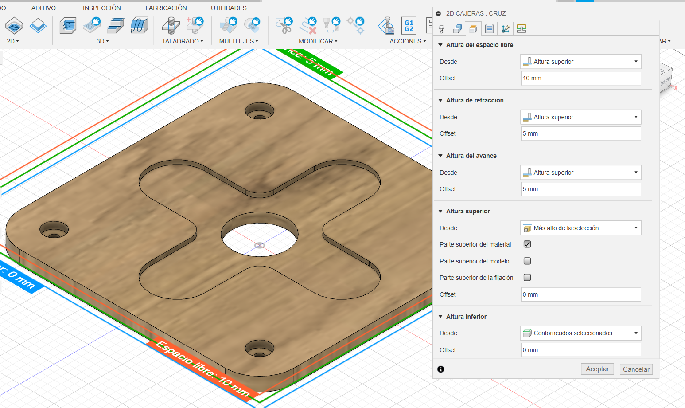

En la opcion pasadas realice la modificacion del parametro "varias profundidades" seteandolo en 1mm para que por cada pasada que realice solo quite ese espesor de material. Esto se hace para no exigir nuetro ruter y/o la fresa con la que estamos mecanizando.

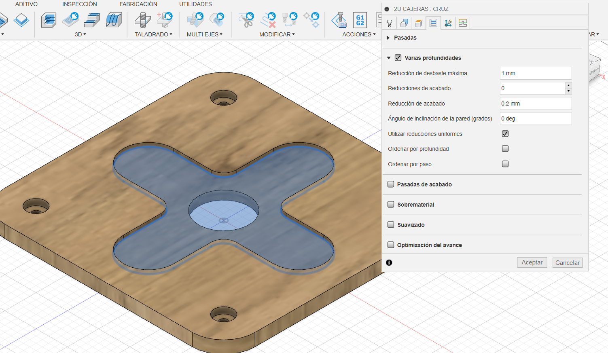

Con las modificaciones descriptas antes ya se puede realizar esa tarea. Cabe destacar que para los demas mecanizados del mismo tipo se siguieron los mismos pasos.

Para la realizacion del Taladrado de los agujeros los pasos a seguir son bastantes parecidos, se setea el punto de origen de la fresa, se elige que la fresa quede perpendicular a la pieza y se elige donde se realizaran los agujeros.

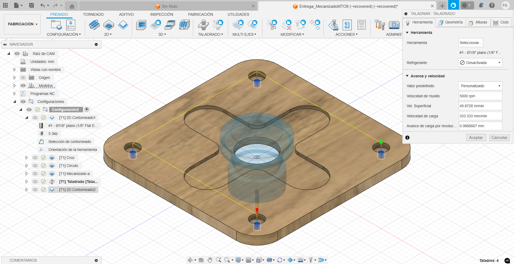

El priemer obstaculo que me encontre fue que al intentar abrir el archivo el programa en el que fue crado el archivo tenia una actualizacion mas reciente. Lo que ocurrio fue que me salto una alerta advirtiendome que no se podia abrir el archivo por este problema. Por lo tanto actualice el programa a la version requerida y automaticamente me abrio el archivo.

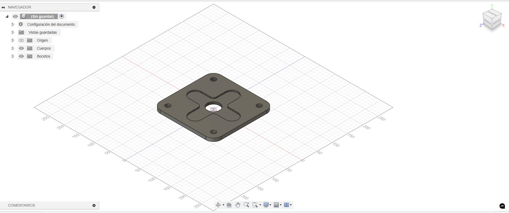

Otro de los problemas que me aparecieron fue que al querer realizar el mecanizado de la pieza en forma de cruz esta me lo realizaba en la totalidad de su espesor y no como yo lo necesitaba que era hasta la mitad del espesor. Lo solucione modificando la altura inferior con la opcion de "contorneados seleccionados" y seleccionando el contorno inferior.

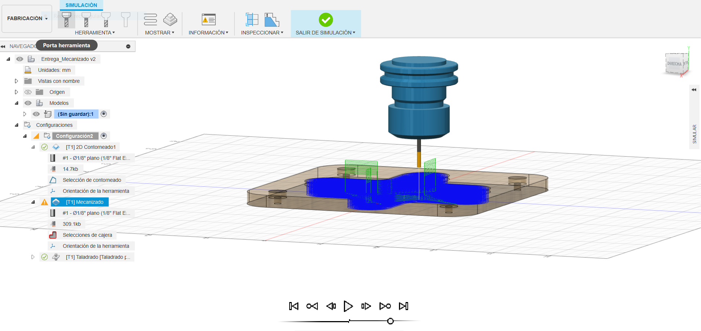

Simulación

<iframe width="560" height="315" src="https://www.youtube.com/embed/_9VAxS63lt8?si=H_Eygf13TGCnaSUw" title="YouTube video player" frameborder="0" allow="accelerometer; autoplay; clipboard-write; encrypted-media; gyroscope; picture-in-picture; web-share" referrerpolicy="strict-origin-when-cross-origin" allowfullscreen></iframe>

Archivo:

  <a href="../Nuevacarpeta/Francisco_Guimaraens.CNC.nc" download="CNC_Guimaraens.nc"> <strong>Descargar</strong> </a>

<strong>Practica en laboratorio:</strong>

A continuación se muestran imágenes del proceso y el corte realizado con el Router CNC.

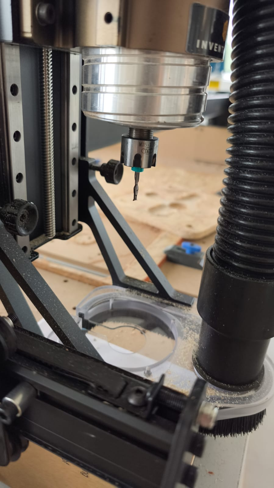
Herramienta utilizada 

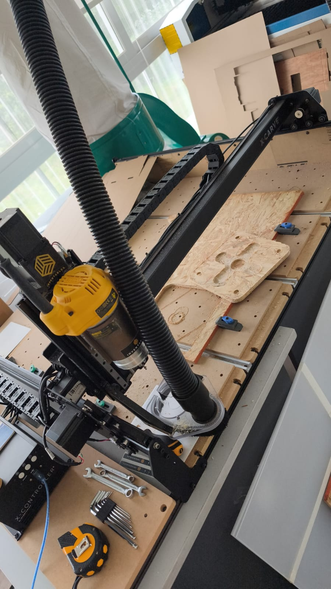
Vista del Router CNC y pieza terminada

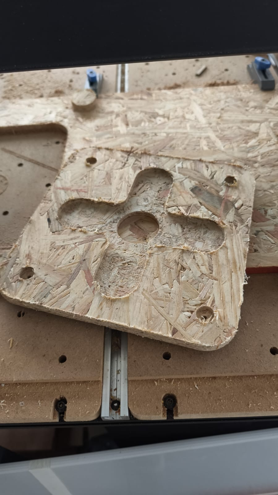
Pieza terminada.

<iframe width="560" height="315" src="https://www.youtube.com/embed/fu6BMS9dAY0?si=2f2EZOtROFXpd3nZ" title="YouTube video player" frameborder="0" allow="accelerometer; autoplay; clipboard-write; encrypted-media; gyroscope; picture-in-picture; web-share" referrerpolicy="strict-origin-when-cross-origin" allowfullscreen></iframe>
