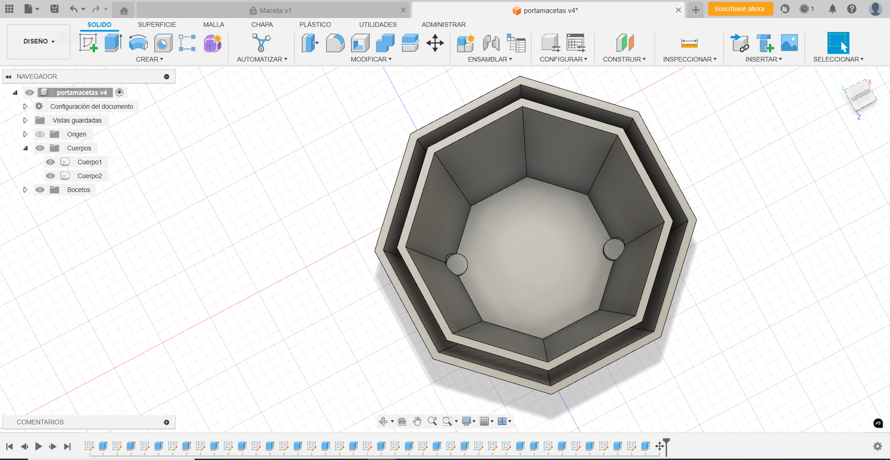

---
hide:
    - toc
---

# MT09

<strong>Moldes</strong>

<strong>Definiciones:</strong>

El moldeado y la fundición es un proceso de fabricación en el que normalmente se vierte un material líquido en un molde, que contiene una cavidad hueca de la forma deseada, y luego se deja solidificar para crear objetos que tengan una apariencia o diseño especifico.

La pieza solidificada también se conoce como replica y se obtiene de expulsar del molde o romper este para terminar el proceso.

<em>¿Cuándo utilizar moldes?</em>

Los moldes se utilizan o tienen más sentido utilizarse cuando queremos hacer o replicar más de una pieza idéntica. Esto lleva un proceso por el que debemos de estar convencido de que nuestro molde cumple los requerimientos necesarios para la creación de nuestra pieza. 
Algunas veces el molde es "Desechable" y nos va a ser útil únicamente para una pieza.

<em>Características de materiales para la creación de moldes:</em>

Los materiales para la creación de moldes tienen ciertas características que los hacen adecuados para reproducir detalles, soportar el proceso de desmoldeado y resistir el desgaste. Además de que este debe de tener la capacidad de fluir ya sea por un incremento en la temperatura y luego tener la capacidad de endurecerse o solidificarse. 

<em>Algunas de las características necesarias:</em>

-Flexibilidad:  Para poder desmoldar sin dañar la pieza, es ideal que el material sea flexible.
-Resistencia al calor: Algunos moldes se usan para verter materiales calientes (como resina y cera).
-Durabilidad: Los moldes necesitan ser duraderos para hacer múltiples copias.
-Compatibilidad con otros materiales: Los moldes deben ser compatibles con el material que se verterá en ellos.
-Fácil desmoldeado: Algunos materiales tienen propiedades antiadherentes naturales, lo que facilita la separación de la pieza.

<em>Tipo de materiales más comunes:</em>

-Silicona: Es flexible y soporta altas temperaturas. Reproduce detalles muy finos. 
-Yeso: Este material es económico, rígido y fácil de usar es muy adecuado para moldes temporales y con materiales de baja temperatura.
-Alginato: Usado para moldes rápidos y de corto plazo, especialmente en aplicaciones como moldes corporales.
-Resina de poliuretano: Muy duradera y resistente, ideal para hacer moldes rígidos y piezas industriales.

<em>Creación de moldes:</em> 

Para la creación de los moldes se pueden usar diversas técnicas.
Una de estas es realizar nuestro molde en un programa de diseño como Fusion 360, AutoCAD, Tinkercad, u otro. Luego de diseñado se puede crear el molde con impresión 3D, corte laser, Reuter CNC u otra herramienta que nos permita llevar nuestro proyecto a la realidad. La herramienta a utilizar va a depender de las características de nuestro molde.
Un paso muy importante al crear un molde es dejar espacios para verter el material que vamos a utilizar para la creación de nuestra pieza como también dejar espacios donde el aire pueda evacuar.
Otra buena práctica es si nuestro molde consiste de más de una cara crear encajes entre ambas para que las piezas salgan exactamente iguales y no haya deslizamientos entre diferentes moldes.

También podemos crear moldes a partir de piezas ya existentes para clonarla o reproducirla.
En este caso se toma la pieza y se elige con que material se va a realizar nuestro molde. Este depende también del tipo de material que va a ser nuestra pieza final.
Luego de esto se toma la pieza, y se coloca en un recipiente o marco dejando espacio para que el material con que se realizara el molde pueda cubrirlo por completo. El material vertido en forma líquida va ir tomando la forma del objeto y al solidificarse quedara con la forma exacta de dicho objeto.
Al solidificarse se retira la pieza original de su interior y el molde queda listo para utilizarse.

Los moldes pueden ser creados de una pieza o más, dependiendo de su tamaño y/o geometría.

<strong>Utilización:</strong> 

Los moldes tienen aplicaciones muy amplias en diversas áreas para la creación de objetos y piezas como son: 

-Industria de plásticos: Para la creación de piezas plásticas en series como juguetes, partes de automóviles e infinidades de artículos.
-Fundición de metales: En la industria metalúrgica es muy utilizado para la creación de piezas a base de moldes de arena.
-Construcción: Son utilizados para la creación de piezas como alcantarillas, ductos, entre otras.
-Medicina y odontología: Se utilizan para la creación de dientes o huesos. 
-Fabricación de joyería: Se crean piezas únicas y detalladas en metales muy valiosos.
-Industria automotriz: Es muy utilizado para diversas piezas ya sean partes de motor o decoración.

<em>Nota:</em> Un molde es una impresión negativa tomada de un modelo positivo, similar a una fotografía.

<strong>Objetivo de este módulo:</strong> 

Diseñar un molde para la creación de una maceta.

<strong>Actividad:</strong>

El primer paso fue diseñar e imaginar un tipo de maceta que sea útil y simple, para ello me base en macetas ya existentes y diseños de internet.
Este diseño lo lleve a cabo en el programa Fusion 360, en el cual tengo más experiencia y me resulta practico.
Mi molde lo diseñe de dos piezas, una pieza interior y otra exterior. Estas piezas constan de dos encastres en la parte interior-inferior la cual me permite encastrar y alinear ambas piezas. También al momento de crear mi pieza final quedara aparte de dos orificios extras estos que servirán para el desagüe de la maceta. 
En la parte superior del molde quedo completamente abierto para el colado del material.

Al comenzar cree una figura de 8 lados (octágono) para luego extruirla y darle una altura definida.
Luego de esto le realice una inclinación para que a la hora de sacar nuestra pieza del molde quedase más práctico.

Le realice cuatro guías en la parte inferior del molde exterior, en el cual dos de ellas son para encastrar el molde interior y que no se produzcan deslizamientos y las otras dos para que sirvan de tope y la base de nuestra pieza no quedase ni más fina ni más gruesa.

Aquí notamos las dos perforaciones del molde de la maceta interior el cual servirán de guía para la creación.

Podemos ver el molde terminado y encastrado.

Visto desde otro Angulo.

Así quedaría nuestra maceta luego de verter nuestro material y haber solidificado.
Podemos ver que en la parte inferior quedan los cuatro agujeros para la evacuación del agua.

<strong>Archivo para descargar:</strong>

Molde maceta:  <a href="../Nuevacarpeta/PortamacetasFinal.f3d" download="Molde_Guimaraens.f3d"> <strong>Descargar</strong> </a>

Maceta:  <a href="../Nuevacarpeta/MacetaFinal.f3d" download="Maceta_Guimaraens.f3d"> <strong>Descargar</strong> </a>
